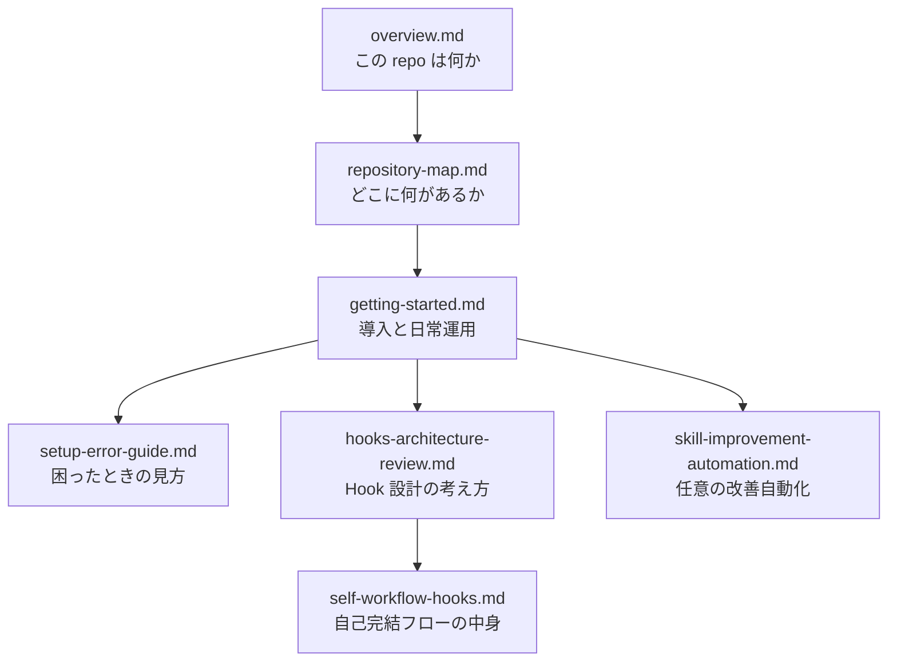

# Docs Hub

> [!IMPORTANT]
> 非エンジニアの方や、このリポジトリを初めて触る方は、まず [overview.md](./overview.md) から読んでください。

この `docs/` フォルダは、`README.md` や `setup.md` よりも一段やさしく、
「このリポジトリは何者で、何をして、どこを見ればいいのか」を理解するための案内板です。

## まずは全体像

## おすすめの読み順

1. [overview.md](./overview.md)
   このリポジトリの目的、向いている人、使うと何がそろうかをつかみます。
2. [repository-map.md](./repository-map.md)
   `instructions/`、`skills/`、`hooks/`、`scripts/` が何のためにあるかを確認します。
3. [getting-started.md](./getting-started.md)
   実際に導入するときの流れ、安全策、日常で使うコマンドを把握します。
4. [setup-error-guide.md](./setup-error-guide.md)
   うまくいかなかったときの見方と、安全な次の一手を確認します。
5. [hooks-architecture-review.md](./hooks-architecture-review.md)
   Hook の構成が今の形になった理由を理解します。
6. [self-workflow-hooks.md](./self-workflow-hooks.md)
   仕様作成から検証までを同じ CLI が回し切る仕組みを深掘りします。
7. [skill-improvement-automation.md](./skill-improvement-automation.md)
   ログから Skill 改善案を作る任意の自動化を知りたいときに読みます。

## 目的別の早見表

| 知りたいこと | まず読むページ |
|---|---|
| そもそもこの repo は何をするのか | [overview.md](./overview.md) |
| どのフォルダを触ればよいか | [repository-map.md](./repository-map.md) |
| 導入で自分の PC に何が起きるか | [getting-started.md](./getting-started.md) |
| setup / update が失敗した | [setup-error-guide.md](./setup-error-guide.md) |
| Hook をなぜグローバル配布にしているか | [hooks-architecture-review.md](./hooks-architecture-review.md) |
| `[[SPEC_DONE]]` などのキーワードは何か | [self-workflow-hooks.md](./self-workflow-hooks.md) |
| Skill 改善の自動化を有効にしたい | [skill-improvement-automation.md](./skill-improvement-automation.md) |

## 先に覚えておくと楽なこと

- このリポジトリは、AI 本体を配るものではなく、**AI の働き方をそろえる設定の母艦**です。
- 中心にあるのは `instructions/AI_AGENT_INSTRUCTIONS.md` で、そこを各 CLI が参照します。
- `scripts/setup.sh` は既存設定を壊しに行く設計ではなく、**dry run・追記/マージ・バックアップ**を前提にしています。
- GitHub Copilot は対象外ではありませんが、**グローバル Hook の自動配布対象ではない**ので扱いが少し別です。

## 実務での使い分け

- 手早く操作だけ知りたい: ルートの [README.md](../README.md) と [setup.md](../setup.md)
- 背景も含めて理解したい: この `docs/` 一式
- 実装の根拠まで追いたい: `instructions/`、`hooks/`、`scripts/`、`tests/`
