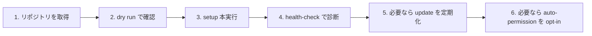

# 導入と日常運用

> [!IMPORTANT]
> 初回は **必ず dry run から** 始めてください。  
> `AI_AGENT_DRY_RUN=1 sh scripts/setup.sh`

## このページの役割

- **読者:** これから導入する人、すでに導入したあと日常運用を知りたい人
- **読み終えると分かること:** 何を準備するか、何がインストールされるか、普段どのコマンドを使うか、安全に戻す方法

## 導入の流れを、まず1枚で



## 事前に必要なもの

| 項目 | 何のために必要か |
|---|---|
| `git` | このリポジトリを取得・更新するため |
| `python3` | 一部スクリプトとテストのため |
| Claude Code / Codex / Gemini CLI | 共通設定の配布先として想定しているため |
| 各 CLI でのログイン完了 | 導入後すぐ使える状態にするため |
| `trash` | 安全な削除・取り外しのため |

> [!TIP]
> `trash` が入っていない場合、`scripts/setup.sh` は対応するインストールコマンドを提案します。

## setup が触る場所

| 場所 | 役割 |
|---|---|
| `~/.codex/` | Codex のグローバル instructions / hooks 設定 |
| `~/.claude/` | Claude Code のグローバル instructions / hooks 設定 |
| `~/.gemini/` | Gemini CLI のグローバル instructions / hooks 設定 |
| `~/.agents/skills/` | 共有 Skill のリンク配置先 |
| `~/.llm-config/hooks` | Hook 本体への安定リンク |
| `<repo>/.github/copilot-instructions.md` | Copilot 用。これは **手動管理** |

## 安全設計

| 約束 | 意味 |
|---|---|
| **dry run がある** | 先に「何が起きる予定か」だけ確認できる |
| **追記/マージが基本** | 既存の `settings.json` や `config.toml` を丸ごと置換しない |
| **バックアップ前提** | 競合時は退避を優先する |
| **`rm` を使わない** | 削除は `trash` に寄せる |
| **Copilot は別扱い** | グローバル Hook の自動配布対象ではない |

## 初回セットアップ

### 1. dry run

```sh
AI_AGENT_DRY_RUN=1 sh scripts/setup.sh
```

### 2. 問題なければ本実行

```sh
sh scripts/setup.sh
```

### 3. 状態確認

```sh
sh scripts/health-check.sh
```

> [!NOTE]
> `health-check` は「インストールできたか」だけでなく、
> リンク切れ、未ログイン、Hook 設定の未反映なども見つけるための診断です。

## 日常でよく使うコマンド

| やりたいこと | コマンド |
|---|---|
| 設定を最新化する | `sh scripts/update.sh` |
| 状態を点検する | `sh scripts/health-check.sh` |
| 取り外す | `sh scripts/uninstall.sh` |
| 更新の定期実行を登録する | `AI_AGENT_UPDATE_CADENCE=daily sh scripts/schedule-update.sh` |
| Skill 改善の定期スキャンを登録する | `AI_AGENT_IMPROVEMENT_CADENCE=daily sh scripts/schedule-skill-improvement.sh` |

## やめたいとき

```sh
sh scripts/uninstall.sh
```

`uninstall.sh` は、この repo が作ったリンクや managed Hook の追記を外すためのものです。  
あなたが手で書いた既存設定を、丸ごと消しにいくことを目的にしていません。

## 「人に頼む」ように AI へ依頼したいとき

`setup.md` には、別の AI エージェント CLI へそのまま貼って使える自然言語のセットアップ依頼文が入っています。  
細かいコマンドより会話ベースで進めたい場合は [setup.md](../setup.md) を見てください。

## 更新の考え方

`scripts/update.sh` は、単に `git pull` するだけではありません。

1. この repo を最新化する
2. 前回 setup 時の状態ファイルを読む
3. その状態に基づいて `setup.sh` を再実行し、リンクや Hook を追随させる

つまり、**「設定 repo の更新」と「PC への再適用」を1セットにしている** のがポイントです。

## auto-permission は任意

> [!CAUTION]
> `scripts/enable-auto-permission.sh` は便利ですが、AI が確認なしでコマンドやファイル操作を進めやすくなります。  
> 非エンジニアの方や、AI の権限をまだ把握していない段階では、まず使わない判断が安全です。

有効化・無効化のコマンド:

```sh
sh scripts/enable-auto-permission.sh
sh scripts/disable-auto-permission.sh
```

## 困ったときに覚えておくとよいこと

- setup が失敗したら、まず [setup-error-guide.md](./setup-error-guide.md)
- Hook の考え方が分からなくなったら、[hooks-architecture-review.md](./hooks-architecture-review.md)
- 実装レベルの self-workflow を知りたいなら、[self-workflow-hooks.md](./self-workflow-hooks.md)
- Skill 改善の自動化を入れたいなら、[skill-improvement-automation.md](./skill-improvement-automation.md)

## さらに詳しい手順

- 具体的なセットアップ引数や環境変数: [setup.md](../setup.md)
- 技術寄りの要約: [README.md](../README.md)
