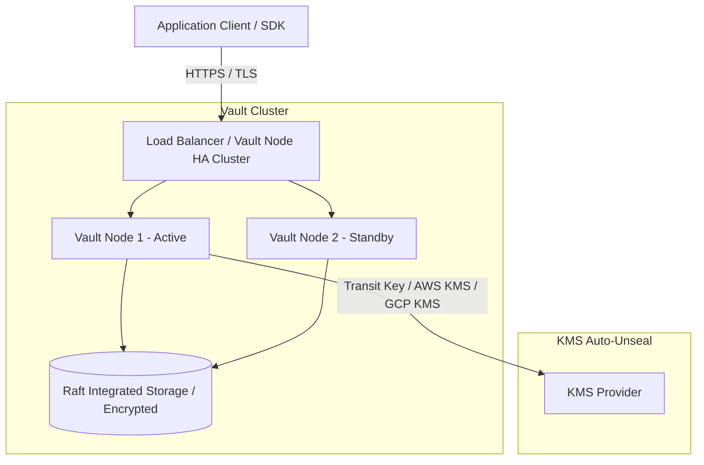
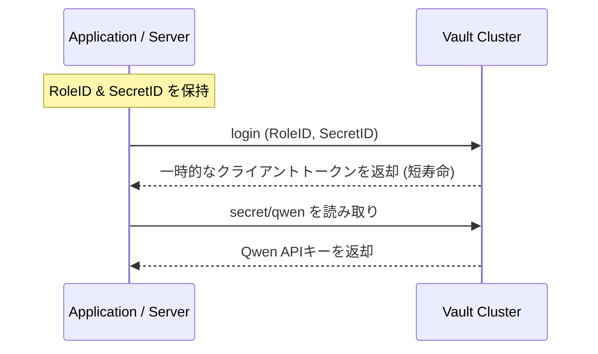
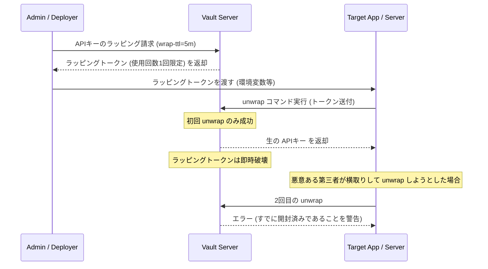

# HashiCorp Vault 導入 & API Key 管理ガイド

APIキーや認証情報などの機密情報を安全に一元管理するため、業界標準の秘密情報管理ツールである **HashiCorp Vault** を導入しました。

また、**`ai-agent-config` の `setup.sh` スクリプトをアップデート**し、環境構築時に自動的に HashiCorp Vault と Python ライブラリ `hvac` がインストール・セットアップされるように統合しました。

---

## 0. セットアップ方法

以下のセットアップスクリプトを実行することで、必要なすべてのツール（`vault` CLI のインストールおよび Python ライブラリ `hvac`）が自動的にセットアップされます。

```bash
# ai-agent-config のセットアップスクリプトを実行
cd ~/Documents/ai-agent-config
./scripts/setup.sh
```

---

## 1. Vault の概要

**HashiCorp Vault** は、APIキー、パスワード、証明書などの「シークレット」へのアクセスを安全に制御・保管・監査するためのツールです。
- **暗号化**: 保管中および転送中のデータはすべて暗号化されます。
- **きめ細かなアクセス制御**: トークンやポリシーを用いて、特定のアプリケーションやユーザーに必要な最小限の権限のみを付与できます。
- **動的シークレット / 監査**: シークレットの作成、アクセス、破棄の履歴をすべてログとして記録できます。

---

## 2. Vault サーバーの起動方法（開発モード）

開発・動作検証用に、最も簡単な **開発モード（Dev Mode）** で Vault サーバーをローカルで起動します。

> [!WARNING]
> 開発モード（`-dev`）は、インメモリでデータを保持するため、サーバーを停止するとデータが消去されます。また、暗号化キーがメモリ上に公開されるため、本番環境では絶対に使用しないでください。

### 起動コマンド

ターミナルで以下のコマンドを実行して、Vault サーバーを起動します。

```bash
vault server -dev
```

起動すると、ターミナルに以下のような重要な情報が出力されます。

```text
==> Vault server configuration:

             Api Address: http://127.0.0.1:8200
                     Cgo: disabled
         Cluster Address: https://127.0.0.1:8201
              Listener 1: tcp (addr: "127.0.0.1:8200", cluster_address: "127.0.0.1:8201", ...)
               Log Level: info
             Mgo Enabled: false
             Storage Type: inmem
             Version: Vault v1.15.x

==> Vault server started! Log data will stream in below:
...
Root Token: hvs.CAESIL... (★ここにルートトークンが表示されます)
```

---

## 3. 環境変数の設定

Vault サーバーを起動したターミナルとは **別の新しいターミナルセッション** を開き、Vault CLI がローカルサーバーと通信できるように環境変数を設定します。

```bash
# Vault サーバーのアドレスを指定
export VAULT_ADDR='http://127.0.0.1:8200'

# サーバー起動時に出力された「Root Token」を設定
export VAULT_TOKEN='hvs.YOUR_ROOT_TOKEN_HERE'
```

正しく接続できるか、以下のコマンドでステータスを確認します。

```bash
vault status
```

---

## 4. 既存の APIキー CSV のインポート

現在 `Config/默认业务空间-apiKey-359315.csv` に保存されている Qwen API キーを Vault にインポートします。

### A. CLI を使った手動インポート

以下のコマンドを実行して、Key-Value（KV）エンジンにデータを保存します。

```bash
vault kv put secret/qwen \
  apiKey="sk-ws-H.IRXIDR.QfL9.MEYCIQCbXcRBL_NUylu2ODrTKR_2yw5RAIsuoAjcZ7bMMzvJuQIhAJxD06DdSFIWI-PGcaWi27ydeWQkT9aNF1__cMVezHPu" \
  apiHost="ws-gx8odax0ujb79o2s.ap-southeast-1.maas.aliyuncs.com" \
  workspaceId="ws-gx8odax0ujb79o2s" \
  workspaceName="默认业务空间" \
  description="Qwen CLI"
```

### B. Python スクリプトによる自動インポート

CSVから自動で Vault にインポートするスクリプトを作成しました。
スクリプトを実行する前に、Vault用の Python クライアントライブラリ `hvac` をインストールしてください。

```bash
pip install hvac
```

#### インポートスクリプト (`Config/import_to_vault.py`)

以下のスクリプトを実行することで、CSVの内容を自動的に Vault の `secret/qwen` パスに書き込みます。

```python
import os
import csv
import hvac

# Vaultの接続情報（環境変数から取得、デフォルトはローカル開発用）
VAULT_ADDR = os.getenv('VAULT_ADDR', 'http://127.0.0.1:8200')
VAULT_TOKEN = os.getenv('VAULT_TOKEN')

if not VAULT_TOKEN:
    print("Error: VAULT_TOKEN 環境変数が設定されていません。")
    print("export VAULT_TOKEN='your_root_token' を実行してください。")
    exit(1)

# クライアントの初期化
client = hvac.Client(url=VAULT_ADDR, token=VAULT_TOKEN)

if not client.is_authenticated():
    print("Vault への認証に失敗しました。")
    exit(1)

csv_path = os.path.join(os.path.dirname(__file__), '默认业务空间-apiKey-359315.csv')
secrets_data = {}

# CSV の読み込み
with open(csv_path, mode='r', encoding='utf-8') as f:
    reader = csv.reader(f)
    for row in reader:
        if len(row) == 2:
            secrets_data[row[0]] = row[1]

# Vault (KV V2) への書き込み
try:
    create_response = client.secrets.kv.v2.create_or_update_secret(
        path='qwen',
        secret=secrets_data,
    )
    print("Successfully imported Qwen API keys to Vault at 'secret/qwen'!")
except Exception as e:
    print(f"Error importing secrets to Vault: {e}")
```

---

## 5. Python アプリケーションから Vault を利用する

実装コード内で APIキーを直接ハードコードせず、Vault から動的に取得する方法です。

```python
import os
import hvac

def get_qwen_secrets():
    # 環境変数から Vault のアドレスとトークンを取得
    vault_addr = os.getenv('VAULT_ADDR', 'http://127.0.0.1:8200')
    vault_token = os.getenv('VAULT_TOKEN')
    
    if not vault_token:
        raise ValueError("VAULT_TOKEN 環境変数が設定されていません。")

    # Vault クライアントの接続
    client = hvac.Client(url=vault_addr, token=vault_token)
    
    # データの取得 (KV V2)
    read_response = client.secrets.kv.v2.read_secret_version(path='qwen')
    secrets = read_response['data']['data']
    
    return secrets

# 使い方
try:
    qwen_config = get_qwen_secrets()
    print("API Key retrieved successfully from Vault!")
    # print(qwen_config['apiKey'])  # APIキーの利用
    print(f"API Host: {qwen_config['apiHost']}")
except Exception as e:
    print(f"Failed to fetch secrets: {e}")
```

---

## 6. セキュリティのベストプラクティス

Vaultを本格運用およびローカル環境でセキュアに維持するため、以下のベストプラクティスを必ず適用してください。

### 6.1 ローカル開発環境における原則（対応完了）

> [!CAUTION]
> **APIキーの直接コミット禁止**:
> 一度コミットされたAPIキーは、Git履歴を書き換えない限りパブリックに漏洩するリスクがあります。

1. **CSVファイルのクリーンアップ（★実施済み）**:
   - Vault へのインポート（KV: `secret/qwen`）完了に伴い、平文でAPIキー情報が記述されていたローカルCSVファイル (`默认业务空间-apiKey-359315.csv`) は、セキュリティ確保のため**物理的に削除（クリーンアップ）されました**。
2. **`.gitignore` による防衛（★設定済み）**:
   - `ai-agent-config` および `ACT` プロジェクト両方の `.gitignore` に `.csv` および `*apiKey*.csv` 関連のエントリを追加し、将来誤ってAPIキーファイルをコミットしないよう多重の防御策が講じられています。
3. **環境変数トークンの秘匿（★徹底実施）**:
   - `VAULT_TOKEN` や `Root Token` をコードに直書き・コミットしない設計を徹底しています。`import_to_vault.py` も完全に `os.getenv` による環境変数での受け渡しに統一されています。

---

### 6.2 本番環境（プロダクション）におけるインフラ設計

本番環境（Production）への移行時は、設計、デプロイ、暗号化方式を開発モードから本番用の堅牢な構成へ切り替える必要があります。



#### ① 高可用性（HA）とバックエンドストレージ
- 開発用の `inmem`（インメモリ）はサーバー再起動でデータが全消去されます。本番では、データ永続化とスケールアウトに対応した **Raft（Integrated Storage）** または **Consul** をバックエンドに使用してください。

#### ② 自動復号（Auto-unseal）の導入
- 通常、Vaultは起動時に「封印（Sealed）」状態になり、Shamirs Secret Sharing キー（分割キー）を複数入力しないと機能しません。
- 本番では、クラウド（AWS KMS、Google Cloud KMS、Azure Key Vault、あるいはオンプレミス用の HSM）を利用した **Auto-unseal** を設定することで、サーバーメンテナンスや自動スケール時に管理者の手動介入なしに安全に自動起動できるように設計します。

#### ③ 転送データの保護（TLS / HTTPS の強制）
- すべての通信経路で中間者攻撃（Man-in-the-Middle）を阻止するため、Vaultは常に HTTPS (TLS 1.2 以上) でリスニングするように設定します。
- Vault の設定ファイル (`vault.hcl`) の `listener`セクションで、正規の証明書と秘密鍵、および TLS設定を指定してください。

```hcl
listener "tcp" {
  address     = "0.0.0.0:8200"
  tls_cert_file = "/etc/vault.d/vault.crt"
  tls_key_file  = "/etc/vault.d/vault.key"
  tls_min_version = "tls12"
}
```

---

### 6.3 最小権限の原則（Least Privilege）と ACL ポリシー

Root Tokenは全権限（管理者権限）を持つため、本番アプリケーションの常時接続や一般の作業で常用することは極めて危険です。本番では必要なアクセス範囲を定義した **ACL ポリシー (HCL形式)** を作成し、それに基づく制限トークンのみを発行して使用します。

#### ① ポリシー例（読み取り専用）
Qwen APIキーのパス (`secret/data/qwen`) に対して、アプリケーション側が「読み取り（Read）」のみを許可するポリシー定義：

```hcl
# qwen-read-only.hcl
path "secret/data/qwen" {
  capabilities = ["read"]
}
```

#### ② ポリシーの登録とトークン発行
```bash
# ポリシーの登録
vault policy write qwen-read qwen-read-only.hcl

# 登録したポリシーに基づく、有効期限12時間のトークンを発行
vault token create -policy=qwen-read -ttl=12h
```

---

### 6.4 マシン向け認証（AppRole）の導入

本番環境でアプリケーションやコンテナ（Kubernetes、Docker等）が自動的に Vault からシークレットを取得する際、静的なトークンを使い続けるのではなく、マシン間認証システムである **AppRole** を採用します。



- **Role ID**（ユーザー名に相当）と **Secret ID**（パスワードに相当）という2つの独立した認証情報を使い、一時的なクライアントトークン（短寿命）を動的に生成して認証します。
- これにより、万が一アプリケーション上のトークンが漏洩した場合でも、その寿命は極めて短く、また権限も制限されているため被害を最小限に防ぐことができます。

---

### 6.5 監査（Auditing）と監視の有効化

Vaultに対するすべてのリクエストとレスポンス、トークン発行、ポリシー編集などのアクセス履歴をリアルタイムで確実に記録するため、監査ログデバイスを有効化します。

```bash
# 監査ログを特定のファイルに出力するように有効化
vault audit enable file file_path=/var/log/vault_audit.log
```

- **監査ログのローテーションと保護**: 監査ログファイルは SIEM や Google Cloud Logging などの収集基盤に転送し、改ざんや削除を防止します。
- **ログのハッシュ化**: Vault はログ出力時にシークレットなどの機密情報を自動的にソルト付きSHA-256でハッシュ化して保護します。

---

### 6.6 1回限り有効なキー・トークンの発行（ワンタイム設定）

HashiCorp Vault では、APIキーの受け渡し時やアプリ起動時の漏洩リスクを極小化するため、**「使用1回きり（ワンタイム）」**で自動失効するアクセスキーやトークンを発行する機能が標準で用意されています。

主に以下の2つのアプローチで実装可能です。

#### ① 使用回数制限トークン（Use-Limit Tokens）
トークンの作成時に「使用可能回数（`use-limit`）」を `1` に指定して発行します。

- **挙動**: このトークンは、Vault に対する API 呼び出し（シークレットの読み取り等）を**1回行うと、その瞬間に自動的に破棄（Revoke）**されます。2回目のアクセスは完全に拒否されます。
- **CLI での生成例**:
  ```bash
  # 1回だけ読み取りが可能なトークンを発行
  vault token create -policy=qwen-read -use-limit=1
  ```
- **Python（hvac）での生成 & 利用例**:
  ```python
  # トークンの発行（管理者側）
  token_output = client.auth.token.create(
      policies=['qwen-read'],
      use_limit=1,  # 1回のみ使用可能
      ttl='10m'     # 未使用の場合でも10分で自動失効
  )
  one_time_token = token_output['auth']['client_token']
  
  # --- アプリケーション側（利用後自動失効） ---
  app_client = hvac.Client(url=VAULT_ADDR, token=one_time_token)
  # 1回目の読み取り：成功する
  secret = app_client.secrets.kv.v2.read_secret_version(path='qwen')
  print(secret['data']['data']['apiKey'])
  
  # 2回目の読み取り（あるいは別エンドポイントへのアクセス）：エラー (403 Forbidden) になる
  try:
      app_client.secrets.kv.v2.read_secret_version(path='qwen')
  except Exception as e:
      print("2回目はアクセス不可:", e) # Permission Denied になります
  ```

#### ② レスポンスラッピング（Response Wrapping）
Vault で最も推奨されるワンタイム安全配送パターンです。APIキー自体を Vault 側で暗号化された「カプセル（ラッピングトークン）」に包んで発行します。



- **メリット**:
  - **中間経路での漏洩検知**: 万が一、ラッピングトークンがアプリに届く前に第三者に奪われて開封（unwrap）された場合、本物のアプリが開封しようとしたときに「すでに開封されています（Invalid or Expired）」と Vault がエラーを返します。これにより、**経路上でハッキング・盗聴が起きた事実を即座に検知**できます。
  - トークン自体にはシークレットそのものは入っておらず、Vault 内部への1回限りの引き換え券として機能します。

- **CLI での生成と開封例**:
  ```bash
  # 1. 有効期限5分、使用回数1回のラッピングトークンを発行
  vault kv get -wrap-ttl=5m secret/qwen
  
  # 出力される「Wrapping Token (hvs.CAES...)」をアプリケーションに渡す
  
  # 2. アプリケーション側で開封（生のAPIキーを取得。トークンは即時消滅）
  vault unwrap <WRAPPING_TOKEN>
  ```

- **Python（hvac）での実装例**:
  ```python
  # 1. 管理者側：ラッピングトークンを生成
  wrapped_data = client.secrets.kv.v2.read_secret_version(
      path='qwen',
      wrap_ttl='5m'  # 5分間のみ有効
  )
  wrapping_token = wrapped_data.raw_response['wrap_info']['token']
  
  # 2. アプリケーション側：引き換え（unwrap）
  app_client = hvac.Client(url=VAULT_ADDR)
  unwrapped_response = app_client.sys.unwrap(token=wrapping_token)
  
  # 生のシークレットデータ
  secrets = unwrapped_response['data']['data']
  print("Unwrapped API Key:", secrets['apiKey'])
  ```

