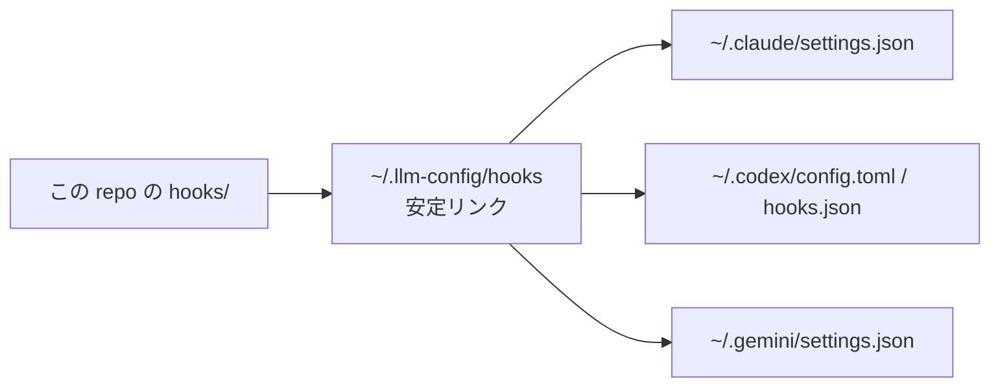

# Hook 設計の考え方

> [!NOTE]
> このページは「なぜ今の Hook 構成にしたのか」を説明します。
> 「Hook が実際にどう動くか」を知りたい場合は [self-workflow-hooks.md](./self-workflow-hooks.md) を読んでください。

## このページの役割

- **読者:** Hook の配置方針や設計判断を知りたい人
- **読み終えると分かること:** 今の構成が何を避け、何を優先しているか

## 結論を先に

この repo の Hook 設計は、次の4つに整理されています。

1. **配布先はグローバルのみ**
   `~/.claude`、`~/.codex`、`~/.gemini` のユーザー設定に入れる
2. **安全系 Hook を最優先**
   `safe_delete_guard.py` で危険な削除を防ぐ
3. **作業は同じ CLI が最後まで持つ**
   `self_workflow.py` により、仕様作成から検証まで同じ CLI が継続する
4. **Hook 本体は repo に残し、各 CLI からは安定リンクで呼ぶ**
   `~/.llm-config/hooks` を経由して参照する

## まずは配置イメージ

## なぜ「グローバルだけ」にしたのか

以前のように「project 単位」と「user 全体」の両方へ Hook を置くと、次の問題が起きやすくなります。

| 問題 | 何が困るか |
|---|---|
| 二重実行 | 同じ Hook が2回走り、意図しない動きになる |
| 責任分散 | どのレイヤーの Hook が効いているのか分かりにくい |
| 遅延増加 | 余計な継続や reviewer 呼び出しで待ち時間が伸びる |

そこで今は、**「共通で効かせたいものはグローバル」「project 固有の事情は project 側で別管理」** という整理に寄せています。

## 現在の主役は2本

| Hook / Skill | 役割 | ひと言でいうと |
|---|---|---|
| `safe_delete_guard.py` | 永続削除の防止 | 「危ない消し方を止める番人」 |
| `self_workflow.py` | 仕様 → 実装 → 検証の自己継続 | 「同じ CLI に最後までやり切らせる進行係」 |
| `skills/refinment` | 指示文の引き締め | 「必要な時だけ brief を整える補助役」 |

> [!TIP]
> `refinment` は Hook そのものではありません。
> Hook が「今は brief を整えた方がよい」と判断した場面で、現在の CLI がその Skill を使います。

## 今の設計が優先していること

| 優先していること | 具体的な意味 |
|---|---|
| 安全性 | `rm` を避ける、過剰な自動化を避ける |
| 一貫性 | Claude Code / Codex / Gemini CLI で同じ考え方を使う |
| 責任の明確さ | 作業を始めた CLI が最後まで仕上げる |
| 軽さ | 外部 reviewer を常時 main path に入れない |

## Copilot はどこまで同じか

GitHub Copilot も同じ「共通 instructions の思想」は共有しますが、扱いは別です。

- 共有するもの: `instructions/.github/copilot-instructions.md`
- 共有しないもの: グローバル Hook 配布、self-workflow runtime、`setup.sh` による自動導入

つまり、**Copilot は仲間だが、同じ Hook 基盤の上にはいない** という理解が近いです。

## まだ残るトレードオフ

- 業務ごとの細かな Hook まで一元化したい場合は、この repo だけでは足りない
- 企業の管理ポリシーと併用するなら、別の配布設計が必要
- 「全部を自動化したい」要求に対しては、安全側を優先してあえて抑えている部分がある

## 次に読むなら

- Hook の実行フローを知りたい: [self-workflow-hooks.md](./self-workflow-hooks.md)
- 導入と運用を知りたい: [getting-started.md](./getting-started.md)
