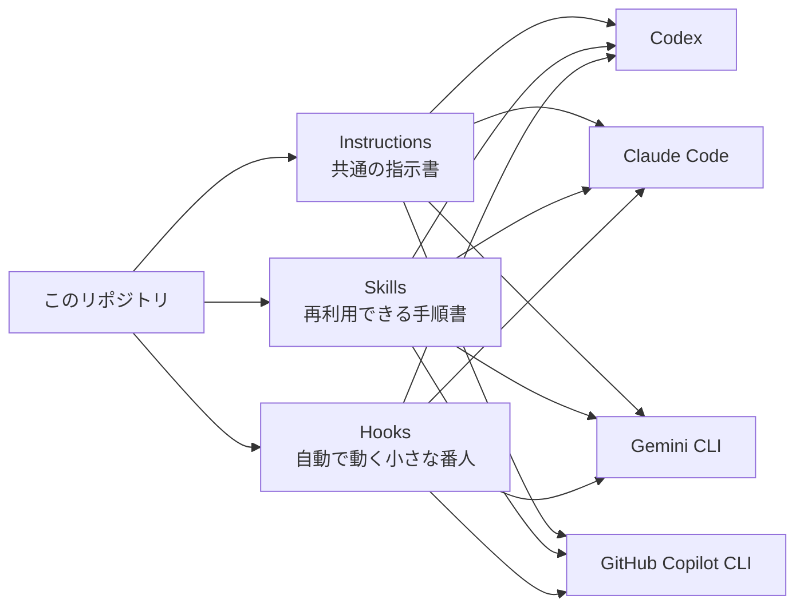

# はじめに: このリポジトリは何をしているのか

> [!NOTE]
> 3行で言うと:
> - このリポジトリは、**Claude Code / Codex / Gemini CLI / GitHub Copilot CLI に同じ働き方を配る設定の母艦**です。
> - 配るものは主に **Instructions（指示書）**、**Skills（再利用できる手順）**、**Hooks（自動で走る番人）** の3つです。
> - GitHub Copilot CLI にも global config を配り、この repo 自体には `.github/copilot-instructions.md` も持ちます。

## このページの役割

- **読者:** 非エンジニアを含む、初めてこの repo を読む人
- **前提:** 「AI をターミナルから使う CLI がある」くらいの理解で十分
- **読み終えると分かること:** この repo の目的、向いている人、導入すると何がそろうか、次にどのページを読めばよいか

## 一言でいうと

**AI に毎回同じ説明をしなくても、複数の CLI へ共通ルールを配れるようにするリポジトリ**です。

たとえば、こんな悩みを減らすためにあります。

- Codex には安全ルールを入れたが、Claude Code には入っていない
- チームで使う AI の振る舞いが人ごとにばらつく
- 新しい PC に移るたび、同じ設定をもう一度作り直している
- せっかく良い指示や手順を作っても、1つのツールの中だけで終わってしまう

## まずは絵でつかむ

## 配っているものは何か

| 種類 | 非エンジニア向けの言い換え | この repo での役割 | 例 |
|---|---|---|---|
| **Instructions** | 就業ルール・基本方針 | AI の共通マナーや安全ルールをそろえる | `rm` を使わず `trash` を使う、最初に仕様を整理する |
| **Skills** | よく使う作業手順書 | 繰り返し使う考え方や進め方を再利用する | `refinment`、`skill-design-research` |
| **Hooks** | 自動で見張る番人 | 特定のタイミングで安全確認や進行制御を入れる | 削除ガード、self-workflow |

## この repo を使うと何が変わるか

| 使う前 | 使った後 |
|---|---|
| CLI ごとに別々のルールを持ちやすい | 主要 CLI へ共通のルールを配れる |
| 新しい PC で設定をやり直しやすい | `setup.sh` と `update.sh` で再現しやすい |
| 良い手順が会話の中に埋もれやすい | `skills/` に切り出して再利用しやすい |
| 危険な削除や雑な完了報告が起こりやすい | `trash` ルールや self-review が組み込まれる |

## 誰に向いているか

### 向いている人

- Claude Code / Codex / Gemini CLI / Copilot CLI のうち、少なくとも1つを日常的に使う人
- 1人で複数 CLI を併用し、動き方をそろえたい人
- 小さなチームで AI エージェントの運用ルールを共有したい人
- GitHub Copilot CLI も含めて global config をそろえたい人

### まだ不要な人

- ブラウザ版 ChatGPT / Claude だけを使い、CLI は使っていない人
- AI ごとの個別設定をわざと分けて運用したい人
- PC 全体へのグローバル設定をまだ入れたくない人

## この repo が「やらないこと」

誤解しやすいので、先に境界も書いておきます。

- Claude Code / Codex / Gemini CLI そのものをインストールするわけではありません
- ブラウザ版 ChatGPT や Claude の設定まで自動で変えるわけではありません
- GitHub Copilot CLI も global Hook 配布の対象です
- ただし、この repo の `.github/copilot-instructions.md` は repo 固有の tracked file として別に持ちます
- ユーザーの既存設定を「全部こちらの形に置き換える」ことを目的にはしていません

## セットアップすると、自分の PC で何が起きるか

まず大枠だけ押さえると、`scripts/setup.sh` は次のことをします。

1. `~/.codex`、`~/.claude`、`~/.gemini` に共通設定を入れる
2. `~/.copilot` に Copilot 用の共通設定を入れる
3. `~/.agents/skills` と `~/.copilot/skills` に共有 Skill へのリンクを置く
4. 各 CLI の公式設定フォルダーに `hooks/` リンクを置く
5. `~/.ai-agent-config` に state や backup を保存する
6. 既存設定がある場合は、置き換えではなく **追記/マージ** で扱う

> [!TIP]
> 最初から本実行する必要はありません。`AI_AGENT_DRY_RUN=1 sh scripts/setup.sh` で、
> 「何が起きる予定か」だけ先に確認できます。

## この repo が大事にしていること

- **1つの正本を持つこと**
  `instructions/AI_AGENT_INSTRUCTIONS.md` を中心に、各 CLI 側は薄い入口ファイルで参照します。
- **危険な削除を避けること**
  `rm` ではなく `trash` を使うのが共通ルールです。
- **設定を壊しにいかないこと**
  既存の `settings.json` や `config.toml` は、可能な限り保持しながら必要部分だけ追加します。
- **完了報告の前に見直すこと**
  self-workflow と shared instructions の両方で、自己レビューを強く求めます。

## 先に覚えると読みやすい用語

| 用語 | 意味 |
|---|---|
| **CLI** | ターミナルから使う AI ツール。Claude Code、Codex、Gemini CLI など |
| **グローバル設定** | ある1つのリポジトリだけでなく、その PC 全体で使う設定 |
| **repo-local** | そのリポジトリの中だけで有効な設定 |
| **シンボリックリンク** | 元ファイルを参照するショートカットのようなもの |
| **Hook** | 開始や終了など、決まったタイミングで自動実行される処理 |

## 次に読むなら

- フォルダの役割をつかみたい: [repository-map.md](./repository-map.md)
- 導入と運用を知りたい: [getting-started.md](./getting-started.md)
- 失敗したときの見方を知りたい: [setup-error-guide.md](./setup-error-guide.md)
- Hook の思想を知りたい: [hooks-architecture-review.md](./hooks-architecture-review.md)
