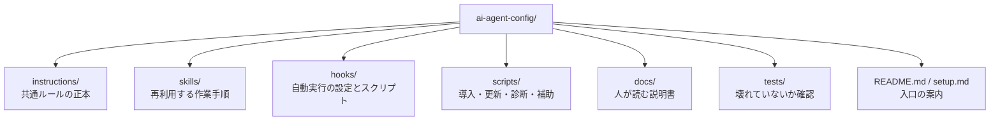
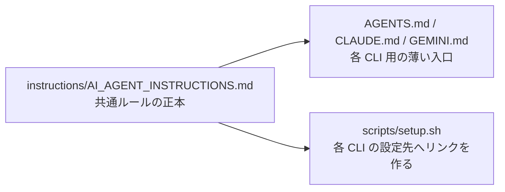

# リポジトリ地図

> [!TIP]
> 「どのフォルダを見ればいいか分からない」ときのためのページです。

## このページの役割

- **読者:** repo の中を歩く前に地図がほしい人
- **読み終えると分かること:** 主要フォルダの意味、何を変えたいときにどこを触るか

## まずは全体図

## 主要フォルダの役割

| 場所 | ここにあるもの | 何をしたい時に見るか | 代表例 |
|---|---|---|---|
| `instructions/` | AI の共通ルール | AI の振る舞い方針を直したい | `AI_AGENT_INSTRUCTIONS.md`, `DESIGN.md`, `HOOKS.md` |
| `skills/` | 再利用できる手順書 | 繰り返し使う作業フローを追加・改善したい | `refinment/`, `skill-design-research/` |
| `hooks/` | Hook 設定と本体 | 自動で起動する処理を見直したい | `safe_delete_guard.py`, `self_workflow.py` |
| `scripts/` | 導入・更新・診断用スクリプト | セットアップ、更新、健康診断、スケジュール登録をしたい | `setup.sh`, `update.sh`, `health-check.sh` |
| `docs/` | 人間向けの説明 | 初見者向け説明や運用ガイドを読みたい | このフォルダ一式 |
| `tests/` | テストとフィクスチャ | 変更が壊れていないか確認したい | `test_self_workflow.py`, `test_merge_hook_config.py` |

## 「何を変えたいか」から逆引きする

| 変えたいこと | 最初に見る場所 | 理由 |
|---|---|---|
| AI の口調・安全ルールを変えたい | `instructions/` | ここが共通ルールの正本だから |
| 新しい再利用ワークフローを追加したい | `skills/` | Skill は「作業の型」を表す単位だから |
| 自動実行のタイミングや挙動を変えたい | `hooks/` | Hook が開始・停止時の処理を持つから |
| 新しい PC に入れたい / 更新したい | `scripts/` | 導入・更新フローはスクリプト化されているから |
| 説明をもっと分かりやすくしたい | `docs/` | 人向けの説明はここにまとめるから |
| 変更しても壊れていないか確かめたい | `tests/` と `scripts/validate-repo.sh` | 最後の品質ゲートだから |

## この repo の「正本」と「入口」

この repo には、**中身を持つ正本** と **そこへ案内する入口** があります。

### 重要な見方

- `instructions/AI_AGENT_INSTRUCTIONS.md`
  いちばん大きな共通ルールです。
- `instructions/AGENTS.md`、`instructions/CLAUDE.md`、`instructions/GEMINI.md`
  各 CLI が正本にたどり着くための入口です。
- `README.md` と `setup.md`
  人が最初に読む案内で、導入手順の入口です。

## 実際のファイル構成を、非エンジニア向けに言い換えると

| 技術的な名前 | やさしい言い換え |
|---|---|
| `instructions/` | AI の共通ルールブック |
| `skills/` | よく使う仕事の型をまとめた手順集 |
| `hooks/` | タイミングが来ると自動で動く番人 |
| `scripts/` | セットアップ係・更新係・点検係 |
| `tests/` | 「壊れていないか」を確かめる検査表 |

## よく触る入口

### 人が直接使うもの

- [README.md](../README.md)
- [setup.md](../setup.md)
- [getting-started.md](./getting-started.md)

### 仕組みの中心

- [instructions/AI_AGENT_INSTRUCTIONS.md](../instructions/AI_AGENT_INSTRUCTIONS.md)
- [hooks/README.md](../hooks/README.md)
- [scripts/setup.sh](../scripts/setup.sh)

## 次に読むなら

- 導入から運用まで知りたい: [getting-started.md](./getting-started.md)
- Hook の思想を知りたい: [hooks-architecture-review.md](./hooks-architecture-review.md)
- 実装の深い仕組みを知りたい: [self-workflow-hooks.md](./self-workflow-hooks.md)
