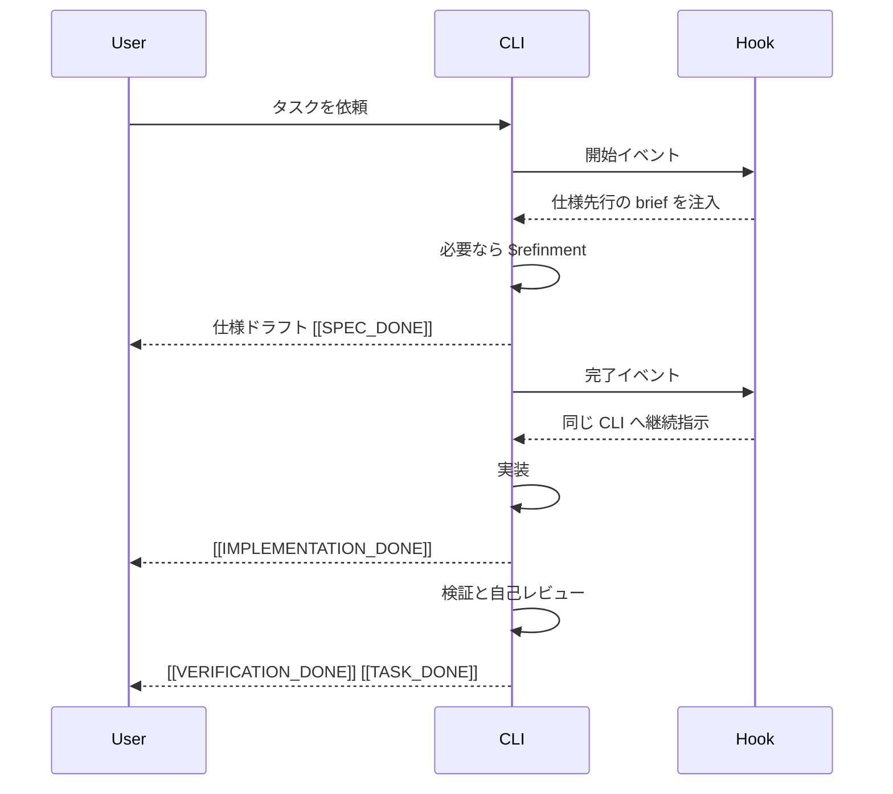

# Self-Workflow Hooks

> [!NOTE]
> このページは、「同じ CLI に最後までやり切らせる」self-workflow の中身を説明します。

## このページの役割

- **読者:** `[[SPEC_DONE]]` などのキーワードや、Hook による自己継続の流れを知りたい人
- **前提:** [hooks-architecture-review.md](./hooks-architecture-review.md) を読んでいると理解しやすい

## 何をしたい仕組みか

**作業を始めた CLI 自身が、仕様作成 → 実装 → 検証まで責任を持って進み切ること** が目的です。

別のモデルへ毎回バトンを渡すのではなく、必要な時だけ `refinment` で brief を整えながら、
同じ CLI が段階的に進むようにしています。

## まずは流れを見る

## この仕組みがカバーする CLI

| CLI | 開始イベント | 完了イベント |
|---|---|---|
| Codex | `UserPromptSubmit` / `SessionStart` | `Stop` |
| Claude Code | `UserPromptSubmit` | `Stop`, `SubagentStop` |
| Gemini CLI | `BeforeAgent` | `AfterAgent` |
| GitHub Copilot CLI | `UserPromptSubmit` / `SessionStart` | `Stop` |

## フェーズの意味

| フェーズ | 何をするか | 主な合図 |
|---|---|---|
| 仕様作成 | ゴール、制約、受け入れ条件をまとめる | `[[SPEC_DONE]]` |
| 実装 | 実際の編集や作成を進める | `[[IMPLEMENTATION_DONE]]` |
| 検証 | 自己レビュー、確認、必要な修正を行う | `[[VERIFICATION_DONE]]` |
| 完了 | 本当に終わりとして閉じる | `[[TASK_DONE]]` |

> [!TIP]
> `[[IMPLEMENTATION_DONE]]` は「全部終わった」の意味ではありません。
> 「実装は終わったので、次は検証へ進む」の合図です。

## `refinment` はいつ使うのか

`refinment` は常時ではなく、次のような場面でだけ使います。

- ユーザー依頼の契約が曖昧で、仕様化した方が事故を防げるとき
- 仕様はあるが、次の1手がぼやけているとき
- 検証の前に、何をもって完了とするかを締め直したいとき

つまり、**全部を重くするための仕組みではなく、必要な時だけ輪郭を出す道具** です。

## どのタスクがこのループに入るか

| 入りやすいタスク | ふつうは入らないタスク |
|---|---|
| 設計、実装、レビュー、調査、ドキュメント刷新 | 単純な質問、短い比較、雑談、進捗確認だけの返答 |

self-workflow は、answer-only のやり取りまで全部を自動継続させる設計ではありません。
重い仕事だけを対象にすることで、待ち時間と過剰な制御を抑えています。

## 安全装置

| 安全装置 | 何を防ぐか |
|---|---|
| `AI_AGENT_SELF_WORKFLOW_ACTIVE=1` | 再帰的な暴走 |
| continuation 上限 | 自動継続がいつまでも続くこと |
| 同一プロンプト上限 | 同じ継続指示のループ |
| verification 上限 | 検証だけが終わらないこと |
| session ごとの state | 別セッションの混線 |
| fail-open | 対象外タスクを無理に loop へ入れること |

## どこに状態が残るか

| 項目 | 場所 |
|---|---|
| Hook 本体 | `hooks/scripts/self_workflow.py` |
| 補助 Skill | `skills/refinment/` |
| 共有ルール | `instructions/HOOKS.md` |
| セッション state | `~/.ai-agent-config/self-workflow` |

## Copilot での扱い

GitHub Copilot CLI もこの self-workflow runtime に入ります。

- `UserPromptSubmit` / `SessionStart` で brief を注入します
- `Stop` では `transcript_path` を読んで phase 判定します
- この repo では global runtime に加えて `.github/copilot-instructions.md` も tracked file として持ちます

## この設計の狙い

- 作業の責任を今の CLI に持たせる
- prompt 改善を必要時だけ、しかもユーザーに見える形で行う
- routine reviewer latency を常時発生させない
- 4つの CLI でほぼ同じライフサイクルを使う

## 関連ページ

- 設計思想の要約: [hooks-architecture-review.md](./hooks-architecture-review.md)
- 導入と運用: [getting-started.md](./getting-started.md)
