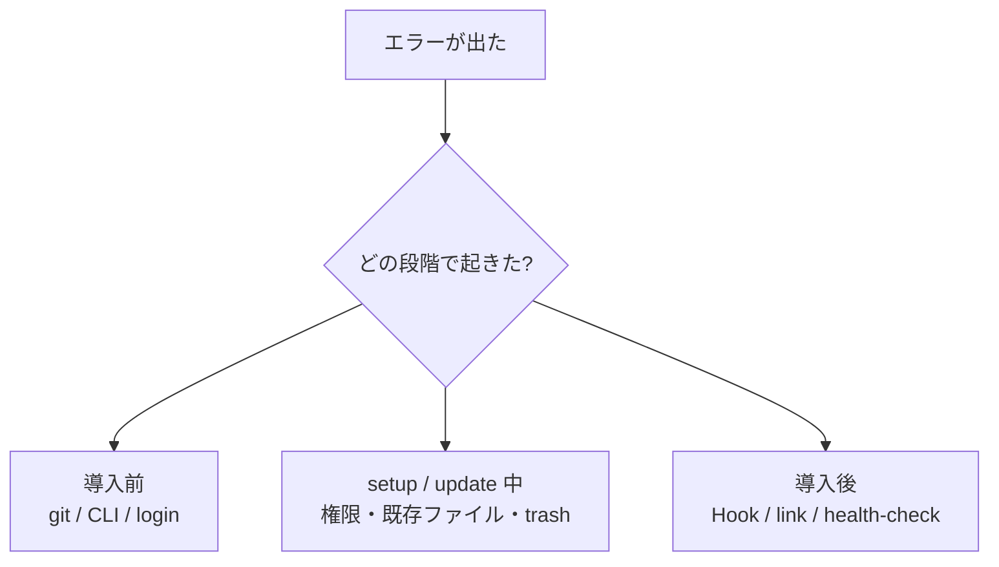

# 困ったときの見方

> [!IMPORTANT]
> あわてて削除や上書きをしないでください。
> この repo では、まず **原因を読み解き、次に一番小さい安全策を打つ** のが基本です。

## このページの役割

- **読者:** `setup.sh`、`update.sh`、`uninstall.sh`、各種スケジュール登録で失敗した人
- **読み終えると分かること:** エラーの意味、まず何を確かめるか、安全な再試行の順番

## まずはこの順で確認

1. **どの段階で失敗したか**
   導入前なのか、setup 中なのか、導入後なのかで見る場所が違います。
2. **既存ファイルは残っているか**
   この repo は破壊的に置換しない方針なので、慌てて復旧作業を始める前に状態を確認します。
3. **最小の次の一手は何か**
   いきなり全部やり直すより、足りない前提だけ直して再実行した方が安全です。
4. **必要なら dry run**
   `AI_AGENT_DRY_RUN=1` を付けると、変更せずに予定だけを確認できます。

## 失敗箇所の見分け方



## よくあるエラーと意味

| エラーや症状 | 何が起きているか | 最初にやる安全な一手 |
|---|---|---|
| `command not found: git` | Git が入っていない | Git を入れてから再実行する |
| `missing required LLM CLI(s): ...` | `claude` / `codex` / `gemini` / `copilot` のいずれかが未導入 | 不足分をインストール・ログインする |
| GitHub authentication failed | GitHub 認証が未完了、または権限不足 | GitHub へログインできているか確認する |
| `target exists but is not a git repository` | 置きたい場所に別フォルダがある | 中身を確認し、必要なら安全に退避する |
| `path already exists` | リンク先に同名のファイルやフォルダがある | 何がぶつかっているか確認する |
| `permission denied` / `operation not permitted` | 設定先や状態保存先へ書き込めない | ホーム配下で実行しているか確認する |
| `trash is required for safe uninstall` | 安全な削除用コマンドがない | `trash` を導入してから再試行する |
| `config repository has local changes` | 更新対象 repo に未保存の変更がある | 変更内容を確認し、退避かコミットを決める |
| `not a git repository` | `update.sh` の対象が Git repo ではない | 正しい clone 先を確認する |
| `copilot-instructions.md` が見つからない | `~/.copilot` 側の global link か、この repo の tracked file が欠けている | `sh scripts/setup.sh` を再実行し、`.github/copilot-instructions.md` も確認する |
| `launchctl` / `systemctl` scheduling failed | 定期実行登録だけ失敗した | まずは手動コマンドで運用を継続する |
| Hook が効かない | Hook 設定や Skill リンクが壊れている可能性 | `health-check.sh` で Hook 行を確認する |
| `health: warn` | 動くが、確認すべき弱点がある | 警告行を1つずつ解消する |
| `health: fail` | 前提が崩れていて診断の土台が足りない | Git / repo / state file の存在を優先確認する |

## 特に詰まりやすい場面

### 1. CLI が足りない

`setup.sh` は既定で Claude Code / Codex / Gemini CLI / Copilot CLI の4つを前提確認します。
まだ全部は入れない方針なら、意図を持って次のように進めます。

```sh
AI_AGENT_REQUIRE_LLM_CLIS=0 sh scripts/setup.sh
```

### 2. Hook が起動しない

確認ポイントは次の順です。

1. `sh scripts/health-check.sh`
2. `~/.codex/hooks.json`、`~/.claude/settings.json`、`~/.gemini/settings.json`、`~/.copilot/settings.json` に managed Hook が入っているか
3. `~/.agents/skills/refinment` のリンクがあるか
4. 必要なら `AI_AGENT_DRY_RUN=1 sh scripts/setup.sh` で予定を再確認してから再実行

### 3. update が止まる

`update.sh` は「手元の変更を守る」ため、作業ツリーが汚れていると止まります。
これは故障ではなく、安全装置です。

## エラー時の返し方の型

問題を説明する側になったときは、次の順で書くと伝わりやすくなります。

1. **何が起きたか**
   例: 「Git が見つからないため、リポジトリを取得できません。」
2. **ファイルは壊れていないか**
   例: 「この時点では既存設定はまだ変更されていません。」
3. **次にやる1手**
   例: 「Git を導入して、同じコマンドを再実行してください。」

## やってはいけない対処

- `rm` で消す
- 権限エラーの意味を確かめずにシステム領域へ手を出す
- `health: warn` を「全部壊れている」と誤解して総入れ替えする
- update 失敗時に、未保存変更を確認せず `git pull` を重ねる

## 迷ったら

```sh
AI_AGENT_DRY_RUN=1 sh scripts/setup.sh
sh scripts/health-check.sh
```

この2つで、「何が起きるはずか」と「いま何が不足しているか」をかなり切り分けられます。
