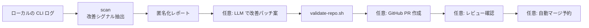

# Skill 改善の自動化

> [!NOTE]
> これは **任意機能** です。
> まずは `setup.sh` と `health-check.sh` を普通に回せる状態を作り、そのあと必要なら導入してください。

## このページの役割

- **読者:** 日々の CLI 利用ログから、「どの Skill を改善するとよさそうか」を自動で拾いたい人
- **読み終えると分かること:** 何が自動化されるのか、どこまでローカルで閉じるのか、どの段階で GitHub PR へ進むのか

## 一言でいうと

**利用ログをそのまま外へ出さずに、改善のヒントだけを匿名化してレポートや PR に変える仕組み** です。

## 全体像



## ここで大事な前提

| 項目 | 結論 | 理由 |
|---|---:|---|
| ログの定期チェック | できる | ログは各ユーザー PC 上にあるため |
| GitHub Actions だけでログ収集 | できない | GitHub-hosted runner は各ユーザー PC のローカルログを読めないため |
| 匿名化レポート作成 | できる | `skill-improvement-bot.py` がローカルで処理するため |
| PR 作成 | 条件付きでできる | `gh` が使え、GitHub 認証が通る場合 |
| レビュー対応や自動マージ | 条件付きでできる | レビュー状態・競合・チェック結果を満たす場合のみ |

## 安全設計

- **生ログはコミットしない**
  GitHub に上がる対象は、匿名化された提案レポートだけです。
- **秘密情報は伏せる**
  API key、token、メールアドレス、長いハッシュなどは redaction 対象です。
- **PR 化は opt-in**
  `AI_AGENT_IMPROVEMENT_CREATE_PR=1` を付けたときだけ PR を作ります。
- **自動マージはさらに opt-in**
  `AI_AGENT_IMPROVEMENT_AUTO_MERGE=1` を付けた場合だけ、条件確認後に予約します。
- **外部 LLM 利用も opt-in**
  `AI_AGENT_IMPROVEMENT_LLM` を指定したときだけ、改善パッチ案の自動生成に進みます。

> [!IMPORTANT]
> 高プライバシーモードでは、スニペット入りレポートをそのまま PR 化しないよう止めます。
> ローカル確認用の詳細と、GitHub へ出す内容は分けて考える設計です。

## 4段階で使える

| 段階 | 何をするか | こんな時に向く |
|---|---|---|
| 1. **見るだけ** | ログを読み、改善候補を表示する | まず傾向だけ知りたい |
| 2. **レポート化** | ローカルに匿名化レポートを作る | 定期的に棚卸ししたい |
| 3. **PR 化** | GitHub に改善提案 PR を出す | チームでレビューしたい |
| 4. **レビュー追従** | 既存 PR のレビュー状態を見て、必要なら追従する | 運用を半自動化したい |

## よく使うコマンド

### 改善候補を一覧で見る

```sh
python3 scripts/skill-improvement-bot.py scan
```

### JSON で見る

```sh
python3 scripts/skill-improvement-bot.py scan --json
```

### レポートを作る

```sh
python3 scripts/skill-improvement-bot.py run
```

### PR を作る

```sh
AI_AGENT_IMPROVEMENT_CREATE_PR=1 \
python3 scripts/skill-improvement-bot.py run
```

> [!TIP]
> PR 化に進む前に、`gh auth status` が通ることを確認しておくと詰まりにくくなります。

### 既存 PR のレビュー状態を見る

```sh
python3 scripts/skill-improvement-bot.py review-pr <PR_NUMBER>
```

### レビュー追従と自動マージ予約まで行う

```sh
AI_AGENT_IMPROVEMENT_APPLY_REVIEW=1 \
AI_AGENT_IMPROVEMENT_AUTO_MERGE=1 \
python3 scripts/skill-improvement-bot.py review-open-prs
```

## 定期実行

推奨は **1日1回** です。

| 選択肢 | 設定 | 用途 |
|---|---|---|
| 1日1回 | `AI_AGENT_IMPROVEMENT_CADENCE=daily` | 通常運用 |
| 12時間ごと | `AI_AGENT_IMPROVEMENT_CADENCE=twice-daily` または `12h` | 更新頻度が高い時期 |
| 1週間ごと | `AI_AGENT_IMPROVEMENT_CADENCE=weekly` | PR 頻度を抑えたい |
| 手動のみ | `AI_AGENT_IMPROVEMENT_CADENCE=manual` | 必要な時だけ回したい |

dry run:

```sh
AI_AGENT_DRY_RUN=1 sh scripts/schedule-skill-improvement.sh
```

通常導入:

```sh
AI_AGENT_IMPROVEMENT_CADENCE=daily sh scripts/schedule-skill-improvement.sh
```

PR 作成まで自動化:

```sh
AI_AGENT_IMPROVEMENT_CREATE_PR=1 \
AI_AGENT_IMPROVEMENT_LLM=claude \
AI_AGENT_IMPROVEMENT_CADENCE=daily \
sh scripts/schedule-skill-improvement.sh
```

## まず覚える変数

| 変数 | 役割 |
|---|---|
| `AI_AGENT_IMPROVEMENT_CREATE_PR` | `1` で改善提案 PR を作る |
| `AI_AGENT_IMPROVEMENT_LLM` | `claude` / `codex` / `gemini` のいずれかで改善案を作る |
| `AI_AGENT_IMPROVEMENT_APPLY_REVIEW` | `1` でレビュー追従を試みる |
| `AI_AGENT_IMPROVEMENT_AUTO_MERGE` | `1` で条件成立時に自動マージ予約を行う |
| `AI_AGENT_IMPROVEMENT_CADENCE` | 定期実行の頻度を決める |
| `AI_AGENT_IMPROVEMENT_INCLUDE_SNIPPETS` | ローカルレポートに短い匿名化スニペットを含める |
| `AI_AGENT_IMPROVEMENT_PRIVACY_MODE` | PR 化の安全度を調整する |

## 何を「改善シグナル」と見なすか

この bot は、何でもかんでも改善提案にするわけではありません。

1. Skill 名や Skill パスに近い話題がログに出る
2. そのあとに「修正」「漏れ」「足りない」「fix」「missing」などの再作業シグナルが続く
3. それを `activation`、`validation`、`formatting`、`privacy` などの種類に分ける
4. 生ログではなく、抽象化した提案に変える

つまり、**「使っていて実際に詰まった点」だけを拾うための仕組み** です。

## どんな人に向いているか

- Skill 改善を場当たりではなく、ログ起点で回したい人
- 改善提案を PR として残したい人
- 個人の試行錯誤を、チームの再利用知に変えたい人

## 向いていない使い方

- 生ログをそのまま GitHub に上げたい
- いきなり完全自動マージまで任せたい
- まだ setup や health-check が安定していない段階で導入したい

## 関連ページ

- 通常の導入と日常運用: [getting-started.md](./getting-started.md)
- 失敗時の見方: [setup-error-guide.md](./setup-error-guide.md)
- root 手順書: [setup.md](../setup.md)
