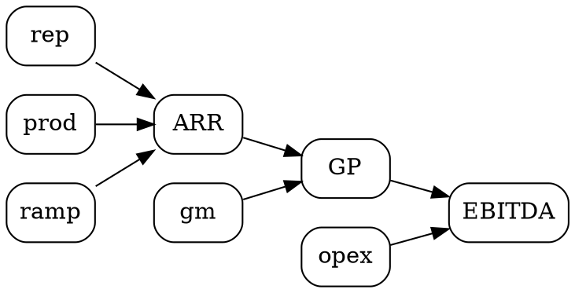

## このドキュメントの位置づけ

- **正本 (SSoT)**: 「変数の置き方」「driver tree decomposition」「top-down vs bottom-up triangulation」「epistemic confidence tier」「sensitivity / tornado」「driver DAG」「hard-code 排除」は本書を canonical とする。`02_saas_metrics` / `03_business_models` は metric の **定義式** を、`09_market_sizing` は **TAM 計算** を、`09_DCF § Sensitivity` は **xlsx 上の sensitivity sheet 実装** を canonical とするが、本書はそれらを **「変数 → driver → defense」の方法論として束ねる正本** である。
- **Routing**: [`_master_decision_tree.md §C 4 段ゲート`](_master_decision_tree.md) の Stage A (TAM / Top-down) と Stage B (Bottom-up sales) の両方の justification は本書 §3 の triangulation protocol を満たすこと。Quick mode (Mode = quick) でも leaf driver の **source_tier** annotation は省略不可。Standard / Comprehensive mode では §5 Justification Matrix と §6 Tornado を全 critical variable に必須適用する。
- **Self-review**: 本書に従って driver tree を構築したあと、[`_self_review_protocol.md §8`](_self_review_protocol.md) の check 1-10 に追加する **新 check 11-15** (driver tree completeness / top-down × bottom-up triangulation / tornado top driver / no floating leaves / DAG no cycles) を必ず実行する。本書 §9.2 を参照。
- **関連 reference**: `02_saas_metrics` (metric 定義) / `03_business_models` (業態別 driver tree の出発点) / `09_market_sizing` (TAM × penetration の Top-down 経路) / `09_DCF § Sensitivity` (sensitivity sheet implementation、本書 §6 で tornado 拡張) / `15_input_schema` (各 leaf に `source_tier` / `range` / `driver_parents` を追加: 本書 §9.1) / `18_customer_value_and_pricing` (pricing driver の justification) / `21_metric_benchmarks` (benchmark を per-driver で query) / `_benchmark_protocol` (Tier 1-4 source 規律) / `_master_decision_tree` (Stage 判定 × driver triangulation) / `_self_review_protocol` (新 check 11-15)。

> 用語注: 本書では「Operating System」「OS」表記を避け、「処理系」「経営の仕組み」「pricing 体系」と表現する (個人ルール、`MEMORY.md` 参照)。時系列の数値データは原則として markdown table に揃える。
>
> 出典規律: 全 driver の value / range / source は **`_benchmark_protocol`** の Tier 1-4 規律に従い、本文または `15_input_schema` の `source_url` field に一次出典を併記する。レンジが分かれる場合は **平均化せずレンジで提示** し、推奨は中央値ではなく **保守側 (悲観側)** を採用する (`15_input_schema §1.4` 規律と整合)。
>
> 範囲外: metric の formula 詳細 (NRR / Magic Number / Burn Multiple) は `02_saas_metrics` を canonical、TAM の計算 step は `09_market_sizing` を canonical、sensitivity sheet の cell layout は `09_DCF § Sensitivity` を canonical、Excel 命名規則・named range・色は `_named_ranges` / `_design_consistency_rules` を canonical とし、本書では触れない。

---

# 22. Driver-Based Modeling — 「変数の置き方」「driver tree」「triangulation」「sensitivity / tornado」の正本

> 本ドキュメントは、財務モデリングにおいて **最も上流の規律**、すなわち「どの変数を leaf に置き、どの変数を formula で従属化するか」「driver tree をどう設計するか」「top-down と bottom-up を triangulation でどう一致させるか」「各 driver にどの epistemic tier を付け、どの range で振るか」「tornado / sensitivity でどの driver が thesis を支配するかをどう示すか」を定義する **assumption defense の正本** である。
>
> **対象読者**: Claude (xlsx 15a–15c 系 sheet 生成エージェント、IC memo の "Assumption Defense" / "Driver Tree" / "Tornado" section を書くエージェント、`build_model.py` で input schema をパースし leaf driver と中間 formula を組み立てるエージェント)、それを review する人間バンカー / VC partner / founder。
>
> **Scope (INCLUDE)**: driver tree canonical methodology (root / intermediate / leaf, MECE, multiplicative or additive, single owner per leaf, no leaf without source, no floating leaves)、業態別 driver tree (SaaS B2B / Marketplace / D2C / Fintech Lending / Hardware / Bio / AI Foundation Model)、top-down × bottom-up triangulation protocol (TAM × penetration 経路、Macro × industry 経路、Comp 経路、Sales-driven 経路、Cohort-driven 経路、Capacity-driven 経路、reconciliation workflow)、epistemic confidence tier (Tier 1-4 定義、80/20 rule、tier escalation path、`source_tier` annotation in input schema)、justification matrix (per-variable entry、range generation rule、sensitivity rank)、sensitivity / tornado protocol (single-variable / two-variable / tornado / Monte Carlo)、driver DAG (cycle detection / critical path)、hard-code 排除 workflow (検出 / migration recipe)、`15_input_schema` 拡張提案、`_self_review_protocol §8` の新 check 11-15、`09_DCF § Sensitivity` の tornado 拡張、`_master_decision_tree §C` 4 段ゲート連携、`21_metric_benchmarks` / `_benchmark_protocol` の per-driver query 規律、mini case (Series A SaaS / Marketplace take rate / AI token decomposition / D2C CAC sensitivity / Hardware capacity / 失敗事例 hard-code / Multi-segment driver tree)、anti-patterns (goal-seeking, 5x growth, hard-code 中継, top-down only, Tier 4 dominant, sensitivity ±5%, floating leaves, circular reference)、xlsx 統合 (`15_Driver_Tree`, `15a_Driver_DAG`, `15b_Justification_Matrix`, `15c_Tornado` の新シート候補)、Python helper code (DriverNode / DriverTree / check_triangulation / compute_tornado)。
>
> **Scope (EXCLUDE — 別 reference 担当)**:
>
> | 領域 | 担当 reference | 本書の扱い |
> |---|---|---|
> | metric formula 詳細 (ARR / MRR / NRR / Magic Number / Burn Multiple / Rule of 40) | `02_saas_metrics` | 触れず。本書 §2.3.1 で SaaS driver tree の **decomposition 構造のみ** 示し、formula は逆参照。 |
> | TAM / SAM / SOM の計算 step、bottom-up TAM 推定の data source | `09_market_sizing` | 触れず。本書 §3.2 で「TAM × penetration × share」の **triangulation 経路の 1 つとして使う** に留める。 |
> | sensitivity sheet の cell layout / Excel formula / named range | `09_DCF § Sensitivity` | 触れず。本書 §6 は **方法論** (tornado / Monte Carlo) のみ。実装は §12.2 で逆参照。 |
> | input schema の field 名 / 型 / default / Quick-Standard-Comprehensive mode 切替 | `15_input_schema` | 触れず。本書 §9.1 で **拡張提案 (source_tier / range / driver_parents の追加)** のみ。 |
> | 各業態の P/L 構造、cost structure、unit economics 詳細 | `03_business_models` / `16_cost_structure` / `18_customer_value_and_pricing` | 触れず。本書 §2.3 は **driver tree skeleton** のみ。 |
> | benchmark 値 (P25 / P50 / P75 の数値) | `21_metric_benchmarks` | 触れず。本書 §9.5 で **per-driver granularity で query** する規律のみ示し、数値は逆参照。 |
> | Tier 1-4 source 分類の詳細運用、citation 規律 | `_benchmark_protocol` | 触れず。本書 §4 は Tier 定義の引用と driver tree 上での適用のみ。 |
> | Excel 名前付き範囲、color, font, sheet naming | `_named_ranges` / `_design_consistency_rules` | 触れず。本書 §12 は新シート候補の **目的と内容** のみ示す。 |
>
> **数値の出典**: 本文中に明示。Bessemer Cloud Index、a16z growth team blog、SaaS Capital、Damodaran NYU Stern、Pitchbook、CB Insights、Pavilion (旧 Sales Hacker)、ChartMogul、Klipfolio benchmark、IFRS / ASC、ScaleVP、OpenView、TechCrunch、Forbes、各社 IR (10-K / 有価証券報告書)。primary source URL と観測時点を併記する。レンジが分かれる場合は **平均化せずレンジで提示** する。
>
> **思想的継承**: 本書の方法論は、IB (Goldman Sachs / Morgan Stanley / J.P. Morgan の equity research・M&A modeling 規律)、Damodaran NYU Stern (valuation の "narrative and numbers" 哲学)、Bessemer Venture Partners (cloud businesses の driver-based forecasting に関する thought leadership)、a16z (growth team の cohort-driven modeling)、McKinsey (driver tree / value driver 概念の起源)、BCG (issue tree)、Bain (sensitivity と tornado の運用) の合流点に位置づける。本書はこれらの実務知を **startup financial modeling の文脈で 1 本に束ね、`build_model.py` から呼び出される正本** として再構成したものである。

---

## 目次

1. [設計原則 — なぜ Driver-Based か](#1-設計原則--なぜ-driver-based-か)
2. [Driver Tree Canonical Methodology](#2-driver-tree-canonical-methodology)
3. [Top-Down vs Bottom-Up Triangulation](#3-top-down-vs-bottom-up-triangulation)
4. [Epistemic Confidence Tier System](#4-epistemic-confidence-tier-system)
5. [Justification Matrix](#5-justification-matrix)
6. [Sensitivity / Tornado Protocol](#6-sensitivity--tornado-protocol)
7. [Driver DAG (Dependency Graph)](#7-driver-dag-dependency-graph)
8. [Hard-code 排除 Workflow](#8-hard-code-排除-workflow)
9. [Integration with Existing References](#9-integration-with-existing-references)
10. [Mini Cases (実例)](#10-mini-cases-実例)
11. [Anti-patterns (避けるべき)](#11-anti-patterns-避けるべき)
12. [xlsx 統合 (skill との接続)](#12-xlsx-統合-skill-との接続)
13. [Python Helper Code](#13-python-helper-code)
14. [関連 reference との整合](#14-関連-reference-との整合)

---

<!-- WAVE 1: §1-§4 -->

## 1. 設計原則 — なぜ Driver-Based か

### 1.1 三原則: Defensibility = Decomposition + Triangulation + Citation

財務モデリングにおいて IC partner / VC partner / IB MD が **defensible** と評価する計画には、必ず次の 3 つの性質がある。

1. **Decomposition (分解)**: 全 top-line variable は **multiplicative or additive な driver の合成** に decompose されている。「ARR Y3 = ¥1B」という単一の数値ではなく、「ARR Y3 = (Existing ARR Y2 × NRR) + (New customers Y3 × ACV Y3) − (Existing ARR Y2 × Churn rate Y3)」という構造として表現される。
2. **Triangulation (三角測量)**: 全 critical variable は **少なくとも 2 つの独立した経路** で計算され、その出力が想定 tolerance 内で一致する。Top-down (TAM × penetration × share) と Bottom-up (rep × productivity × ramp) の **両方** を提示し、reconcile する。
3. **Citation (出典)**: 全 leaf driver には **Tier 1-4 source** が紐付き、source URL / 観測時点 / sample size / methodology が `15_input_schema` の `source_url` field と本文に明記される。「Tier 4 (judgment)」を選んだ場合も、その判断根拠と trip-wire (再評価 trigger) が併記される。

この 3 原則のうち 1 つでも欠けると、IC は「opaque」「unaudited」「unsubstantiated」と評価し、term sheet 提示前に DD が止まる。逆に 3 原則をすべて満たせば、たとえ一部 driver の絶対値が conservative でも、partner は「assumption が壊れた場合の影響範囲が見える」「壊れる兆候を management が把握できる」「壊れたあとも plan が re-base 可能」と判断し、conditional な投資判断 (例: milestone-based tranching) が下せる。

### 1.2 IC partner の古典 4 問

実際の IC discussion で partner が最初に投げる質問は、業態を問わずほぼ次の 4 問に収斂する。本書の方法論は **すべての問に driver tree で即座に答えられる** ように設計されている。

| 古典問 | partner の真意 | driver tree でどう答えるか |
|---|---|---|
| Q1: 「ARR Y3 = ¥1B、その内訳は?」 | top-line を decompose できているか、どの driver が dominant か把握しているか | §2 の driver tree を提示。Existing × NRR / New customers × ACV / Churn の各 component の絶対値と寄与率を即答。 |
| Q2: 「どの assumption が壊れると thesis が崩れるか?」 | risk awareness、management focus が正しい driver に向いているか | §6 の tornado chart 上位 5 driver を提示。それぞれの「壊れる scenario」と「壊れた場合の Y3 ARR への impact (¥M)」を即答。 |
| Q3: 「Top-down と Bottom-up は一致しているか?」 | triangulation 規律、market definition の整合性 | §3 の triangulation table (top-down ¥X、bottom-up ¥Y、ratio Z) を提示。一致しない場合は reconcile した rationale を即答。 |
| Q4: 「leaf driver はどこから来たか?」 | citation 規律、Tier 4 (judgment) の依存度 | §5 の justification matrix を提示。Tier 1-4 mix の % を即答 (例: Tier 1-2 が 78%、Tier 3 が 15%、Tier 4 が 7%)。 |

### 1.3 Hard-code は opaque、driver tree は transparent

「Hard-code」とは leaf driver でない cell (中間 / top-line) に直接 literal numeric value を書き込むことを指す。例えば `ARR_Y3 = 1000` と直接書く、`Y2_revenue = Y1_revenue * 1.5` のように比率を hard-code する、`new_customers_y2 = AVERAGE(50, 60, 70)` のように formula 風の hard-code を埋め込む、などである。

Hard-code は次の 4 つの問題を持つ。

1. **Audit 不能**: その値の source / methodology / range が cell から読み取れず、IC review で "where does this number come from?" に答えられない。
2. **Sensitivity 不能**: tornado / scenario / Monte Carlo を回しても、hard-code されている driver は振れず、output の uncertainty が過小評価される。
3. **Update 不能**: market 変化 / pilot data 更新 / pricing 改定が起きたときに、影響範囲が追跡できず、model の age と共に diverge する。
4. **Re-base 不能**: trip-wire が発動して assumption を更新する場合、hard-code は何を置き換えればよいかの logical link がない。

対して driver tree は次の性質を持つ。

1. **Audit 可能**: 全 leaf に `source_tier` / `source_url` / `source_note` が紐付き、cell 値と source が 1:1 対応する。
2. **Sensitivity 可能**: leaf driver の low / mid / high が `15_input_schema` の `range` field に定義され、`09_DCF § Sensitivity` sheet と `15c_Tornado` sheet が自動 propagate する。
3. **Update 可能**: 1 leaf driver の value を変えると、DAG の downstream が一斉に再計算される。
4. **Re-base 可能**: trip-wire 発動時、置き換える対象 leaf が `15_input_schema` の field 名で特定でき、影響範囲が DAG topology から事前に把握できる。

### 1.4 Mind-share rather than data-share という anti-pattern

業界比較において、未熟な founder / analyst が陥る典型的 bias が **「mind-share rather than data-share」** である。これは「Slack が ¥10B ARR を 4 年で達成した」「Notion が 4M users を 2 年で獲得した」のような **記憶に強く残る (mind-share の高い) anecdotal benchmark** を、自社の calc の anchor として使ってしまう pattern を指す。

問題点:

1. Slack / Notion / Stripe / OpenAI のような **outlier (>P95)** だけが mind-share に残り、median (P50) や P25 の data は記憶に残らない。
2. その結果、自社の plan を「Slack pace で growth」と置くと、それは P50 ではなく **P95 ペースで growth** を想定していることになり、IC partner は immediately "this assumes top-decile execution; is your team in the top decile?" と返す。
3. driver-based modeling では、`21_metric_benchmarks` から **業態 × Stage × geography の P25/P50/P75 を per-driver で query** し、自社 leaf に対応させる (`_benchmark_protocol §3`)。これにより mind-share bias が automatic に排除される。

> **規律**: 全 leaf driver は、`21_metric_benchmarks` の per-driver benchmark から **median (P50) を default に取り**、median を上回る (例: P75 を assume する) 場合は **その execution edge の根拠** を `source_note` に書く (例: "founder は前職 X 社で同 metric の P90 を達成、execution edge を継承"; Tier 3 internal data 引用)。

### 1.5 Quick / Standard / Comprehensive Mode 適用

`15_input_schema §1.1` の 3 mode と本書の関係:

| Mode | driver tree depth | per-leaf source_tier 必須? | triangulation 必須? | tornado 必須? |
|---|---|---|---|---|
| Quick | 2-3 層 (root + 中間 1-2 + leaf) | ◯ (簡易: Tier 番号のみ) | △ (top-line のみ 1 経路、source 引用必須) | △ (top 3 driver のみ list) |
| Standard | 3-4 層 | ◯ (Tier + source URL) | ◯ (top-line + 主要 segment で 2 経路) | ◯ (top 5-10 driver) |
| Comprehensive | 4-5 層 | ◯ (Tier + URL + methodology + sample size) | ◯ (全 critical variable で 2 経路) | ◯ (top 10 driver、+ Monte Carlo optional) |

> Quick mode でも `source_tier` annotation は省略不可 (本書 §4.3)。Quick mode は **省略する driver の数を減らす** ことで時間短縮するのであって、defensibility を犠牲にするモードではない。

### 1.6 思想史的位置づけ (3 系統の合流)

本書の方法論は次の 3 つの実務知の合流点にある。歴史と思想を理解しておくと、なぜこの 3 原則 (decomposition / triangulation / citation) なのかが腹落ちする。

**(a) IB equity research / M&A modeling (1980s-)**: Goldman Sachs / Morgan Stanley / J.P. Morgan の equity research analyst は、1980 年代から「revenue build-up」「driver-based projections」を慣習として確立してきた。Wall Street の sell-side model はほぼ全て driver tree 構造で、leaf に operational metric (units / ASP / take rate / ARPU / NIM 等) を置き、上に向かって revenue を build up する。M&A modeling では更に厳格で、各 leaf に historicals 5 年 + projection 5 年の cell を持ち、source を footnote 化する規律がある。

**(b) Strategy consulting issue tree (McKinsey / BCG / Bain, 1960s-)**: McKinsey の "MECE principle" (Mutually Exclusive, Collectively Exhaustive、Barbara Minto の "Pyramid Principle" 1981 で公式化) と "issue tree" は、driver tree の祖型である。BCG の "value driver tree" は財務指標を operational driver に decompose する point で本書の §2 と直接連続する。Bain の sensitivity / tornado 運用は §6 の祖。

**(c) VC growth team の cohort-driven modeling (2010s-)**: a16z の growth team (Andrew Chen らが主導)、Bessemer Cloud Index、SaaS Capital、ChartMogul の発信が、特に SaaS の cohort-based forecasting (cohort retention curve × cohort ARPU × cohort acquisition cost) を driver tree に組み込む方法論を一般化した。Tomasz Tunguz (Redpoint)、Jason Lemkin (SaaStr)、David Sacks (Yammer / Craft) の blog が thought leadership の中心。

3 系統が共通して説くのは「leaf driver を decompose せよ、複数経路で triangulate せよ、source を引け」という同一の規律である。本書は 3 系統を **startup financial modeling の文脈で 1 本に束ね、`build_model.py` の生成エージェントと `_self_review_protocol §8` の audit エージェントから呼び出される正本** として再構成したものである。

### 1.7 本書を読まない場合のリスク (どこで毀損するか)

本書の規律を skip した場合、典型的に次の毀損が観測される:

1. **Term sheet 段階で IC が止まる**: partner の Q1-Q4 (§1.2) のいずれかに即答できず、follow-up DD で 2-4 週間遅延、その間に competing round が closed して valuation が下がる、もしくは round 自体が崩れる。
2. **Series A → B で plan が崩れる**: Series A 時の plan が hard-code 中心だと、Y1 actual で deviation が出たときに re-base 不能。Series B raise で同じ partner に「previous plan didn't ship; what changed in the new plan?」と問われ、答えられず discount valuation。
3. **M&A buyer-side で earn-out が miscalibrate**: hard-code された plan を earn-out target に紐づけると、market shock 時に target が hit せず、founder が earn-out forfeit。本来 driver tree で「target は driver A × driver B の関数」と表現していれば、再交渉余地が残った。
4. **Operating execution が分散**: management team が「どの driver が thesis を支配するか」を共有していないと、KPI dashboard が top-line ARR だけになり、leading indicator (pipeline coverage / win rate / NRR) を track せず、warning sign に気づけない。

本書 §6 の tornado を 1 度回せば、上記 4 リスクのほぼ全てが mitigation 可能になる。

---

## 2. Driver Tree Canonical Methodology

### 2.1 Driver Tree の定義

**Driver tree** とは、財務モデルの top-line output (root) から計算上の祖先関係を辿り、最終的に **hard-code 不可避な root variable (leaf)** まで decompose した有向木構造を指す。本節では各 node を次のように定義する。

| Node 種別 | 定義 | 例 (SaaS B2B) |
|---|---|---|
| **Root driver** | model の top-line output、IC が最終的に see する数字 | ARR (Y3), Revenue, EBITDA, EV |
| **Intermediate driver** | 中間集計、複数 child の multiplicative or additive | Revenue = Subscription + Services + Usage; New ARR = New customers × ACV |
| **Leaf driver** | 計算上それ以上 decompose しない (or しないと選択した) variable。`15_input_schema` field に対応 | win_rate_pct, sales_rep_count_y1, list_price_per_seat_jpy |

> **規律**: leaf は「decompose 不可能」ではなく「decompose しないと **選択した** 変数」である。例えば `win_rate_pct` を更に `(deal_size_segment × ICP_match × competitor_present)` のような multivariate function に分解することは技術的に可能だが、Series A 段階ではそこまでやると model の audit cost が増えすぎる。Stage と data availability に応じて、**どこを leaf にするかを意識的に選ぶ** のが modeler の craft である。

### 2.2 Tree depth の目安

Stage と Mode に応じた tree depth の目安:

| Stage / Mode | depth | leaf 数の目安 |
|---|---|---|
| Pre-Seed / Quick | 2-3 層 | 8-15 |
| Seed-A / Standard | 3-4 層 | 20-40 |
| Series B-C / Comprehensive | 4-5 層 | 50-100 |
| Pre-IPO / Public comp model | 5-6 層 | 100-200 |

Depth が深すぎる場合 (>6 層) の症状:
- 全体把握が困難、IC partner の attention span (1 page) を超える
- Tier 4 (judgment) leaf が増えすぎ、audit cost > value
- DAG cycle / floating leaves のリスク増

Depth が浅すぎる場合 (<2 層) の症状:
- driver の sensitivity が捉えられない (root - leaf 間の弾力性が分からない)
- partner の "drill-down" 質問に答えられない
- top-down と bottom-up triangulation が成立しない (両方とも root に直結してしまう)

### 2.3 Tree 設計の 5 規則

driver tree を構築するときの canonical な 5 規則:

#### 2.3.1 規則 1: MECE (Mutually Exclusive, Collectively Exhaustive)

各 layer で、children は parent を **過不足なく** decompose する。

- **Mutually Exclusive**: children 間に重複がない。例: revenue を decompose するときに `Subscription + Services` だけだと Usage が抜けるが、`Subscription + Services + Usage` の 3 つを並べるとちょうど exhaustive。
- **Collectively Exhaustive**: children の合算が parent と一致する。例: `Σ children = parent` を sanity check で検証する (本書 §8.1 の hard-code 検出と並行)。

#### 2.3.2 規則 2: Multiplicative or Additive (mixed は禁止)

各 node は、children を **乗算 (multiplicative)** か **加算 (additive)** のいずれか **1 種類** で集約する。乗算と加算を mix した式は hard-code 中継になりやすく、sensitivity の elasticity 計算が破綻する。

例: ❌ `Revenue = (Customers × ACV) + ¥50M` (50M は hard-code)
正しい修正: `Revenue = Subscription_revenue + Services_revenue` (additive) かつ `Subscription_revenue = Customers × ACV` (multiplicative)、Services_revenue は別 leaf として独立に source 付き。

#### 2.3.3 規則 3: Single Owner per Leaf

各 leaf driver は、`15_input_schema` の **1 つの field** に対応し、**1 人の owner (CEO / CFO / VPS / VPM 等)** が assumption defense に責任を持つ。複数 owner や複数 field に紐づくと、updating 時に conflict が発生する。

- 例: `win_rate_pct` の owner は VP Sales (CRM データの最終責任者)、`gross_margin_pct` は CFO、`product_release_velocity` は VP Engineering。
- IC memo の "Assumption Defense" section で、各 leaf の owner を明示する。

#### 2.3.4 規則 4: No Leaf Without Source

全 leaf には `_benchmark_protocol §2` の Tier 1-4 のいずれかが付く。Tier 4 (judgment) の場合も「なぜその judgment なのか」「どの trip-wire で再評価するか」を併記する。

- 検証手段: `_self_review_protocol §8 check 11` (driver tree completeness) で、source なし leaf を 0 件にする。

#### 2.3.5 規則 5: No Floating Leaves

`15_input_schema` 内の field は、必ず driver tree のどこかの leaf として参照される。**どの formula からも参照されない field (floating leaf)** は禁止する。

- 検証手段: `15a_Driver_DAG` sheet の edge list を grep し、`15_input_schema` の全 field が parent 側に出現するか確認 (`_self_review_protocol §8 check 14`)。

### 2.3 業態別 Driver Tree (Canonical Templates)

以下、本 skill が canonical に扱う 7 業態の driver tree を ASCII art / table で示す。業態の他の詳細 (KPI / cost structure / pricing) は `03_business_models` / `02_saas_metrics` / `16_cost_structure` / `18_customer_value_and_pricing` を逆参照。

#### 2.3.1 SaaS B2B

```
ARR (Y_n)                                              [root]
├── Existing ARR (Y_n-1) × NRR (Y_n)                   [intermediate, additive]
│   ├── Existing ARR (Y_n-1)                           [carry from prior period]
│   └── NRR (Y_n)                                      [intermediate, multiplicative]
│       ├── Gross retention rate (1 - logo churn)      [leaf]
│       ├── Expansion rate (cross-sell + upsell)       [leaf]
│       └── Contraction rate                           [leaf]
├── New ARR (Y_n)                                      [intermediate, additive]
│   └── New customers (Y_n) × ACV (Y_n)                [intermediate, multiplicative]
│       ├── New customers (Y_n)                        [intermediate, multiplicative]
│       │   ├── Sales rep count × productive months    [intermediate]
│       │   │   ├── Initial rep count (Y_0)            [leaf]
│       │   │   ├── Hire rate per quarter              [leaf]
│       │   │   └── Productive ramp curve              [leaf, table]
│       │   ├── Win rate per rep                       [leaf]
│       │   ├── Pipeline coverage ratio (3-4x)         [leaf]
│       │   └── Avg sales cycle (months)               [leaf]
│       └── ACV (Y_n)                                  [intermediate, multiplicative]
│           ├── List price per seat                    [leaf]
│           ├── Avg seats per customer                 [leaf]
│           ├── Discount rate                          [leaf]
│           └── Mix shift (SMB / Mid / Enterprise %)   [leaf, table]
└── Churn ARR (Y_n)                                    [intermediate, multiplicative]
    └── Existing ARR (Y_n-1) × Logo churn rate         [intermediate]
```

> **Source mapping (`02_saas_metrics` 逆参照)**: NRR / GRR の formula は `02 §3`、ACV / new logo は `02 §2`、Magic Number / CAC payback は `02 §5`。本書ではこれらの **decomposition 構造のみ** 規定する。

#### 2.3.2 Marketplace

```
Net Revenue                                            [root]
└── GMV × Take rate                                    [intermediate, multiplicative]
    ├── GMV                                            [intermediate, multiplicative]
    │   ├── Active buyers (Y_n)                        [intermediate, additive]
    │   │   ├── New buyers acquired (Y_n)              [leaf]
    │   │   │   ├── Acquisition spend per buyer (CAC)  [leaf]
    │   │   │   ├── Conversion rate (visit → buyer)    [leaf]
    │   │   │   └── Organic / SEO contribution         [leaf]
    │   │   └── Retained buyers (Y_n)                  [intermediate]
    │   │       ├── Prior buyers (Y_n-1)               [carry]
    │   │       └── 12-mo retention rate               [leaf]
    │   ├── Frequency (transactions / buyer / period)  [leaf]
    │   └── AOV (Average Order Value)                  [intermediate, multiplicative]
    │       ├── ASP (Average Selling Price)            [leaf]
    │       └── Items per order                        [leaf]
    └── Take rate                                      [intermediate, additive]
        ├── Marketplace fee %                          [leaf]
        ├── Advertising / promoted listings %          [leaf]
        ├── Payment processing fee %                   [leaf]
        └── Logistics / fulfillment fee %              [leaf]
```

> **Take rate decomposition の重要性**: 楽天 / Mercari / eBay / Etsy などの comp で take rate を **単一の % として hard-code** すると、competitive pressure に対する sensitivity が捉えられない。本書 §10 Case 2 で楽天 EC の take rate ~8% を 4 component に分解する具体例を示す。

#### 2.3.3 D2C

```
Revenue                                                [root]
├── New customer revenue                               [intermediate, multiplicative]
│   ├── New customers (Y_n)                            [intermediate, additive]
│   │   ├── Paid acquisition (Meta / TikTok / Google)  [intermediate, multiplicative]
│   │   │   ├── Marketing spend                        [leaf]
│   │   │   └── CAC per channel                        [leaf, table]
│   │   ├── Organic acquisition (SEO / referral)       [leaf]
│   │   └── Influencer / PR contribution               [leaf]
│   ├── First-purchase AOV                             [leaf]
│   └── First-time discount / promo rate               [leaf]
└── Repeat customer revenue                            [intermediate, multiplicative]
    ├── Repeat customers (Y_n)                         [intermediate]
    │   ├── Prior cohort × retention rate              [leaf, cohort table]
    │   └── Win-back rate (lapsed → reactivated)       [leaf]
    ├── Repeat AOV                                     [leaf]
    └── Order frequency (repeat / customer / year)     [leaf]

[Cost-side driver tree]
COGS = Units × Unit cost
   ├── Units shipped                                   [from revenue side]
   ├── Material cost per unit                          [leaf]
   ├── Manufacturing cost per unit                     [leaf]
   ├── Packaging cost per unit                         [leaf]
   └── Inbound logistics cost per unit                 [leaf]

CAC blended = Marketing spend / (paid + organic new customers)
   (organic は spend 0 として扱うが、new customers の母数には含める)
```

> **Cohort retention table**: D2C は単純な churn rate ではなく **cohort retention curve** で扱う必要がある (acquired in Q1 2024 cohort の M3 / M6 / M12 / M24 retention table)。`leaf, cohort table` 表記は、driver tree 上は 1 leaf だが裏に lookup table を持つことを示す。

#### 2.3.4 Fintech (Lending)

```
Net Revenue                                            [root]
├── Interest Income                                    [intermediate, multiplicative]
│   ├── Loan balance (Avg, Y_n)                        [intermediate, additive]
│   │   ├── Origination volume (Y_n)                   [intermediate, multiplicative]
│   │   │   ├── Active borrowers                       [leaf]
│   │   │   ├── Avg loan size                          [leaf]
│   │   │   └── Approval rate                          [leaf]
│   │   ├── Loan term (months)                         [leaf]
│   │   └── Prepayment rate                            [leaf]
│   └── NIM (Net Interest Margin = APR − funding cost) [intermediate, additive]
│       ├── APR (charged to borrower)                  [leaf]
│       └── Funding cost (cost of capital)             [leaf]
├── Fee Income                                         [intermediate, multiplicative]
│   ├── Origination fee %                              [leaf]
│   ├── Late fee %                                     [leaf]
│   └── Servicing fee %                                [leaf]
└── (−) Provision for loan losses                      [intermediate, multiplicative]
    └── Loan balance × Cost of risk                    [intermediate, multiplicative]
        ├── Loan balance                               [from above]
        └── Cost of risk (annualized, vintage curve)   [leaf, table]
            ├── PD (Probability of Default)            [leaf]
            ├── LGD (Loss Given Default)               [leaf]
            └── EAD (Exposure At Default)              [leaf]
```

> **Vintage analysis**: lending では cohort = vintage と呼び、各 vintage の cumulative loss curve (M6 / M12 / M24 / M36) を table で扱う。Cost of risk は単一 % ではなく vintage curve から導出する。

#### 2.3.5 Hardware

```
Revenue                                                [root]
├── Product Revenue                                    [intermediate, multiplicative]
│   ├── Units shipped (Y_n)                            [intermediate, multiplicative]
│   │   ├── Production capacity (units / month)        [leaf]
│   │   ├── Capacity utilization rate                  [leaf]
│   │   ├── Yield rate (good units / total)            [leaf]
│   │   └── Demand fulfillment %                       [leaf]
│   └── ASP per unit (Y_n)                             [intermediate, additive]
│       ├── List price                                 [leaf]
│       ├── Channel discount                           [leaf]
│       └── Mix shift (SKU mix %)                      [leaf, table]
└── Service / Recurring Revenue                        [intermediate, multiplicative]
    ├── Installed base (Y_n)                           [intermediate, additive]
    │   ├── Cumulative units shipped (Y_0..Y_n)        [carry]
    │   └── Decommission rate                          [leaf]
    ├── Service attach rate                            [leaf]
    └── Service ARPU per unit / year                   [leaf]
```

> **Bottleneck identification**: capacity / utilization / yield のうち **最小値** が実 units を支配する (Theory of Constraints)。本書 §10 Case 5 で Hardware の bottleneck identification を tornado で示す。

#### 2.3.6 Bio (Drug development)

```
Probability-weighted Revenue (NPV)                     [root]
├── Phase progression probability                      [intermediate, multiplicative]
│   ├── Phase 1 → Phase 2 success rate                 [leaf, BIO industry data]
│   ├── Phase 2 → Phase 3 success rate                 [leaf]
│   ├── Phase 3 → FDA approval rate                    [leaf]
│   └── (post-launch) market access / reimbursement    [leaf]
└── Conditional Peak Revenue (if approved)             [intermediate, multiplicative]
    ├── Eligible patient population                    [intermediate, multiplicative]
    │   ├── Disease prevalence (per 100k)              [leaf, epidemiology data]
    │   ├── Diagnosis rate                             [leaf]
    │   └── Eligibility criteria match %               [leaf]
    ├── Penetration rate at peak                       [intermediate, additive]
    │   ├── Efficacy advantage vs SoC                  [leaf, clinical trial]
    │   ├── Competition (number of approved drugs)     [leaf]
    │   └── Marketing / sales force investment         [leaf]
    ├── Annual treatment cost (price)                  [intermediate, additive]
    │   ├── List price per patient / year              [leaf]
    │   └── Rebate / discount %                        [leaf]
    ├── Compliance / persistence rate                  [leaf]
    └── Patent life (years of exclusivity)             [leaf]
```

> **Pre-approval valuation**: phase progression probability と peak revenue の積で NPV を取る (risk-adjusted NPV, rNPV)。BIO industry の phase 1→2 success rate は 約 50%、phase 2→3 約 28%、phase 3→approval 約 50-60%、cumulative approval rate は化合物クラスにより 5-15% (出典: BIO / Biomedtracker / Amplion による industry-wide analysis、観測時点 2010-2020)。

#### 2.3.7 AI / Foundation Model

```
Revenue                                                [root]
├── API Revenue                                        [intermediate, multiplicative]
│   ├── Active API customers                           [intermediate, additive]
│   │   ├── New API signups                            [leaf]
│   │   └── Retained API customers                     [leaf]
│   ├── Tokens consumed per customer / month           [leaf]
│   └── Price per 1M tokens (input + output)           [leaf, table by model]
├── Subscription Revenue (consumer / ChatGPT-style)    [intermediate, multiplicative]
│   ├── Subscribers                                    [intermediate, additive]
│   │   ├── New subscribers                            [leaf]
│   │   └── Retention rate                             [leaf]
│   └── ARPU (subscription tier mix)                   [leaf, table]
└── Enterprise Contract Revenue                        [intermediate, multiplicative]
    ├── Enterprise customer count                      [leaf]
    ├── ACV (Average Contract Value)                   [leaf]
    └── Custom model / fine-tuning premium             [leaf]

[Cost-side critical drivers (AI specific)]
COGS = Inference cost + Training amortization
   ├── Tokens served × cost per token                  [intermediate]
   │   ├── GPU hours required                          [leaf]
   │   ├── GPU price per hour (cloud or owned)         [leaf]
   │   └── Inference efficiency (tokens / GPU hour)    [leaf]
   └── Training cost amortized (Y_n)                   [intermediate]
       ├── Total training run cost                     [leaf]
       └── Amortization period (months)                [leaf]
```

> **AI economics の特殊性**: COGS が **token consumption に直接連動** するため、API price / token cost の gap が gross margin の主要 driver になる。SaaS と異なり gross margin が customer 数の増加と共に **改善せず**、むしろ heavy users が GM を圧迫するケースもある (`16_cost_structure §AI` 逆参照)。

### 2.4 業態 mix の場合 (multi-segment)

複数業態を持つ会社 (例: SaaS + Marketplace、SaaS + Hardware、Lending + Payment) の場合、driver tree を **per-segment で独立に build し、root 直下で additive に集約** する。`20_multi_segment_modeling §3` の per-segment 3-statement 構造と整合させる。

```
Total Revenue (Group, Y_n)                             [root, additive]
├── Segment A Revenue (e.g., SaaS)                     [§2.3.1 の tree]
├── Segment B Revenue (e.g., Marketplace)              [§2.3.2 の tree]
└── Segment C Revenue (e.g., Hardware)                 [§2.3.5 の tree]
```

> Inter-segment elimination が必要な場合は `20_multi_segment_modeling §4` 参照。本書では segment 間 overlap leaf (例: shared sales rep が複数 segment に貢献) の取扱を §10 Case 7 で扱う。

---

## 3. Top-Down vs Bottom-Up Triangulation

### 3.1 Two-Route Principle

driver-based modeling の **三角測量原則 (triangulation principle)**: critical variable (top-line revenue / 主要 segment revenue / 主要 cost driver) は **少なくとも 2 つの独立した経路** で計算し、両 route の output が **±50% 以内** で一致することを要件とする。

「独立した経路」とは、**leaf driver の集合が overlap しない** か、overlap しても各 route が独立に検証可能であることを意味する。例えば:
- top-down (TAM × penetration × share) の leaf は `TAM`, `penetration_pct`, `market_share_pct`
- bottom-up (rep × productivity × ramp) の leaf は `rep_count`, `productivity_per_rep`, `ramp_curve`

両 route の leaf は完全に異なる data source (top-down は market research, bottom-up は internal pipeline) を引いており、独立に audit 可能である。

### 3.2 Top-Down Approach (3 経路)

#### 3.2.1 経路 A: TAM × penetration × share

最も古典的な top-down 経路。`09_market_sizing` の TAM 算定を起点とする。

```
Revenue (Y_n) [top-down] = TAM (Y_n) × Penetration_pct (Y_n) × Market_share_pct (Y_n)
```

各 leaf の Tier:
- `TAM`: Tier 1 (Gartner / IDC / Statista) or Tier 2 (analyst report)
- `Penetration_pct`: Tier 2-3 (technology adoption curve, S-curve fit)
- `Market_share_pct`: Tier 3-4 (positioning hypothesis)

> **規律**: TAM definition の **boundary** が triangulation の質を決める。「global SaaS TAM」は意味が無く、「Japan mid-market HRTech SaaS TAM, defined as companies with 100-1000 employees that buy commercial HRTech, average annual spend ¥X」のように **boundary を 4-5 句で限定** する (`09_market_sizing §2.3`)。

#### 3.2.2 経路 B: Macro × industry share × company share

GDP / industry size を起点とする経路。Bio / Hardware / Fintech の regulated industry で有効。

```
Revenue (Y_n) [top-down] = Industry_total_spend (Y_n) × Sub-industry_share × Company_share
```

例: Japan health insurance market の Y3 spend ¥5T × 健康増進 sub-segment share 0.1% × company share 5% = ¥250M。

#### 3.2.3 経路 C: Comparable company multiplier

公開可能な comp の同 stage revenue を anchor にする経路。

```
Revenue (Y_n) [top-down] = Comp_revenue (at same vintage) × Adjustment_factor
```

例: Comp X (Series B same year) の revenue ¥800M × adjustment factor 0.7 (TAM 小、execution edge -) = ¥560M。

> **Comp の選び方**: Bessemer Cloud Index / Pitchbook / CB Insights から geography / vertical / business model を match させた 3-5 社を anchor とし、平均ではなく **median + range** を取る。

### 3.3 Bottom-Up Approach (3 経路)

#### 3.3.1 経路 D: Sales-driven (rep × productivity × ramp)

最も典型的な bottom-up。Series A SaaS B2B の主流。

```
New ARR (Y_n) [bottom-up] = Σ(t=1..12) [Active_reps(t) × Productivity_per_rep(t) × Ramp(t)]
```

各 leaf:
- `Active_reps(t)`: hire plan から積上 (initial reps + cumulative hires − attrition)
- `Productivity_per_rep`: ramped quota (例: ¥30M / rep / year)
- `Ramp(t)`: hire からの月数に応じた productivity %、典型的には M0-3: 0%, M4-6: 30%, M7-9: 60%, M10-12: 90%, M13+: 100%

#### 3.3.2 経路 E: Cohort-driven (D2C / Marketplace の主流)

```
Revenue (Y_n) [bottom-up] = Σ(cohort) [Cohort_size × Per-cohort-revenue-curve(t since acquisition)]
```

各 leaf:
- Cohort acquisition cost (CAC) と cohort size
- Cohort retention curve (M3 / M6 / M12 / M24 / M36)
- Cohort ARPU curve

> **a16z growth team thought leadership (Andrew Chen, "The cold start problem", 2021)**: marketplace / consumer は cohort-driven が必須。新規 cohort の retention が old cohorts より worse 化していないか (cohort decay) を tracking しない model は IC で却下。

#### 3.3.3 経路 F: Capacity-driven (Hardware / Bio / 物理インフラ)

```
Revenue (Y_n) [bottom-up] = Capacity (units/month) × Utilization × Yield × ASP × 12
```

bottleneck (capacity / utilization / yield のうち最小値) が effective output を支配する。本書 §10 Case 5 参照。

### 3.4 Triangulation Example: Series B SaaS

実例: Series B SaaS の Y3 ARR target を triangulate する。

| 経路 | 数値 | 計算 |
|---|---|---|
| Top-down A: TAM × penetration × share | ¥5M | TAM ¥100B × penetration 0.1% × share 5% |
| Bottom-up D: rep × productivity × ramp | ¥420M | 20 reps × ¥30M productivity × 70% ramp |
| Ratio (top-down / bottom-up) | 0.012 | 大幅に inconsistent (tolerance ±50% を超過) |

**reconciliation**:
1. TAM definition を再 audit: 「日本のみ + 50-200 employee SMB」と狭く定義していた → **mid-market + enterprise も対象** に拡張すれば TAM ¥500B、penetration 0.05%、share 5% で ¥125M。これでも bottom-up と 3 倍 gap。
2. Bottom-up を再 audit: productivity ¥30M は industry P75、own beta data は ¥18M (P50 程度) → bottom-up を ¥250M に修正。
3. Reconciled: top-down ¥125M / bottom-up ¥250M、ratio 0.5 (tolerance 内)、median ¥187M を採用。

> **学び**: triangulation の真の価値は **数値の一致** ではなく、**inconsistency が露わになることで隠れた assumption が表に出ること** にある。本例では TAM definition の狭さと productivity の楽観性の両方が露呈し、最終 plan が ¥187M (元の bottom-up ¥420M の半分以下) に reframe された。

### 3.5 Reconciliation Workflow

triangulation で gap が出た場合の標準 workflow:

```
[Step 1] Both routes calc and document
   ↓
[Step 2] Calculate ratio = top-down / bottom-up
   ↓
[Step 3] Decision branch
   ├── ratio in [0.5, 2.0]: accept, take median (or weighted average if route confidence differs)
   └── ratio outside [0.5, 2.0]: investigate
       ├── Top-down side: TAM boundary、penetration assumption、share assumption を再 audit
       ├── Bottom-up side: productivity、ramp、capacity assumption を再 audit
       └── Re-run both routes with corrected assumptions
   ↓
[Step 4] Document reconciliation rationale in IC memo
   - 元の gap、root cause、修正内容、final number、residual uncertainty
```

> **規律**: tolerance ±50% (= ratio in [0.5, 2.0]) は Series A-B の startup standard。Series C+ / public comp では ±20-30% に絞る (data availability 増のため)。

### 3.6 多重 triangulation (3 routes 以上)

特に重要な variable (top-line revenue at terminal year) では **3 経路以上** で triangulate することが望ましい。

例 (Series B AI startup, Y5 revenue):
- Top-down A (TAM × penetration × share): $300M
- Top-down C (comp adjusted: OpenAI Y5 ÷ 100 × adjustment): $240M
- Bottom-up D (sales-driven, enterprise + API mix): $280M
- Bottom-up E (cohort-driven, signups × retention × ARPU): $260M

→ 4 routes が $240-300M に収斂、median $270M を採用、IC memo で 4 routes 全てを併記。

### 3.7 Triangulation 不在の症状

triangulation を skip した model の典型症状:

1. **Top-down only**: 「TAM ¥10T の 1% を取れば ¥100B」型。bottom-up sales build がなく、how の question (rep を何人 hire するのか、win rate をどう改善するのか) に答えられない。
2. **Bottom-up only**: rep × productivity を積上げて ¥100B、しかし TAM が ¥50B しかない (penetration 200%) という矛盾を見過ごす。
3. **Single bottom-up + comp anchor の合算**: 「自社 bottom-up は ¥80M、comp は ¥120M、平均で ¥100M」と数値を合成するが、route 間の inconsistency が隠れている。

本書の規律では、(1) (2) (3) すべて IC で却下される。`_self_review_protocol §8 check 12` で triangulation の有無を監査する。

---

## 4. Epistemic Confidence Tier System

### 4.1 Tier 定義 (Tier 1-4)

各 leaf driver は、その情報源に応じて 4 段階の **epistemic confidence tier** に分類する。Tier 番号は `_benchmark_protocol §2` と整合し、本書では driver tree 上での適用を扱う。

| Tier | 名称 | 定義 | 例 (SaaS context) | Defense level |
|---|---|---|---|---|
| **Tier 1** | Market data / Primary source | 公開された一次資料 (政府統計 / 公開 IR / 認定機関 report)。public に audit 可能 | TAM from Gartner, comp ARR from 10-K, GDP from 内閣府 | High (publicly auditable, immutable) |
| **Tier 2** | Analogous company / Comp benchmark | analogous comp の disclosed metric、業界 vendor の aggregated benchmark | "Series B SaaS の median ARR growth = 110% (SaaS Capital 2024 survey, n=300)" | Medium-High (sample size と methodology に依存) |
| **Tier 3** | Internal pilot / Empirical data | own beta / pilot / production data。small N だが direct relevance | "Beta program の Q4 2024 churn = 12%, n=25 customers, 3 months" | Medium (small N、time horizon 短) |
| **Tier 4** | Pure judgment / Top-down hypothesis | analyst / founder の judgment、explicit data なし | "We assume win rate improves from 15% to 25% by Y2 due to product maturation" | Low (rationale 必須、trip-wire 必須) |

> **Tier 1 と Tier 2 の境界**: Tier 1 は **immutable な公的記録** (10-K, 有報, 政府統計)。Tier 2 は **vendor が aggregate した benchmark** (Bessemer Cloud Index, OpenView SaaS Benchmark, ChartMogul SaaS Metrics)。後者は vendor の sampling bias に依存するので Tier 2 とする。
>
> **Tier 3 の制約**: own pilot の N が < 10 なら原則 Tier 4 扱い。N=10-30 で Tier 3、N>30 で Tier 3 strong。

### 4.2 Tier Mix Rule (80/20 Rule)

driver tree 全体の Tier 構成について、本書は次の **80/20 rule** を canonical とする。

> **Top-line driver value の **80% 以上** は Tier 1-2 で構築されるべきであり、Tier 4 (pure judgment) は **20% 以下** に収めるべきである**。

「value の 80%」とは、driver tree において top-line revenue への寄与額の 80% を占める leaf が Tier 1-2 でカバーされていること、を意味する。実装は §6 の tornado を回し、寄与額上位の driver を順に audit する。

例 (Series B SaaS, Y3 ARR ¥500M target):
| Driver | Y3 ARR contribution | Tier | OK? |
|---|---|---|---|
| Existing ARR (Y2) | ¥200M | Tier 1 (own actual) | ◯ |
| NRR | ¥40M | Tier 2 (SaaS Capital benchmark) | ◯ |
| New customers Y3 | ¥150M (50 × ¥3M) | Tier 3 (own beta + sales pipeline) | ◯ |
| ACV Y3 | ¥110M (50 × ¥2.2M existing pricing) | Tier 1 (own actuals) | ◯ |

→ Tier 1-2 で ¥350M (70%)、Tier 3 で ¥150M (30%)、Tier 4 = 0。80/20 rule 違反 (Tier 1-2 が 70% < 80%)。修正 action: New customers Y3 の bottom-up sales build を triangulate (rep build + cohort retention) して Tier 3 を Tier 2 に escalate する。

### 4.3 Tier Annotation in `15_input_schema`

`15_input_schema.md` の各 field に **`source_tier: int (1-4)`** field を追加することを本書から提案する (詳細は §9.1)。

```yaml
new_customers_y1:
  value: 50
  range:
    low: 30
    mid: 50
    high: 80
  source_tier: 3
  source_note: "Beta program 2024-Q4 conversion rate 8%, applied to estimated Y1 lead volume of 625"
  source_url: null  # internal data, not public
  driver_parents: ["sales_rep_count", "win_rate", "pipeline_coverage"]
  trip_wire: "Q1 2026 cumulative new customers < 10 (vs. plan 12) → re-evaluate productivity assumption"
```

各 Tier で必須となる annotation:

| Tier | 必須 annotation |
|---|---|
| Tier 1 | `source_url` (一次 URL), `observation_date`, methodology summary |
| Tier 2 | `source_url`, `observation_date`, `sample_size_n`, `methodology` (vendor name) |
| Tier 3 | `source_note` (内部 data の出所), `sample_size_n`, `time_horizon`, observation environment |
| Tier 4 | `source_note` (judgment rationale), `trip_wire` (再評価 trigger), `escalation_plan` (Tier 3 へ昇格する path) |

### 4.4 Tier Escalation Path (Tier 4 → 1)

Tier 4 (judgment) は **temporary な状態** であり、時間と共に Tier 3 → 2 → 1 に escalate するべきである。本書はこれを **escalation path** と呼ぶ。

```
[Tier 4] judgment hypothesis: "Y2 win rate = 25%"
    ↓ (action: pilot 3 deals)
[Tier 3] internal data: "Q3 2025 pilot, n=12 deals, win rate = 22%"
    ↓ (action: scale, get 6 mo of production data)
[Tier 3 strong] "Q4 2025 - Q2 2026, n=80 deals, win rate = 24%"
    ↓ (action: cross-reference with competitor data via comp / VC partner)
[Tier 2] "vs. comp X (analogous segment), reported Y2 win rate = 23-26%"
    ↓ (action: full year actuals, public disclosure if applicable)
[Tier 1] "FY2026 actuals reported, win rate = 24.5%"
```

> **規律**: IC memo で Tier 4 の leaf に対しては、必ず escalation plan を併記する。「Q3 2026 までに Tier 3 に escalate する pilot を runs する」というような action item を management commitment として記載する。

### 4.5 Tier 4 Audit と Trip-wire

Tier 4 leaf には **trip-wire** を設定する。trip-wire とは、その assumption が崩れたと判定する **observable な早期 indicator** のことで、例えば次のようなもの:

| Tier 4 assumption | Trip-wire |
|---|---|
| "Y1 で beta から ¥30M ARR 達成" | Q2 2026 末で cumulative new ARR < ¥6M (= 月次 run-rate ¥3M を 2 ヶ月分) |
| "Win rate Y2 で 25% 達成" | Q3 2026 trailing 6 mo win rate < 18% (現状 15% から大して動いていない) |
| "Series B raise Y3 H2 で完了" | Q4 2026 末で M&A interest なし、Series B leads with sufficient appetite なし |

trip-wire 発動時の action plan も併記する: 「該当 trip-wire 発動時、CFO + CEO で 4 週間以内に re-base 会議を hold する」など。

### 4.6 Tier の総合判定

driver tree 全体に対し、次の 3 metric で Tier 健全性を測定する。`_self_review_protocol §8 check 11` で監査。

| Metric | 計算 | Threshold |
|---|---|---|
| Tier 1-2 value coverage % | Σ(Tier 1-2 leaf の top-line contribution) / Σ(全 leaf contribution) | ≥ 80% |
| Tier 4 leaf count % | count(Tier 4) / count(all leaves) | ≤ 20% |
| Tier 4 with trip-wire % | count(Tier 4 with trip_wire ≠ null) / count(Tier 4) | = 100% |

3 metric すべて threshold 内なら Tier 健全、いずれか 1 つでも違反なら IC memo で flag し、修正 action を記載する。

### 4.7 Tier Cross-check (`_benchmark_protocol` 連携)

`_benchmark_protocol §3` の per-driver benchmark query と本書の Tier annotation は **裏表の関係** にある。

- benchmark query: 「per-driver で P25/P50/P75 を取る」 → これは leaf driver の Tier 2 value source の生成
- Tier annotation: 「leaf driver に Tier 1-4 を付与」 → benchmark query result を Tier 2 leaf として埋め込む

つまり `21_metric_benchmarks` から取得した benchmark は **Tier 2 として注釈** し、own pilot data (Tier 3) と一致するか cross-check する規律になる。

---

<!-- WAVE 2: §5-§6 -->

## 5. Justification Matrix

### 5.1 Per-variable Justification Matrix の定義

Justification Matrix は、driver tree の **全 leaf driver** を一行ずつ並べ、列方向に「なぜその値か」を defensible に記述する一覧表である。IC memo の "Assumption Defense" section、xlsx の `15b_Justification_Matrix` シート、build script の input schema (`15_input_schema`) の三者を結ぶ **共通フォーマット** として位置づける。

| Column | 意味 | 例 |
|---|---|---|
| `driver_id` | leaf 識別子 (snake_case) | `arr_per_account_y2` |
| `name_jp` | 日本語名 (IC memo 用) | 「アカウントあたり ARR (Y2)」 |
| `value_mid` | mid (base case) value | ¥1.2M / 年 |
| `unit` | 単位 | JPY / account / year |
| `range_low` / `range_high` | low / high band | ¥0.84M / ¥1.56M |
| `source_tier` | Tier 1-4 (`§4.1` 参照) | 2 |
| `source_url` または `source_note` | 出典 (Tier 1-2 は URL、Tier 3-4 は note) | "ChartMogul 2024 SaaS Benchmark, MRR per customer SMB segment, P50" + URL |
| `method` | 値の算定方法 (top-down / bottom-up / comp / pilot / judgment) | "comp median (n=4)" |
| `driver_parents` | この leaf を消費する upstream node 名 | `["arr_total_y2"]` |
| `sensitivity_rank` | 1 (= top driver) - N (≤ 10 が実用)、空欄なら未測定 | 2 |
| `trip_wire` | Tier 4 のとき必須 (`§4.5`) | null (Tier 2 のため不要) |
| `last_review_date` | 最終 review 日 (YYYY-MM-DD) | 2026-04-15 |
| `owner` | leaf の owner (CFO / VP Sales / CMO / Head of Eng / etc.) | CRO |
| `change_log` | 直近改訂履歴 (任意、最新 1-2 件) | "2026-04-15: ¥1.0M → ¥1.2M, ChartMogul 2024 release 反映" |

> **MECE 規律**: Justification Matrix の行数は **driver tree の leaf 数と一致** する。intermediate node (computed) は行に含めない。逆に「行は存在するが driver tree の leaf として参照されていない」case は floating leaf (`§2.3.5` 違反) として fail。

### 5.2 Range Generation Rules (Tier 別の振り幅)

`15_input_schema` の `range.low` / `range.high` を機械的に生成するための **Tier 別ルール**。これは §4.1 で定義した Tier に対し、**実務上の振り幅 default** を与える本書独自の規律である (`09_DCF § Sensitivity` の sensitivity sheet および §6 tornado の入力に直結)。

| source_tier | 振り幅 (mid 比) | 根拠 | 例 (mid = 100) |
|---|---|---|---|
| Tier 1 (audited / official) | ±20% | 公開実績は将来も ±20% 程度の volatility は許容 (景気・季節・mix 変動) | 80 - 120 |
| Tier 2 (third-party benchmark) | ±30% | benchmark の P25-P75 がおよそこの幅、median + IQR から推定 | 70 - 130 |
| Tier 3 (own pilot / internal) | ±50% | n が小さく外挿誤差が大きい (Pilot n=10-100 の standard error) | 50 - 150 |
| Tier 4 (judgment / ungrounded) | ±100% (最低)、または 0 - 200 | 仮説段階なので過半は外し得る、桁を逆転しない範囲で広く取る | 0 - 200 |

> **異常系**: leaf driver が割合 (% / rate) で 0 から 100 の bound がある場合 (e.g. retention rate, win rate, take rate)、上記 ±% を **logit-transform で適用** するか、physically meaningful な範囲に **clip** する。例: Tier 2 の retention rate mid = 90% に対し ±30% は 63 - 117% となるが、physical bound で **63 - 99%** に clip する。

> **業態別調整**: Bio (drug development) の Probability of Technical Success (PTS) のような **distribution が二極化する driver** は、上記 ±% rule をそのまま適用せず、phase-specific の literature distribution (Tufts CSDD 2024) を使う。Hardware の歩留まり rate (yield) も 70-95% の bound 内で literature を引く。

> **±% を「広めに」設定する誘惑への警告**: range を広く取れば見かけ上 robust だが、tornado top driver が動きすぎて IC review で「結局どの shock も飲み込めるなら計画が無意味」と批判される。**Tier に従って振り、それでも tornado top の影響が大きいなら、それは経営の現実である**。

### 5.3 Sensitivity Rank: Tornado への接続

各 leaf に **`sensitivity_rank` (integer, 1 = 最重要)** を付与する。これは §6 で計算する tornado の **driver 順位** であり、justification matrix の review priority を駆動する。

ranking の付け方:

1. §6 で全 leaf について **driver impact** (low / high range を独立に shock し、target metric (e.g. Year-3 ARR / Year-3 EBITDA / valuation NPV) の絶対変化幅) を計算。
2. 絶対変化幅の **大きい順** に rank 1, 2, 3, ... を付与。
3. **Top 10 のみ rank 化**、残りは全て rank = null (= immaterial)。

> **規律**: rank 1-3 の leaf は Tier 1 か Tier 2 でなければならない (Tier 健全性の必須条件、§4.6 と整合)。rank 1 の leaf が Tier 4 だった場合、計画の defensibility は壊れる。pilot を打って Tier 3 まで escalate するか、当該 driver を decompose して child driver を Tier 2-3 で測れるように再設計する (§4.4 escalation path)。

> **review cadence**: rank 1-3 leaf は **月次 review**、rank 4-10 leaf は **四半期 review**、rank null は **半期 review** を default とする。

### 5.4 Justification Matrix の最小例 (10 leaf 抜粋、SaaS Series A)

実際の Justification Matrix から 10 leaf を抜粋した形 (`15b_Justification_Matrix` シートの行形式に対応):

| driver_id | value_mid | unit | range_low | range_high | tier | method | rank | owner |
|---|---|---|---|---|---|---|---|---|
| `sales_rep_count_y2` | 6 | rep | 4 | 8 | 3 | hiring plan (CRO commit) | 4 | CRO |
| `productivity_per_rep_y2` | ¥80M | ARR/rep/yr | ¥56M | ¥104M | 2 | Pavilion 2024 SMB SaaS median | 1 | CRO |
| `ramp_factor_y2` | 0.65 | ratio | 0.45 | 0.85 | 2 | Pavilion ramp curve, 6mo ramp | 5 | CRO |
| `gross_logo_retention` | 90% | % / yr | 81% | 99% (clipped) | 2 | ChartMogul SMB P50 | 2 | CCO |
| `nrr` | 110% | % / yr | 77% | 130% (clipped) | 2 | ChartMogul SMB P50 | 3 | CCO |
| `arr_per_account_y2` | ¥1.2M | JPY/acct/yr | ¥0.84M | ¥1.56M | 2 | ChartMogul SMB MRR P50 × 12 | 6 | CRO |
| `cac_y2` | ¥0.6M | JPY/new acct | ¥0.42M | ¥0.78M | 3 | own pilot Q4 2025, n=18 | 8 | VP Mktg |
| `gross_margin` | 78% | % | 70% | 85% | 1 | own audited FY2025 | 7 | CFO |
| `tam_jpn_smb` | ¥320B | JPY/yr | ¥220B | ¥420B | 2 | METI 2024 SaaS market × applicable share | 9 | CFO |
| `valuation_multiple_exit` | 8.0x | x ARR | 5.0x | 12.0x | 2 | Bessemer Cloud Index 2025-Q1 P50 | 10 | CFO |

> **読み方**: rank 1 (`productivity_per_rep_y2`) と rank 2 (`gross_logo_retention`) が Tier 2 であり、§5.3 の規律 "rank 1-3 は Tier 2 以上" を満たしている。rank 4 の `sales_rep_count_y2` は Tier 3 (hiring plan は内部 commitment) で許容範囲。

### 5.5 Justification Matrix の生成と更新フロー

```
[1] Driver tree 確定 (§2)
    ↓
[2] 全 leaf に source_tier (§4.1) 付与、range.low/high 生成 (§5.2)
    ↓
[3] §6 で sensitivity_rank 計算
    ↓
[4] Tier 健全性 check (§4.6) — fail なら driver 再設計に戻る
    ↓
[5] Justification Matrix を `15b_Justification_Matrix` シートに書き出し
    ↓
[6] IC memo "Assumption Defense" section に rank 1-10 を抜粋
    ↓
[7] 月次 / 四半期 / 半期 review (§5.3) で last_review_date, change_log 更新
    ↓ (trip-wire 発動 / new data arrival 時)
[8] tier escalation (§4.4) → range 縮小 → sensitivity rank 再計算
```

> **build script との接続**: `build_model.py` の input schema parser が、各 leaf の `source_tier` を読んで `range.low/high` を上記 §5.2 ルールで自動生成する (manual override 可)。生成後、本書 §6 の `compute_tornado()` (§13.3) で sensitivity_rank を計算し、`15b_Justification_Matrix` の `sensitivity_rank` 列に逆書き戻す。

---

## 6. Sensitivity / Tornado Protocol

### 6.1 Single-variable Sensitivity (1-way)

最も基本的な sensitivity は、**他の driver を mid に固定したまま 1 leaf だけを low / mid / high で振る** こと。target metric (Y3 ARR / Y3 EBITDA / Year-5 NPV / required Series B raise size) の変化幅を観測する。

```
shock = (output_at_high - output_at_low) / output_at_mid
```

| Shock 値 | 解釈 |
|---|---|
| < 5% | immaterial (rank 化せず) |
| 5 - 15% | minor |
| 15 - 50% | material |
| 50 - 100% | dominant (top driver 候補) |
| > 100% | critical (= 1 driver で計画が ±半分以上動く、必ず Tier 1-2 で defend) |

> **規律**: shock > 50% の driver は Justification Matrix の rank 1-3 になるはず。逆に rank 1-3 の driver が shock < 50% なら、計画自体が exogenously bound (e.g. TAM cap / capacity hard limit) しているサインで、その制約自体を leaf として明示する。

### 6.2 Two-variable Heatmap (2-way)

WACC × g (DCF terminal growth)、CAC × NRR、Win rate × ASP のような **互いに重要かつ trade-off を持つ pair** に対し、heatmap を作成する。

|  | g = 1% | g = 2% | g = 3% |
|---|---|---|---|
| **WACC = 9%** | NPV = 1,850 | NPV = 2,100 | NPV = 2,450 |
| **WACC = 10%** | NPV = 1,500 | NPV = 1,650 | NPV = 1,820 |
| **WACC = 11%** | NPV = 1,260 | NPV = 1,360 | NPV = 1,475 |

> **着目**: 対角線方向の感度 (右上 / 左下) が大きいほど、計画は **2 driver の連動 shock** に脆弱。WACC = 11% & g = 1% (悲観 corner) と WACC = 9% & g = 3% (楽観 corner) の比 2,450 / 1,260 = 1.94x 程度なら標準的。3x を超えると 2-way shock を IC で defend する必要が出る。

> **2-way 選択 rule**: 全 leaf の組合せは O(N^2) で爆発するので、**rank 1-5 の中から相関がある 2 leaf を 1-3 組** だけ heatmap 化する。残りは 1-way で十分。

### 6.3 Tornado Chart (Multi-driver Ranking)

Tornado は 1-way sensitivity を全 leaf について計算し、shock 絶対値の **降順に水平棒グラフ** で並べたもの。`15c_Tornado` シートに出力する。

```
Driver                         Low   Mid   High    Shock (Y3 ARR ¥M)
productivity_per_rep_y2        ▓▓▓▓▓▓▓▓▓▓▓▓▓▓▓▓     ±520
gross_logo_retention           ▓▓▓▓▓▓▓▓▓▓▓▓▓        ±420
nrr                            ▓▓▓▓▓▓▓▓▓▓▓          ±360
ramp_factor_y2                 ▓▓▓▓▓▓▓              ±230
sales_rep_count_y2             ▓▓▓▓▓▓               ±200
arr_per_account_y2             ▓▓▓▓▓                ±170
gross_margin                   ▓▓▓                   ±100
cac_y2                         ▓▓▓                   ±95
tam_jpn_smb                    ▓▓                    ±60
valuation_multiple_exit        ▓                     ±30
```

> **表示 default**: top 10 のみ。それ以下は `_other_drivers_combined` として 1 行に集約してもよい。Series A early stage は top 5、Series B 以降は top 10、Pre-IPO は top 15 を default とする。

> **shock の対称性**: low / high が mid 比で対称でない場合 (Tier 4 で 0 - 200 のような skewed range)、棒の左右の長さを別々に描画する (asymmetric tornado)。skew が大きい driver は、上方 shock と下方 shock の解釈を分けて IC で defend する。

### 6.4 Monte Carlo (Optional / Comprehensive Mode)

Comprehensive mode、または投資判断 (Series C 以降の DCF / risk-adjusted IRR) で求められる場合のみ採用する。

- 各 leaf に distribution を割り当てる:
  - Tier 1: Normal(mid, ±20%/2 = ±10% as σ)
  - Tier 2: Normal(mid, ±30%/2 = ±15% as σ) または LogNormal
  - Tier 3: Triangular(low, mid, high)
  - Tier 4: Uniform(low, high) (= 仮説段階なので情報量を保守的に小さく取る)
- **相関 (correlation matrix)** を最低限定義: 例えば win_rate と pipeline_coverage は ρ = +0.3、CAC と NRR は ρ = -0.2 等。default は独立 (ρ = 0) で良いが、明らかに correlate する pair は手動入力。
- 10,000 - 100,000 回 simulate し、target metric の P10 / P50 / P90 を出力。

> **規律**: Monte Carlo は **tornado の代わりではない**。tornado で driver の rank を示し、Monte Carlo で **outcome の distribution と P10 downside** を示す、補完関係。IC memo では tornado を main、Monte Carlo は appendix とする。

> **anti-pattern**: ill-defined correlation で Monte Carlo を回し、見かけ上の "P10 = ¥800M, P50 = ¥1,200M, P90 = ¥1,800M" を出して安心する。実際は correlation が undefined なのに ρ = 0 で simulate しているため、real downside (e.g. macro recession で revenue × CAC × retention が同時に悪化) を捉えていない。Monte Carlo を出すなら correlation matrix を必ず IC で defend する。

### 6.5 Driver Impact 計算式 (Python)

`compute_tornado()` の core (full implementation は §13.3):

```python
def driver_impact(model_fn, base_inputs: dict, leaf_id: str,
                   low: float, high: float) -> dict:
    """1-way sensitivity for one leaf. Returns shock, low_output, high_output."""
    # mid (base) output
    mid_output = model_fn(base_inputs)

    # low shock
    low_inputs = {**base_inputs, leaf_id: low}
    low_output = model_fn(low_inputs)

    # high shock
    high_inputs = {**base_inputs, leaf_id: high}
    high_output = model_fn(high_inputs)

    # absolute shock (for ranking) and signed shock (for direction)
    abs_shock = max(abs(high_output - mid_output),
                     abs(mid_output - low_output))
    signed_shock_rel = (high_output - low_output) / mid_output if mid_output else 0

    return {
        "leaf_id": leaf_id,
        "low_output": low_output,
        "mid_output": mid_output,
        "high_output": high_output,
        "abs_shock": abs_shock,
        "signed_shock_rel": signed_shock_rel,
    }
```

> 全 leaf に対して `driver_impact()` を呼び、`abs_shock` の降順に sort して rank 1, 2, ... を付与すれば §5.3 の sensitivity_rank が得られる。`compute_tornado()` (§13.3) はこれを wrap する。

### 6.6 Sensitivity Run の cadence と保存

| Trigger | run scope | 保存先 |
|---|---|---|
| input schema 変更時 | full tornado 再計算 | `15c_Tornado` シート上書き、`change_log` に記載 |
| 月次 (rank 1-3 review) | rank 1-3 driver のみ 1-way | IC memo monthly update |
| 四半期 (rank 4-10 review) | rank 4-10 driver も含めた tornado | `15c_Tornado` 履歴版 |
| Series 調達直前 | tornado + 2-way heatmap (rank 1-3 pair) + Monte Carlo (option) | board deck appendix |

---

<!-- WAVE 3: §7 -->

## 7. Driver DAG (Dependency Graph)

### 7.1 Why DAG Matters

driver tree は概念上 **tree (各 leaf は 1 つの parent を持つ)** だが、実際の財務モデルでは **同じ leaf が複数 intermediate node に消費される** ことが多い (e.g. `unit_cogs` は `gross_profit` にも `inventory` にも `cash_outflow` にも入る)。これは tree ではなく **DAG (Directed Acyclic Graph)** である。

| 観点 | Tree | DAG |
|---|---|---|
| 1 leaf が消費される先 | 1 parent のみ | 複数 parent に edge を張る |
| 表示 | 階層的 | network |
| cycle の可能性 | 構造上ない | 構造上あり得る — **必ず check** |
| critical path 解析 | 単純な depth | **topological sort + max contribution** で必要 |

財務モデルで DAG として扱う動機:

1. **Cycle 検出**: 「ARR が gross_margin を駆動し、gross_margin が pricing を駆動し、pricing が ARR を駆動する」ような循環参照を、formula エラーになる前に **構造レベルで検出** する (Excel の circular reference 機能では「警告」止まり、本書は構造的に **禁止**)。
2. **Critical path 識別**: target metric (Y3 ARR) に向かう path のうち、どれが最も leaf-to-target の **多段 leverage** を持つかを特定する (= 1 leaf を 10% 動かすと target が 30% 動くような multiplier path)。
3. **Impact 伝播の透明化**: 1 leaf 変更が下流の何箇所に波及するかを事前に可視化 (= sensitivity の "blast radius")。

### 7.2 DAG の表現方法

driver DAG を表現する 3 つの形式:

**(a) Edge list (CSV / DataFrame)**

各行が `(parent_id, child_id, relation)` の triple。最も機械可読。

```csv
parent_id,child_id,relation
arr_total_y2,sales_rep_count_y2,multiplicative
arr_total_y2,productivity_per_rep_y2,multiplicative
arr_total_y2,ramp_factor_y2,multiplicative
gross_profit,arr_total_y2,multiplicative
gross_profit,gross_margin,multiplicative
```

> **規律**: relation 列は `multiplicative` / `additive` / `subtractive` / `divisive` のいずれか。`§2.3.2 規則 2 (mixed 禁止)` に従い、同じ parent_id への child は **全て同一 relation** であること。

**(b) Mermaid diagram (markdown / IC memo)**

人間可読、IC memo / pitch deck 用。

```mermaid
flowchart LR
  rep[sales_rep_count_y2 (Tier3)] --> ARR
  prod[productivity_per_rep_y2 (Tier2)] --> ARR
  ramp[ramp_factor_y2 (Tier2)] --> ARR
  ARR[arr_total_y2] --> GP
  gm[gross_margin (Tier1)] --> GP
  GP[gross_profit] --> EBITDA
  opex[opex_total (Tier3)] --> EBITDA
  EBITDA[ebitda_y2]
```

> **着色規律**: leaf node は Tier 別に着色 (Tier 1 = Surface `#ECE9E1` / Tier 2 = Primary `#008A80` / Tier 3 = Navy `#1F3A66` / Tier 4 = Warning `#D6913D`)。intermediate / target は Ink `#2D332E`。Accent `#ECC85A` は target metric 1 個のみに使う。

**(c) Graphviz DOT (xlsx 添付・大規模 graph)**

>50 node の graph に有用、自動 layout が綺麗。`15a_Driver_DAG` シートに DOT source を保存し、出力時に Graphviz で render。



### 7.3 Cycle Detection (Topological Sort)

driver DAG が **acyclic である** ことの保証は本書の **規律違反 zero tolerance 項目** である。`§13` の `DriverTree.detect_cycles()` で機械的に check し、cycle 発見時は **build を fail させる**。

**検出 algorithm: Kahn のアルゴリズム (BFS-based topological sort)**

```
1. 各 node の in-degree (= 流入 edge 数) を計算
2. in-degree = 0 の node を queue に push
3. queue から pop し、その node を topological order に追加
   → pop した node の各 outgoing edge を削除し、対応する child の in-degree を -1
   → child の in-degree が 0 になれば queue に push
4. queue が empty になるまで繰り返す
5. topological order の len が node 総数と一致 → DAG (cycle なし)
   不一致 → cycle あり (残った node が cycle に含まれる)
```

> **典型的 cycle 事例 (anti-pattern)**:
>
> - **Pricing ↔ Volume cycle**: 「価格を上げると ARR が増えるので、それに応じて pricing power を強める」 → **構造誤り**。pricing は exogenous leaf (Tier 2-3 source) として置き、ARR への影響を **一方向に** model する。
> - **CAC ↔ LTV cycle**: 「LTV/CAC ratio が改善するなら CAC を増やしてもよい」 → 経営判断としては正しいが **モデル構造としては間違い**。CAC は leaf、LTV は intermediate (NRR / churn / margin から computed) として **分離**。LTV/CAC ratio は **読み取り専用 metric**。
> - **Revenue ↔ Reinvestment cycle**: 「revenue が増えれば R&D 投資が増え、R&D 投資が増えれば revenue が増える」 → **lag を導入** して断ち切る (revenue_t → r_and_d_{t+1} → revenue_{t+2}) と、structurally acyclic になる。Excel では offset、code では explicit time index で表現。

### 7.4 Critical Path Identification

target metric (e.g. Y3 ARR / Y5 NPV) に対する **最大 leverage path** を特定する。

**定義**: path P = (leaf → ... → target) の **leverage** = path 上の全 multiplicative edge の係数の積。additive edge は **target metric に対する貢献比** として計算。

**algorithm**:

```
1. target node から逆 traversal (reverse topological order)
2. 各 node に "contribution to target" を計算 (parent からの累積 delta)
3. leaf に到達したとき、leaf の relative_shock × accumulated multiplier = path leverage
4. leverage 降順に sort、top 5 path を critical path として report
```

> **解釈**: critical path 上の leaf は §6 tornado の rank 1-5 と概ね一致するべき。一致しない場合、(a) range が driver の真の volatility を表していない (Tier 別 range default が業態に合わない)、(b) target metric の選択が誤っている、(c) DAG に未表記の path がある、のいずれかを疑う。

### 7.5 DAG の "Blast Radius"

1 leaf を変更したとき、下流の何個の intermediate node が affected されるかを **blast radius** と呼ぶ。

```
blast_radius(leaf) = | descendants(leaf) ∪ {leaf} |
```

| Blast radius | 解釈 | 運用 |
|---|---|---|
| 1-2 | 局所変数 | 月次変更で問題なし |
| 3-5 | 中継変数 | 四半期 review |
| 6-10 | core driver | 半期 review、IC notification |
| > 10 | 計画の屋台骨 | 年次 re-base のみで変更、boards approval |

> **規律**: blast radius > 10 の leaf は **必ず Tier 1 か Tier 2** であること。Tier 3-4 で blast radius > 10 の leaf があれば、計画は脆弱で IC review で fail する。Tier escalation (§4.4) を最優先で実行する。

### 7.6 DAG visualization in `15a_Driver_DAG` Sheet

xlsx の `15a_Driver_DAG` シートには次の 3 ブロックを置く:

1. **Edge list table** (上位): parent_id / child_id / relation の 3 列
2. **Topological order table** (中位): node_id / topo_index / blast_radius / is_critical_path
3. **Mermaid / DOT source** (下位、cell 内に長文として保存): export 時に Graphviz で render し、IC memo に貼り込む

> 視覚化に Excel 上の SmartArt は **使わない** (手動 maintenance 不可、auto-layout なし)。Mermaid (markdown export) または Graphviz (PNG export) を canonical とする。

---

<!-- WAVE 4: §8-§9 -->

## 8. Hard-code 排除 Workflow

### 8.1 Hard-code とは何か / なぜ排除するか

本書での **hard-code** = 「数値が cell に直接打ち込まれており、driver tree の leaf として annotation されておらず、source / tier / range / parent が記録されていない値」。

| 状態 | 例 | 判定 |
|---|---|---|
| ✅ leaf (annotated) | `B5 = 80,000,000` + `15_input_schema` に `productivity_per_rep_y2` として登録 | 問題なし、driver tree の leaf |
| ❌ hard-code | `=B5 * 6 * 0.65` の中に `0.65` が直接埋まっている (ramp_factor の出所が cell 内に存在しない) | **排除対象** |
| ❌ hidden constant | `=AVERAGE(0.10, 0.15, 0.20)` で「3 つの想定の平均」を取る | **排除対象** (3 つの想定の出所と合理性が不明) |
| ❌ goal-seeking | `=B100 / 5` で「Y5 で 5x grow させたいから」と逆算 | **排除対象** (`§11.1` anti-pattern と一致) |

> **規律**: hard-code が **1 つでも** 含まれていると、その下流全部の defensibility が壊れる (audit chain が途切れるため)。本書では **`09_DCF § Sensitivity` の sanity_checks D14 候補** として hard-code 検出を必須化する。

### 8.2 Hard-code Detection (Sanity Check)

`09_DCF § Sensitivity` シートの sanity_checks block に **D14: hard-code count** を追加する。検出 algorithm:

```
全 cell をスキャンし、次の条件のいずれかに合致する cell を hard-code 候補として flag:

1. 数値リテラルが formula 内に埋め込まれている (cell 参照経由でない数値、ただし 0/1/-1/100 の純粋定数を除く)
   例: =B5 * 0.65   →  0.65 が hard-code 候補
       =SUM(C5:C10) * 12   →  12 が hard-code 候補 (Y → M 換算なら named range として annotation する)

2. cell 内に直接の数値があり、`15_input_schema` の leaf 一覧に対応する `driver_id` が **存在しない**
   (= leaf のように見えるが annotation されていない)

3. `=AVERAGE(literal, literal, ...)` のように複数 literal を集約する formula

4. `15_input_schema` の `driver_id` のうち、`source_tier` / `source_url` / `source_note` のいずれも
   空 (= "leaf として登録されているが defensibility annotation がない")
```

> **検出 threshold**: hard-code count = 0 が target。1-3 個までは "minor / fix in next pass" として許容、4 個以上は **build fail** として `build_model.py` を停止させる。

> **例外規定**: 物理定数 (秒 / 分 / 時間 / 日 / 月 / 年 換算)、税法レート (例: 法人税 23.2%、消費税 10%)、会計基準パラメータ (depreciation 耐用年数 5 年など) は **named range として登録すれば例外** (cell 内 literal は禁止のまま)。`_named_ranges` で `TAX_RATE_CORP_JP = 0.232` のように managed され、出典 (国税庁 URL) を named range comment に記録する。

### 8.3 Hard-code → Driver Tree Migration Recipe (5 step)

検出された hard-code を driver tree に正しく組み込む手順:

**Step 1. Identify** — sanity_checks D14 で flag された cell の coordinate を一覧化する。

**Step 2. Classify** — 各 cell について次のいずれかに分類:

| 種類 | 対応 |
|---|---|
| **(a) leaf 候補** (例: `0.65` が ramp factor) | Step 3 へ |
| **(b) intermediate** (= literal だが本来 formula であるべき、e.g. `=2024 - 2019` の `2024` と `2019`) | formula で書き直し、年度は named range `MODEL_BASE_YEAR = 2024` 等で参照 |
| **(c) named constant** (税率・物理定数) | `_named_ranges` に移動、cell 内 literal を named range 参照に置換 |
| **(d) 不要・誤入力** | 削除、cell を空にする (Excel auditing で trace 確認後) |

**Step 3. Annotate** — leaf 候補に対し、`15_input_schema` に新規 entry を追加:

```yaml
# Before (hard-code in cell B7): =B5 * 6 * 0.65
# After: =B5 * 6 * ramp_factor_y2 (where ramp_factor_y2 is named range bound to input cell)

ramp_factor_y2:
  value: 0.65
  unit: ratio
  range:
    low: 0.45
    mid: 0.65
    high: 0.85
  source_tier: 2
  source_url: "https://www.pavilion.com/insights/saas-rep-ramp-2024"
  source_note: "Pavilion 2024 SaaS rep ramp curve, 6mo ramp default"
  driver_parents: ["arr_total_y2"]
  observation_date: "2024-09"
  owner: CRO
```

**Step 4. Wire** — cell formula を named range 参照に置換:

```
Before: =B5 * 6 * 0.65
After:  =sales_rep_count_y2 * productivity_per_rep_y2 * ramp_factor_y2
```

named range の付与は `_named_ranges` の rule に従う (本書では触れず、逆参照)。

**Step 5. Verify** — 4 step 完了後:

1. `09_DCF § Sensitivity` の D14 hard-code count が 1 減少していること (= migration 成功)
2. tornado (§6) を再計算し、新 leaf が rank 化されていること
3. DAG (§7) を再計算し、新 leaf の blast radius と critical path 寄与を確認
4. unit test (`tests/test_hardcode_migration.py`) で「same input → same output (numerical equivalence)」を check

> **regression risk**: migration で formula を書き換えた瞬間、numerical equivalence が壊れる typo (`* 0.6` → `*0.06` のような) は IB modeling で頻発する。Step 5.4 の unit test を **必ず** 実行する。

### 8.4 Hard-code 0 を維持するための Build-time 規律

`build_model.py` 起動時に次の sequence で hard-code を防ぐ:

```
1. parse `15_input_schema.yaml`  →  全 leaf id 一覧 L を取得
2. parse `15_Driver_Tree` sheet  →  全 cell の formula を抽出
3. for each cell:
     extract numeric literals (excl. 0/1/-1/100)
     if literal 数 > 0 and corresponding leaf in L not found:
        flag as hard-code
4. if total flag count > 3:
     raise BuildError("hard-code count exceeds threshold; run §8.3 migration first")
5. otherwise:
     proceed with build, log flag count to `09_DCF § Sensitivity!D14`
```

> **CI 統合**: GitHub Actions / Cloud Build で `build_model.py --strict` を default とし、hard-code count > 0 で fail させる。Pre-commit hook で同 check を走らせる開発もよい (大規模化時)。

### 8.5 Migration Case: 失敗事例から学ぶ

**事例 (Series A SaaS, 2025 観測)**: 創業者が pitch deck の Y3 ARR 目標 ¥1.2B を先に決め、Excel で `=ARR_y3_target / 5` で Y2 ARR を逆算、`=ARR_y2 / 5` で Y1 ARR を逆算。leaf cell は **6 個の hard-code** (`5`, `5`, base year, etc.) を持ち、driver tree がそもそも存在しなかった。

- IC memo review で "where does the 5x come from?" の問いに答えられず Series A unfunded。
- migration 後 (§8.3 を全 cell に適用): rep × productivity × ramp の bottom-up に再構築し、Y3 ARR ≈ ¥720M に修正、IC で ¥720M-¥850M range の plan として approved。
- **教訓**: hard-code は単に modeling clean-up の問題ではなく、**「経営の defensibility 自体」が hard-code 排除の有無で決まる**。

---

## 9. Integration with Existing References

### 9.1 `15_input_schema.md` 拡張提案

本書 §4-§5 を実装するために、`15_input_schema.md` の field 定義に次の **5 field を追加** する (canonical はあくまで `15_input_schema`、本書はその追加提案を保持):

| Field | 型 | 必須 | 説明 |
|---|---|---|---|
| `source_tier` | int (1-4) | Yes | §4.1 Tier。Tier 4 のとき `trip_wire` 必須 |
| `source_url` | str (URL) または null | Tier 1-2 で必須 | 一次出典 URL |
| `source_note` | str | Tier 3-4 で必須 | 内部 data の出所 / judgment rationale |
| `range` | dict {low, mid, high} | Yes | §5.2 ルールで生成 (mid は `value` と一致) |
| `driver_parents` | list[str] | Yes | この leaf を消費する upstream node 名 (DAG edge 構築用) |
| `trip_wire` | str または null | Tier 4 で必須 | 早期 indicator (§4.5) |
| `escalation_plan` | str | Tier 4 で必須 | Tier 3 への昇格 path (§4.4) |
| `sensitivity_rank` | int または null | No | tornado 計算後に逆書き戻し (§5.3) |
| `last_review_date` | date (ISO) | Yes | 最終 review 日 |
| `owner` | str | Yes | leaf の owner (CFO / CRO / etc.) |

> **後方互換**: 既存の `15_input_schema` field (value / unit / type / default 等) はそのまま残す。新 field は **default で null 可** とし、Quick mode では `source_tier` のみ必須、Standard mode で `range` と `driver_parents` も必須、Comprehensive mode で全 field 必須に escalate。

> **migration**: 既存 model に対し、本書の 10 field を一括追加する script を `scripts/upgrade_input_schema_to_v2.py` として用意 (本書 §13 の `DriverTree` を使い、既存 cell formula から `driver_parents` を自動推定)。

### 9.2 `_self_review_protocol §8` 追加 check 11-15

`_self_review_protocol.md §8` の既存 check 1-10 (formula correctness、unit consistency、circular reference、sign convention 等) に **driver-based modeling 専用の 5 check** を追加する:

| ID | Check | Condition (pass) | Fail action |
|---|---|---|---|
| **11. Driver tree completeness** | 全 leaf に Tier 1-4 annotation、source、range、driver_parents が揃っているか | `15_input_schema` の必須 field がすべて埋まっている、かつ Justification Matrix の行数 = leaf 数 | `§5.1` に従い annotation を補完。complete までは IC memo を出さない |
| **12. Top-down × Bottom-up triangulation** | critical variable (Y3 ARR / Y3 EBITDA など) について 2 経路以上で計算され、ratio が [0.5, 2.0] (= ±50%) の範囲か | `§3.5` reconciliation workflow を pass (ratio in tolerance、document 化済み) | `§3.4` triangulation example のように差異原因を特定し、route 修正または定義変更 |
| **13. Tornado top driver Tier** | tornado rank 1-3 の leaf がすべて Tier 1 か Tier 2 か | `15b_Justification_Matrix` の rank 1-3 行で `source_tier ≤ 2` | rank 1-3 の Tier 4 leaf を `§4.4` escalation path で Tier 3 以上に昇格、または driver decompose で Tier 2 child を導入 |
| **14. No floating leaves** | 全 leaf が target metric への path を持つ (使われていない leaf がない) か | DAG topological sort 後、target に到達する node 集合に全 leaf が含まれる (`§7.4` critical path から漏れていない) | floating leaf を削除するか、target への consumer node を追加 |
| **15. DAG no cycles** | driver DAG に cycle がない (= Kahn algorithm で完全 sort 可) か | `§13.1` `DriverTree.detect_cycles()` が空 list を返す | `§7.3` の典型 cycle pattern (Pricing↔Volume / CAC↔LTV / Revenue↔R&D) を参照し、lag 導入または exogenous 化で断ち切る |

> **規律**: 5 check すべて pass しない限り、Standard / Comprehensive mode の build を **完了させない**。Quick mode は check 11 と 15 のみ必須、12-14 は warning 扱い。

### 9.3 `09_DCF § Sensitivity` シート Enhancement (Tornado 自動生成)

既存の `09_DCF § Sensitivity` シートは 1-way / 2-way の cell-based sensitivity table を canonical とするが、本書 §6 の tornado 機能を追加する:

```
[既存 layout]                    [拡張後]
A. 1-way table                   A. 1-way table  (既存維持)
B. 2-way table                   B. 2-way table  (既存維持)
C. sanity_checks block           C. sanity_checks block
                                    + D14: hard-code count (§8.2)
                                    + D15: triangulation ratio (§3.5)
                                    + D16: tier 1-2 coverage % (§4.6)
                                 D. **Tornado data block** (新規, §6.3)
                                    rank | driver_id | low_output | mid_output | high_output | abs_shock | signed_shock_rel
                                 E. **Heatmap block** (新規, §6.2、rank 1-5 から手動選定 1-3 pair)
```

> **build script**: `build_model.py` 内で `compute_tornado()` (§13.3) を呼び、D ブロックに書き出す。tornado chart 自体 (棒グラフ) は xlsx の Excel chart 機能で D ブロックを source とする bar chart として render。

> **`15c_Tornado` との分離**: 本書では新シート `15c_Tornado` を提案する (§12.1)。`09_DCF § Sensitivity` D ブロックは **data**、`15c_Tornado` は **chart + ranking 表示** を持つ、という役割分担。

### 9.4 `_master_decision_tree §C` Integration

`_master_decision_tree.md §C 4 段ゲート` (Stage A: TAM / Top-down → Stage B: Bottom-up sales → Stage C: Cost → Stage D: Capital plan) に対する本書の責務:

| Stage | 既存責務 | 本書追加要件 |
|---|---|---|
| Stage A (Top-down) | TAM × penetration × share の計算 | §3.2 の **3 経路 (TAM 経路 / Macro 経路 / Comp 経路)** から最低 1 つ、できれば 2 つを並走 |
| Stage B (Bottom-up) | sales-rep × productivity または cohort モデル | §3.3 の **3 経路 (Sales-driven / Cohort-driven / Capacity-driven)** から業態に合致するものを 1 つ |
| Stage A × B reconciliation | `09_market_sizing` で TAM-bound の sanity check | §3.5 の reconciliation workflow を **必須**、ratio in [0.5, 2.0]、外れたら investigate |
| Stage C (Cost) | gross margin / opex 構造 | §2.3 の業態別 driver tree から cost driver を decompose、leaf に Tier 付与 |
| Stage D (Capital) | runway / Series 調達 | tornado の rank 1-3 driver の悲観 case で runway を再計算 (downside scenario 必須) |

> **Quick mode**: Stage A × B reconciliation のみ必須、tornado は省略可 (rank 1-3 の Tier 健全性 check のみ実行)。

> **Comprehensive mode**: 全 Stage で本書全機能 (triangulation × tier × tornado × DAG × hard-code 0) を強制。

### 9.5 `21_metric_benchmarks` / `_benchmark_protocol` Integration

`21_metric_benchmarks` の benchmark query は **per-metric 単位** (e.g. "SaaS NRR P50") が default だが、本書は **per-driver 単位** (e.g. "SaaS SMB win_rate Y2 P50, conditioned on ACV ¥0.5-1.5M and rep tenure ≥ 6mo") への detail-down を要求する。

| 観点 | 既存 (per-metric) | 本書要求 (per-driver) |
|---|---|---|
| 単位 | metric (NRR / Magic Number / etc.) | leaf driver (gross_logo_retention / arr_per_account / etc.) |
| Conditioning | segment (SMB / Mid / Ent) のみ | segment + ACV band + tenure + cohort vintage |
| Output | P25 / P50 / P75 | P25 / P50 / P75 + sample size n + observation window |
| Tier 注釈 | optional | **必須**: 本書 §4.7 で Tier 2 として annotation |

> `_benchmark_protocol §3` の query template を本書 §4.7 に従って per-driver granularity で書き直す。具体的には、benchmark query 結果を `15b_Justification_Matrix` の `source_url` / `source_tier=2` に直接埋め込めるよう、benchmark output を **leaf-aligned schema** で返すこと。

### 9.6 既存 reference との分担サマリ

| 領域 | canonical reference | 本書の役割 |
|---|---|---|
| Metric formula 定義 (NRR / Magic Number) | `02_saas_metrics` | 触れない、driver tree 構造のみ |
| 業態別 P/L 構造 | `03_business_models` | 触れない、driver skeleton のみ |
| TAM / SAM / SOM 計算 | `09_market_sizing` | §3.2 で 1 経路として参照 |
| Sensitivity sheet 実装 (cell layout) | `09_DCF § Sensitivity` | 触れない、§6 は方法論 / §9.3 で D ブロック追加提案のみ |
| Input schema field | `15_input_schema` | §9.1 で 10 field 追加提案 |
| Cost structure 詳細 | `16_cost_structure` | 触れない、cost driver tree skeleton のみ |
| Pricing driver justification | `18_customer_value_and_pricing` | 触れない、leaf としての扱い方のみ |
| Benchmark 数値 | `21_metric_benchmarks` | 触れない、per-driver query 規律のみ |
| Tier 1-4 source 規律 | `_benchmark_protocol` | §4 で Tier 適用、Tier 1-4 定義は引用 |
| Stage gate | `_master_decision_tree` | §9.4 で integration |
| Self review 8 check | `_self_review_protocol` | §9.2 で check 11-15 を追加 |
| Excel 命名規則 / 色 / font | `_named_ranges` / `_design_consistency_rules` | 触れない、新シート名のみ提案 (§12.1) |

---

<!-- WAVE 5: §10-§12 -->

## 10. Mini Cases (実例)

7 つの mini case で driver-based modeling の具体的運用を示す。case 番号は §11 の anti-pattern と対比できるよう付番。

### 10.1 Case 1: Series A SaaS — TAM narrow と global re-triangulation

**状況**: Japan SMB SaaS、ARR ¥120M (Y0)、Series A pitch 中。創業者は Y3 ARR ¥1.5B、Y5 ARR ¥6B を主張。

**Driver tree (bottom-up)**:

```
ARR_y3 = sales_rep_count_y3 × productivity_per_rep_y3 × ramp_factor_y3 + retained_arr_y2 × NRR
       = 12 × ¥80M × 0.85 + ¥600M × 1.10
       = ¥816M + ¥660M = ¥1,476M ≈ ¥1.5B
```

**TAM check (top-down)**: Japan SMB IT spend = ¥6,400B/yr (METI 2024)、SaaS share 15% = ¥960B、own segment (HR Tech for SMB 50-200 人) = 5% applicable share = ¥48B SAM。Y3 SOM @ 3% penetration = ¥1.4B。 **TAM-bound に近い** が ratio = 1.5/1.4 = 1.07x ∈ [0.5, 2.0] で pass。

**問題発見**: ratio は範囲内だが TAM が **narrow に切られすぎ** (HR Tech for SMB 50-200 人) でこのまま市場 cap に近接、Y5 ¥6B は physically 不可能。Series B story が崩れる。

**Re-triangulation**:

1. TAM 定義を **HR Tech for SMB 50-300 人 + 隣接 5 業種** に拡張 → SAM ¥190B、SOM @ 3.5% = ¥6.6B (Y5)。
2. Bottom-up 側の Y5 を rep × productivity で再計算: rep 30 人 × ¥120M × 0.95 = ¥3.4B + retained Y4 × NRR ≈ ¥5.8B。
3. Ratio Y5 = 5.8/6.6 = 0.88 ∈ [0.5, 2.0] で pass。

**結論**: TAM definition を **2 段階** で defend する形に変更 (Y3 は narrow segment、Y5 は隣接拡張)。IC memo に 2 段階 TAM の根拠 (隣接業種への lateral expansion playbook) を併記。

**教訓**: top-down と bottom-up の ratio が範囲内でも、**physically TAM-bound に達する planned trajectory** は story として弱い。**re-triangulation で TAM definition を見直す勇気** が defensibility に直結。

### 10.2 Case 2: Marketplace — Take Rate Decomposition

**状況**: 日本 EC Marketplace (楽天 EC pattern)、GMV ¥80B、take rate 8% で revenue ¥6.4B 主張。Series B IC memo 査読中。

**問題**: take rate 8% が **monolithic な leaf** として置かれており、source = "comp 平均" だけで decompose されていない。査読で「8% は何で構成され、各構成要素はどう動くか」と質問されると defend できない。

**Driver tree (decomposed)**:

```
take_rate = base_commission_rate
          + payment_fee_rate
          + shipping_revenue_rate
          + ad_revenue_rate (= advertising on platform)
          + premium_subscription_rate
          - merchant_rebate_rate
          - chargeback_loss_rate
        = 4.5% + 1.2% + 0.8% + 1.8% + 0.3% - 0.4% - 0.2%
        = 8.0%
```

**Tier annotation**:

| Component | value | tier | source |
|---|---|---|---|
| base_commission_rate | 4.5% | 2 | 楽天 IR 2024-Q3 平均、CB Insights |
| payment_fee_rate | 1.2% | 1 | own audited (Y0 actuals) |
| shipping_revenue_rate | 0.8% | 3 | own pilot Q4 2025 (n=8 large merchants) |
| ad_revenue_rate | 1.8% | 4 | judgment、Amazon US comp 4.0% 比 1.8% (= 45%) を当てる |
| premium_subscription_rate | 0.3% | 4 | judgment、launch Y2-Y3 |
| merchant_rebate_rate | -0.4% | 1 | own audited |
| chargeback_loss_rate | -0.2% | 2 | Visa Japan industry benchmark |

**Tornado**: rank 1 = `ad_revenue_rate` (Tier 4、shock ±¥600M)、rank 2 = `base_commission_rate` (Tier 2、shock ±¥360M)、rank 3 = `payment_fee_rate` (Tier 1、shock ±¥240M)。

**Action**: Tier 4 の ad_revenue_rate が rank 1 → §4.4 escalation path で Q1 2026 までに pilot 50 merchant、Q3 2026 までに Tier 3 escalate を management commitment として IC memo に明記。

**教訓**: monolithic な take rate を decompose することで、**どの収益源が rank 1** かが見える。8% を一塊で defend するより、構成要素別に defensibility を立てる方が IC review に強い。

### 10.3 Case 3: AI Foundation Model startup — Token Cost Decomposition (Tier 4 → 3 migration)

**状況**: AI Coding Agent startup、Y0 monthly inference cost ¥40M (Tier 4 judgment、"GPU rate × token volume" 全体を一塊で置いている)。Series A IC でこの cost が exit valuation の DCF に critical と指摘される。

**初期 driver tree (粗)**:

```
inference_cost_monthly = "0.0001 USD/token × 400B token/month" (Tier 4 judgment, single leaf)
```

**Decomposition**:

```
inference_cost_monthly = (Σ over user_segment){
    DAU_segment × avg_session_per_DAU × avg_tokens_per_session × cost_per_1k_tokens / 1000
}
= (DAU_pro × 4 × 8000 × ¥0.012 + DAU_free × 1.5 × 3000 × ¥0.012) / 1000
```

**Tier annotation per leaf**:

| leaf | value | tier | source |
|---|---|---|---|
| DAU_pro | 12,000 | 1 | own audited 2025-Q3 |
| DAU_free | 80,000 | 1 | own audited 2025-Q3 |
| avg_session_per_DAU (pro) | 4.2 | 3 | own internal 90 day sample |
| avg_session_per_DAU (free) | 1.5 | 3 | own internal 90 day sample |
| avg_tokens_per_session (pro) | 8,200 | 3 | own internal, sample n=10K sessions |
| avg_tokens_per_session (free) | 3,100 | 3 | own internal |
| cost_per_1k_tokens | ¥0.012 | 2 | OpenAI public pricing 2025-Q3 (gpt-5-mini-equivalent, ¥0.008-0.018 range) |

**Migration: Tier 4 → 3** が完了し、`inference_cost_monthly` の new range:

- low (Tier 3 -50%) = ¥18M → -55% から +35% の asymmetric
- mid = ¥38M (旧 ¥40M とほぼ一致)
- high = ¥58M

**Tornado before / after**:

| Phase | rank 1 | rank 2 | rank 3 |
|---|---|---|---|
| Before (Tier 4 monolithic) | inference_cost (Tier 4) | ARR | gross_margin |
| After (decomposed Tier 1-3) | cost_per_1k_tokens (Tier 2) | avg_tokens_per_session_pro (Tier 3) | DAU_pro growth (Tier 3) |

**Action**: rank 1 が Tier 2 (公開 pricing) になり、§9.2 check 13 を pass。Y2 で pricing が動いた場合の re-base trigger も IC memo に併記。

**教訓**: AI startup では token cost が rank 1 に出やすい。decompose して **provider pricing + own usage pattern** に分けることで、provider 値下げ感度と usage growth 感度を **分離** して defend できる。

### 10.4 Case 4: D2C — CAC Sensitivity (Meta / TikTok / organic mix)

**状況**: D2C cosmetics、CAC ¥3,500 (blended)、LTV ¥18,000、LTV/CAC = 5.1x 主張。Series A 査読で "CAC が SNS 広告依存だが Meta CPM 上昇で破綻するのでは" と疑義。

**Channel-decomposed CAC driver tree**:

```
new_customer_count_total = new_meta + new_tiktok + new_organic + new_referral
CAC_blended = total_marketing_spend / new_customer_count_total
            = (spend_meta + spend_tiktok + spend_organic + spend_referral)
              / Σ new_customer_count_channel
```

| Channel | spend | new customer | CAC | mix | tier |
|---|---|---|---|---|---|
| Meta (FB/IG) | ¥80M | 16,000 | ¥5,000 | 50% | 1 (own audited Y0) |
| TikTok | ¥30M | 12,000 | ¥2,500 | 37.5% | 2 (own pilot 6mo + comp benchmark) |
| Organic (SEO/owned) | ¥10M (content cost) | 3,000 | ¥3,333 | 9.4% | 3 (n=3mo) |
| Referral | ¥3M (incentive) | 1,000 | ¥3,000 | 3.1% | 3 |
| **Blended** | ¥123M | 32,000 | ¥3,844 | 100% | computed |

**Sensitivity (1-way per channel)**:

- Meta CPM +30% (= MoCAC ¥6,500): blended CAC → ¥4,569、LTV/CAC → 3.94x、依然 healthy
- Meta CPM +60%: CAC → ¥5,294、LTV/CAC → 3.40x、warning zone
- Meta share 50% → 30% (TikTok / Organic に shift): CAC → ¥3,267、LTV/CAC → 5.51x、改善

**Tornado top 3**: rank 1 = `cac_meta` (Tier 1 audited、shock ±20%, blended CAC ±¥500)、rank 2 = `mix_meta_share` (Tier 3、 shock ±15pp、blended CAC ±¥730)、rank 3 = `cac_tiktok` (Tier 2、shock ±30%、blended CAC ±¥280)。

**Action**: rank 2 = mix_meta_share が **戦略的 driver** であり、TikTok / organic への migration plan を management commitment で IC memo 添付。Meta dependency を Y2 末で 30% 以下に持っていく target。

**教訓**: blended CAC は **channel ごとに decompose** することで、(1) channel ごとの defensibility が出せ、(2) channel mix shift を sensitivity の axis にできる、(3) Meta CPM ショックに対する resilience plan を defendable に書ける。

### 10.5 Case 5: Hardware — Manufacturing Capacity (yield rate が #1)

**状況**: 半導体テスト装置メーカー Series B、Y3 revenue ¥4.8B 計画 (units 600 × ASP ¥8M)。製造拠点は中国 OEM 1 社、Y0 unit shipped = 120、Y3 600 units = 5x 計画。

**Driver tree (capacity-driven)**:

```
units_produced_y3 = available_machine_hours_y3 × utilization_rate_y3 × yield_rate_y3
                   / hours_per_unit_y3
                 = 8,760 × 0.85 × 0.78 / 9.6
                 = 605 units (≈ 600 計画と一致)
```

| Leaf | value | tier | source |
|---|---|---|---|
| available_machine_hours_y3 | 8,760 (= 365×24) | 1 | physical constant |
| utilization_rate_y3 | 0.85 | 2 | OEM パートナー実績 P50 |
| yield_rate_y3 | 0.78 | 3 | own pilot Y0 actuals (n=120 units) |
| hours_per_unit_y3 | 9.6 | 3 | own engineering data |
| ASP_y3 | ¥8M | 1 | contract pricing |

**Tornado top 3** (target = revenue Y3 ¥4.8B):

- rank 1 = `yield_rate_y3` (Tier 3、range 0.65-0.88 = ±15%、shock ±¥920M)
- rank 2 = `hours_per_unit_y3` (Tier 3、range 7.5-12.0 = ±25%、shock ±¥780M)
- rank 3 = `utilization_rate_y3` (Tier 2、range 0.75-0.92 = ±10%、shock ±¥430M)

**重要**: rank 1 と 2 は **Tier 3** で本書 §9.2 check 13 (rank 1-3 は Tier 2 以上) に違反。

**Action**: yield_rate を Tier 3 → Tier 2 に escalate するため、(a) 業界 yield benchmark を SEMI Japan / VLSIresearch から購入、(b) OEM パートナーの 6mo production data を CDA で受領。Q2 2026 までに完了予定として IC memo に escalation_plan を明記。

**教訓**: Hardware では「歩留まり (yield)」が rank 1 になりやすい。pilot 段階の Tier 3 で計画を出す場合、IC memo の **escalation_plan** が defensibility の決め手になる。

### 10.6 Case 6: 失敗事例 — Driver Tree 不在による IC Failure

**状況**: Pre-Series A SaaS 創業者、Y3 ARR ¥800M を pitch deck に記載、IC で「どう作る」を問われ、

> 「市場が大きいので、頑張れば取れます」「Y1 ¥80M、Y2 ¥240M、Y3 ¥800M、毎年 3x grow」

と答えた。Excel は revenue 行に直接 ¥80M, ¥240M, ¥800M を hard-code (`¥80M * 3 = ¥240M`、`¥240M * 3.33 = ¥800M`)。

**IC feedback**:

- "rep が何人で、productivity がいくらで、retention がいくつ" を聞かれて答えられない
- "Y3 ¥800M を仮に下振れ ¥500M したとき burn は何ヶ月で尽きるか" を sensitivity 計算できない
- "TAM ¥320B / SOM 何 %" を bottom-up で再現できない
- → **fund pass**

**事後 driver tree 再構築** (consultant 入った後):

```
ARR_y3 = sales_rep × productivity × ramp + retained × NRR
       = 6 × ¥80M × 0.65 + ¥220M × 1.10
       = ¥312M + ¥242M = ¥554M
```

実際の defensible Y3 は ¥550-600M、当初の ¥800M は **物理的に不可能** (rep を 14 人雇い productivity ¥120M を全員達成、ramp 0.95 = ほぼ super star のみ採用、というしか描けない構造)。

**Action**: pitch を Y3 ¥600M base case + Y3 ¥850M upside (rep 8 人 + Tier 2 productivity P75 達成) に書き直し、6 ヶ月後再 pitch で Series A close。

**教訓**: hard-code → 逆引き → 単純前年比 (n×3) は **3 種同時の anti-pattern**。1 件で IC fail。driver tree 不在は IC で見抜かれる。

### 10.7 Case 7: Multi-Segment Driver Tree (Segment 別 driver tree)

**状況**: Vertical SaaS が 2 segment (建設 vs 製造) に展開、両 segment で driver が違うので一塊で modeling すると defensibility が壊れる。

**Multi-segment driver tree (§2.4 と整合)**:

```
ARR_total = ARR_construction + ARR_manufacturing

ARR_construction = rep_construction × productivity_construction × ramp_construction
                 + retained_construction × NRR_construction
ARR_manufacturing = rep_manufacturing × productivity_manufacturing × ramp_manufacturing
                  + retained_manufacturing × NRR_manufacturing
```

**Segment 別 leaf 値 (Y3)**:

| Driver | Construction | Manufacturing | 単位 | tier |
|---|---|---|---|---|
| rep_count_y3 | 8 | 4 | rep | 3 |
| productivity_y3 | ¥60M | ¥110M | ARR/rep/yr | 2 |
| ramp_y3 | 0.7 | 0.65 | ratio | 2 |
| NRR | 105% | 118% | %/yr | 2 |
| retained_y2 | ¥200M | ¥160M | ARR | computed |

**Segment ARR_y3**:
- Construction: 8 × ¥60M × 0.7 + ¥200M × 1.05 = ¥336M + ¥210M = ¥546M
- Manufacturing: 4 × ¥110M × 0.65 + ¥160M × 1.18 = ¥286M + ¥189M = ¥475M
- Total = ¥1,021M

**Cross-segment tornado** (both segment の driver を 1 つの tornado に統合):

- rank 1 = `productivity_y3_manufacturing` (shock ±¥143M)
- rank 2 = `productivity_y3_construction` (shock ±¥101M)
- rank 3 = `NRR_manufacturing` (shock ±¥57M)

**Action**: rank 1 = manufacturing productivity が segment 全体の double を駆動する → manufacturing への投資 (rep 採用 + ABM motion) に集中する戦略決定が defendable に。

**教訓**: segment 別 driver tree は (a) 複雑性は増すが、(b) cross-segment tornado で **どの segment の driver が会社全体を動かすか** を可視化できる。M&A や segment exit の意思決定にも直結する。

---

## 11. Anti-patterns (避けるべき)

実務で頻発する 8 つの anti-pattern。各々に検出 cue と対処法を併記。

### 11.1 Goal-seeking (逆引き) Modeling

**症状**: 「Y3 ARR ¥1.5B にしたい」が先に決まり、そこから rep 数 / productivity を逆算。`=target / productivity / ramp` の式が登場、target 自体が hard-code。

**検出 cue**: cell 内に "_target" または "_goal" 名の named range、formula が `=B5 / C5 * D5` の形で **逆方向** に流れる、build script の input schema に target が leaf として登録されている。

**対処**: target は output、leaf は driver。target を leaf に置く誘惑を退け、leaf から target が **forward に出る** よう構築。

### 11.2 単純前年比 (5x growth assumed)

**症状**: `Y2 ARR = Y1 ARR × 5` のような、growth multiplier を leaf として置く modeling。

**検出 cue**: `growth_factor_y2 = 5.0` のような driver、cell 内に `5x` / `3x` の literal、IC で「なぜ 5x か」を聞かれて沈黙。

**対処**: growth multiplier そのものを leaf にしない。**driver tree を多段 (rep × productivity × ramp + retained × NRR)** で expand し、結果として multiplier が出る形にする。

### 11.3 Hard-code の中継 (`=AVERAGE(0.10, 0.15, 0.20)`)

**症状**: 「3 つの想定の平均」「複数 source の中央値」と称し、formula 内で複数の literal を集約。

**検出 cue**: §8.2 D14 sanity check で `=AVERAGE(literal, ...)` または `=(literal + literal + literal) / 3` を flag。

**対処**: 各 literal を **個別の leaf として登録**、その上で formula で集約 (`=(low_estimate + mid_estimate + high_estimate) / 3` など、leaf 名で表現)。さらに「平均」ではなく **保守側採用** の運用 (本書 frontmatter 規律) に変更。

### 11.4 Top-down Only / Bottom-up Only

**症状**: TAM × penetration だけで revenue を計算 (top-down only)、または rep × productivity だけで計算 (bottom-up only)。triangulation がない。

**検出 cue**: §9.2 check 12 (triangulation) で fail、`09_DCF § Sensitivity!D15` の triangulation_ratio が null。

**対処**: 必ず両 route を構築。route が物理的に存在しない (e.g. early stage で rep がまだ 0 人) 場合でも、**comp 経路** (§3.2.3) を 2 番目 route として使う。

### 11.5 Tier 4 Dominant Model (overall Tier 健全性違反)

**症状**: leaf の 50% 以上が Tier 4、または rank 1-3 が Tier 4。計画の半分以上が judgment で支えられている。

**検出 cue**: §4.6 Tier 健全性 (Tier 1-2 value coverage < 80%、Tier 4 leaf count > 20%、または rank 1-3 が Tier 4)。

**対処**: pilot を打って Tier 3 へ escalate (§4.4)、benchmark query を per-driver で実施 (§9.5) して Tier 2 leaf を増やす。escalation 不能ならば、計画自体を **より conservative な scope** に再設計。

### 11.6 Sensitivity の意味なし範囲 (±5% で robust 主張)

**症状**: tornado の low/high を ±5% で振り、「全 driver が material でない、計画は robust」と主張。実際は range が driver の真の volatility を反映していない。

**検出 cue**: leaf の range.high / range.low の比が 1.1 (= ±5%) 以下、tornado に表示される shock がほぼ全て < 5%、Tier 3-4 leaf でも range が tight。

**対処**: §5.2 の Tier 別 range default を **必ず適用**。Tier 4 ±100%、Tier 3 ±50%、Tier 2 ±30%、Tier 1 ±20%。これより tight にするには **defendable な根拠** (n=10K の own dataset の standard error が小さい等) を併記。

### 11.7 Floating Leaves (使われていない leaf)

**症状**: `15_input_schema` に登録されているが、driver tree / formula から参照されていない leaf。historical artifacts や "future use" として残っている。

**検出 cue**: §9.2 check 14 (no floating leaves) で fail。DAG topological sort 後の到達 node 集合に含まれない leaf が ≥ 1。

**対処**: floating leaf を **削除** するか、target metric への consumer node を追加 (= 計画に組み込む決断をする)。中途半端な状態を残さない。

### 11.8 Circular Reference (cycle in DAG)

**症状**: driver A が B を駆動し、B が C を駆動し、C が A を駆動する。Excel では「循環参照警告」止まりで、計算は (運が良ければ) iterative calculation で収束するが、構造としては fail。

**検出 cue**: §9.2 check 15 で fail。`DriverTree.detect_cycles()` が non-empty list を返す。

**対処**: §7.3 の典型 pattern (Pricing↔Volume / CAC↔LTV / Revenue↔R&D) を参照し、(a) 一方を exogenous leaf に固定、(b) lag を導入 (revenue_t → r_and_d_{t+1}) で断ち切る。Excel circular calculation は **使わない**。

### 11.9 Anti-pattern 検出 summary

| Anti-pattern | §11.x | 検出 location | check 番号 |
|---|---|---|---|
| Goal-seeking | 11.1 | input schema、formula direction | hard-code 検出 (§8.2) |
| 5x growth | 11.2 | leaf 名 (`growth_factor_*`) | hard-code 検出 |
| Hard-code 中継 | 11.3 | formula 内 literal | sanity D14 |
| Top-down / Bottom-up only | 11.4 | triangulation_ratio = null | check 12 |
| Tier 4 dominant | 11.5 | tier 健全性 metric | check 13 + §4.6 |
| ±5% sensitivity | 11.6 | range.high/low 比 | range audit |
| Floating leaves | 11.7 | DAG 到達性 | check 14 |
| Circular reference | 11.8 | DAG cycle | check 15 |

---

## 12. xlsx 統合 (skill との接続)

### 12.1 新シート候補 (4 sheet)

`startup-financial-modeling` skill の既存 17 sheet 構成に対し、本書から **新 4 sheet** を提案する。シート名は `_design_consistency_rules` の規則に従い、既存 15a / 15b / 15c の番号空間を使う。

| Sheet | 目的 | 主要 column / block |
|---|---|---|
| **`15_Driver_Tree`** | driver tree の階層構造を行列形式で表示 (root が最上行、leaf が最下行) | level (depth) / node_id / formula_text / unit / value_mid / parent_id / source_tier |
| **`15a_Driver_DAG`** | DAG edge list + topological order + Mermaid/DOT source | A: edge list (parent_id / child_id / relation) / B: topo order + blast_radius / C: Mermaid source text |
| **`15b_Justification_Matrix`** | per-leaf の justification 一覧、§5.1 の 13 column 構造 | driver_id / value_mid / unit / range_low / range_high / tier / source_url / source_note / method / driver_parents / sensitivity_rank / trip_wire / last_review_date / owner |
| **`15c_Tornado`** | tornado chart の data + chart object | A: rank / driver_id / abs_shock / signed_shock_rel / B: bar chart object referencing A / C: top 10 tabular display |

> **既存 17 sheet の構成と衝突しない**: 既存 model は `15_input_schema` を持つが、本書の `15_Driver_Tree` は **別 sheet** として共存する想定。`15` の番号 prefix は driver-related cluster を示す統一規則として運用。

### 12.2 既存シート強化

| Sheet | 既存 | 本書による追加 |
|---|---|---|
| `09_DCF § Sensitivity` | 1-way / 2-way table、sanity_checks | + Tornado data block (D ブロック、§9.3)、+ Heatmap block (E ブロック)、+ sanity D14-D16 |
| `15_input_schema` | field 一覧、Quick/Standard/Comp mode 切替 | + 10 field 追加 (§9.1: source_tier / source_url / source_note / range / driver_parents / trip_wire / escalation_plan / sensitivity_rank / last_review_date / owner) |
| `_named_ranges` | 既存 named range 定義 | + 物理定数 / 税法レート / 会計基準パラメータの mandatory named range 化 (§8.2 例外規定) |

### 12.3 IC Memo Template "Assumption Defense" Section

IC memo の構成に **新 section "Assumption Defense"** を追加する (template 名は `_ic_memo_template`):

```
## Assumption Defense

### A1. Driver Tree (top-line revenue)
[Mermaid diagram from 15a_Driver_DAG, full or rank 1-10 leaf only]

### A2. Triangulation
- Top-down route: TAM ¥X × penetration Y% × share Z% = ¥A
- Bottom-up route: rep N × productivity ¥P × ramp R + retained × NRR = ¥B
- Ratio A/B = 1.07x ∈ [0.5, 2.0]: pass

### A3. Tornado Top 10 Drivers
[Tornado chart, top 10 from 15c_Tornado]

### A4. Tier Health
- Tier 1-2 value coverage: 84% (target ≥ 80%) ✅
- Tier 4 leaf count: 12% (target ≤ 20%) ✅
- Tier 4 with trip-wire: 100% ✅
- Rank 1-3 driver Tier: all Tier 1 or 2 ✅

### A5. Critical Path
[2-3 critical paths from leaf to target metric, with leverage values]

### A6. Tier 4 Trip-wires & Escalation Plan
[Table of Tier 4 leaves with trip_wire condition + escalation Q-by-Q action]

### A7. Hard-code Status
- hard-code count: 0 (target = 0) ✅
- last D14 audit: 2026-04-15
```

> **規律**: IC memo は本 section を **必ず含む**。Quick mode では A1, A2, A3, A4 のみ必須、Standard mode で A5 追加、Comprehensive mode で全 A1-A7 必須。

### 12.4 build_model.py Integration Sequence

```
[1] parse 15_input_schema.yaml  →  leaf id 一覧 L、各 leaf の value/range/tier/parent
[2] DriverTree() を構築 (§13.1)、cycle check (§13.1.detect_cycles)、cycle あれば raise
[3] topological sort、各 node の formula を順に evaluate → mid case の全 cell 値計算
[4] hard-code detection (§8.2 D14)、count > 3 で raise
[5] compute_tornado() (§13.3) で sensitivity_rank 算出、15b_Justification_Matrix に書き戻し
[6] check_triangulation() (§13.2) で top-down × bottom-up ratio 算出、out of range なら warn
[7] tier 健全性 metric 計算 (§4.6)、いずれか fail なら warn
[8] 09_DCF § Sensitivity D14-D16 sanity check 値書き込み
[9] 15a_Driver_DAG / 15c_Tornado / 15b_Justification_Matrix に results を書き込み
[10] IC memo "Assumption Defense" section の boilerplate を生成
```

---

<!-- WAVE 6: §13-§15 -->

## 13. Python Helper Code

本章の code は `build_model.py` から import される helper の **canonical implementation**。stdlib のみで動作 (外部依存なし)。Python 3.10+ を想定。

### 13.1 `DriverNode` / `DriverTree` Class

```python
"""
driver_tree.py — Driver-based modeling helpers (canonical implementation).

Stdlib only (no external dependencies). Python 3.10+.
References:
- 22_driver_based_modeling.md §2 (driver tree), §7 (DAG), §13 (this file).
"""
from __future__ import annotations

from collections import defaultdict, deque
from dataclasses import dataclass, field
from typing import Callable, Iterable, Literal, Optional


Relation = Literal["multiplicative", "additive", "subtractive", "divisive"]


@dataclass
class DriverNode:
    """A node in the driver DAG (leaf, intermediate, or target)."""
    node_id: str
    name_jp: str = ""
    kind: Literal["leaf", "intermediate", "target"] = "intermediate"
    value_mid: Optional[float] = None
    range_low: Optional[float] = None
    range_high: Optional[float] = None
    unit: str = ""
    source_tier: Optional[int] = None  # 1-4, None for intermediate
    source_url: Optional[str] = None
    source_note: Optional[str] = None
    method: Optional[str] = None
    trip_wire: Optional[str] = None
    escalation_plan: Optional[str] = None
    sensitivity_rank: Optional[int] = None
    last_review_date: Optional[str] = None  # ISO date
    owner: Optional[str] = None
    formula: Optional[str] = None  # e.g. "rep * productivity * ramp"

    def is_leaf(self) -> bool:
        return self.kind == "leaf"

    def validate(self) -> list[str]:
        """Return list of validation errors. Empty list = valid."""
        errs: list[str] = []
        if self.is_leaf():
            if self.value_mid is None:
                errs.append(f"{self.node_id}: leaf requires value_mid")
            if self.source_tier is None:
                errs.append(f"{self.node_id}: leaf requires source_tier (§4.1)")
            elif self.source_tier == 4:
                if not self.trip_wire:
                    errs.append(f"{self.node_id}: Tier 4 requires trip_wire (§4.5)")
                if not self.escalation_plan:
                    errs.append(f"{self.node_id}: Tier 4 requires escalation_plan (§4.4)")
            if self.range_low is None or self.range_high is None:
                errs.append(f"{self.node_id}: leaf requires range_low/high (§5.2)")
            elif self.range_low > self.range_high:
                errs.append(f"{self.node_id}: range_low > range_high")
        return errs


@dataclass
class DriverTree:
    """
    Driver DAG. Nodes can have multiple parents (e.g. unit_cogs is consumed
    by both gross_profit and inventory_value).

    Edges flow from leaf → intermediate → target (i.e. parent_id is the
    *consumer* and child_id is the *contributor*; the producer-consumer
    direction is identical to §7.2 edge list).
    """
    nodes: dict[str, DriverNode] = field(default_factory=dict)
    # edges[parent_id] -> list of (child_id, relation)
    edges: dict[str, list[tuple[str, Relation]]] = field(default_factory=lambda: defaultdict(list))
    target_id: Optional[str] = None

    # ----- construction -----

    def add_node(self, node: DriverNode) -> None:
        if node.node_id in self.nodes:
            raise ValueError(f"duplicate node: {node.node_id}")
        self.nodes[node.node_id] = node
        if node.kind == "target":
            if self.target_id and self.target_id != node.node_id:
                raise ValueError(
                    f"multiple targets: {self.target_id} and {node.node_id}"
                )
            self.target_id = node.node_id

    def add_edge(self, parent_id: str, child_id: str,
                  relation: Relation = "multiplicative") -> None:
        if parent_id not in self.nodes:
            raise KeyError(f"parent not found: {parent_id}")
        if child_id not in self.nodes:
            raise KeyError(f"child not found: {child_id}")
        # §2.3.2 規則 2: same parent's children must share relation
        existing = self.edges.get(parent_id, [])
        if existing and existing[0][1] != relation:
            raise ValueError(
                f"{parent_id} already uses {existing[0][1]}; cannot mix with {relation}"
            )
        self.edges[parent_id].append((child_id, relation))

    # ----- validation -----

    def validate_all(self) -> list[str]:
        errs: list[str] = []
        for node in self.nodes.values():
            errs.extend(node.validate())
        # check edges reference existing nodes
        for parent_id, children in self.edges.items():
            for child_id, _rel in children:
                if child_id not in self.nodes:
                    errs.append(f"edge {parent_id}->{child_id}: child missing")
        return errs

    # ----- topological sort (Kahn's algorithm) -----

    def _in_degree(self) -> dict[str, int]:
        """In-degree of each node, counting outgoing edges as "incoming to child"."""
        deg = {nid: 0 for nid in self.nodes}
        for parent_id, children in self.edges.items():
            # child_id has incoming edge from parent_id
            for child_id, _rel in children:
                pass  # in our convention, child contributes to parent
        # Convention: parent depends on children. So child has out-degree to parent.
        # In topological sort, we want order where children come first, then parents.
        # in_degree[node] = number of parents that depend on node? No --
        # We define "node depends on its children" (parent uses children). To sort
        # leaves first, we count incoming edges as "edges into this node from
        # someone who depends on it" — i.e. number of parents.
        # Simpler: for each edge parent -> child (parent depends on child),
        # increment deg[parent] (parent has 1 more dependency).
        deg = {nid: 0 for nid in self.nodes}
        for parent_id, children in self.edges.items():
            deg[parent_id] += len(children)
        return deg

    def topological_order(self) -> list[str]:
        """
        Return node ids in topological order: leaves first, target last.
        Raises ValueError if cycle detected.
        """
        deg = self._in_degree()
        queue: deque[str] = deque(nid for nid, d in deg.items() if d == 0)
        order: list[str] = []

        # reverse edge map: for each child, which parents depend on it
        reverse: dict[str, list[str]] = defaultdict(list)
        for parent_id, children in self.edges.items():
            for child_id, _rel in children:
                reverse[child_id].append(parent_id)

        while queue:
            nid = queue.popleft()
            order.append(nid)
            for parent_id in reverse.get(nid, []):
                deg[parent_id] -= 1
                if deg[parent_id] == 0:
                    queue.append(parent_id)

        if len(order) != len(self.nodes):
            cyclic = [nid for nid, d in deg.items() if d > 0]
            raise ValueError(f"cycle detected; nodes still in cycle: {cyclic}")
        return order

    def detect_cycles(self) -> list[str]:
        """Return list of node_ids participating in a cycle. Empty if acyclic."""
        try:
            self.topological_order()
            return []
        except ValueError as e:
            # extract from message
            msg = str(e)
            if "nodes still in cycle:" in msg:
                tail = msg.split("nodes still in cycle:", 1)[1].strip()
                # crude parse of list repr
                tail = tail.strip("[]")
                return [s.strip().strip("'\"") for s in tail.split(",") if s.strip()]
            return ["<unknown>"]

    # ----- evaluation -----

    def evaluate(self, leaf_overrides: Optional[dict[str, float]] = None) -> dict[str, float]:
        """
        Evaluate all node values given current leaf values (with optional overrides).
        Returns dict of {node_id: value}.
        """
        overrides = leaf_overrides or {}
        order = self.topological_order()
        values: dict[str, float] = {}
        for nid in order:
            node = self.nodes[nid]
            if node.is_leaf():
                v = overrides.get(nid, node.value_mid)
                if v is None:
                    raise ValueError(f"leaf {nid} has no value")
                values[nid] = float(v)
            else:
                children = self.edges.get(nid, [])
                if not children:
                    # intermediate without children — leaf in disguise
                    if node.value_mid is None:
                        raise ValueError(f"{nid} has no children and no value_mid")
                    values[nid] = float(node.value_mid)
                    continue
                rel = children[0][1]
                child_vals = [values[cid] for cid, _r in children]
                if rel == "multiplicative":
                    acc = 1.0
                    for cv in child_vals:
                        acc *= cv
                    values[nid] = acc
                elif rel == "additive":
                    values[nid] = sum(child_vals)
                elif rel == "subtractive":
                    # first child positive, rest subtracted
                    values[nid] = child_vals[0] - sum(child_vals[1:])
                elif rel == "divisive":
                    # first child / product of rest
                    denom = 1.0
                    for cv in child_vals[1:]:
                        denom *= cv
                    if denom == 0:
                        raise ZeroDivisionError(f"{nid}: divisive denominator is 0")
                    values[nid] = child_vals[0] / denom
                else:
                    raise ValueError(f"unknown relation: {rel}")
        return values

    # ----- analysis -----

    def descendants(self, node_id: str) -> set[str]:
        """All node ids that consume this node (directly or indirectly)."""
        # reverse traversal: parents that depend on this node
        reverse: dict[str, list[str]] = defaultdict(list)
        for parent_id, children in self.edges.items():
            for child_id, _rel in children:
                reverse[child_id].append(parent_id)

        seen: set[str] = set()
        stack: list[str] = list(reverse.get(node_id, []))
        while stack:
            cur = stack.pop()
            if cur in seen:
                continue
            seen.add(cur)
            stack.extend(reverse.get(cur, []))
        return seen

    def blast_radius(self, node_id: str) -> int:
        """§7.5 blast radius: |descendants(node) ∪ {node}|."""
        return len(self.descendants(node_id)) + 1

    def leaves(self) -> list[str]:
        return [nid for nid, n in self.nodes.items() if n.is_leaf()]

    def floating_leaves(self) -> list[str]:
        """Leaves that do not reach the target (§9.2 check 14)."""
        if not self.target_id:
            return []
        target_descendants_of_each_leaf = []
        floating: list[str] = []
        for leaf_id in self.leaves():
            descs = self.descendants(leaf_id)
            if self.target_id not in descs:
                floating.append(leaf_id)
        return floating

    # ----- exports -----

    def to_mermaid(self, tier_color: bool = True) -> str:
        """Produce Mermaid flowchart source (§7.2 (b))."""
        tier_color_map = {
            1: "fill:#ECE9E1",
            2: "fill:#008A80,color:#fff",
            3: "fill:#1F3A66,color:#fff",
            4: "fill:#D6913D,color:#fff",
        }
        lines = ["flowchart LR"]
        for parent_id, children in self.edges.items():
            for child_id, _rel in children:
                lines.append(f"  {child_id} --> {parent_id}")
        if tier_color:
            for nid, node in self.nodes.items():
                if node.is_leaf() and node.source_tier in tier_color_map:
                    lines.append(f"  style {nid} {tier_color_map[node.source_tier]}")
                elif node.kind == "target":
                    lines.append(f"  style {nid} fill:#ECC85A,color:#2D332E")
        return "\n".join(lines)

    def to_dot(self) -> str:
        """Produce Graphviz DOT source (§7.2 (c))."""
        lines = ["digraph driver_dag {", "  rankdir=LR;",
                 "  node [shape=box, style=rounded];"]
        for parent_id, children in self.edges.items():
            for child_id, _rel in children:
                lines.append(f"  {child_id} -> {parent_id};")
        lines.append("}")
        return "\n".join(lines)
```

### 13.2 `check_triangulation()` Function

```python
def check_triangulation(top_down_value: float, bottom_up_value: float,
                          tolerance: float = 0.5) -> dict:
    """
    §3.5 reconciliation workflow. Compares top-down vs bottom-up output.

    Args:
        top_down_value: revenue calculated via TAM × penetration × share
                         or comp multiplier (§3.2)
        bottom_up_value: revenue calculated via rep × productivity × ramp
                          or cohort or capacity (§3.3)
        tolerance: ±50% by default (Series A-B standard, §3.5).
                    Series C+ should use 0.2-0.3.

    Returns:
        dict with keys:
          - ratio: bottom_up / top_down
          - in_tolerance: bool, ratio in [1-tol, 1+tol]
          - status: "pass" | "investigate" | "fail"
          - tolerance_band: (low_ratio, high_ratio)
          - delta_pct: (bottom - top) / top
    """
    if top_down_value <= 0:
        raise ValueError("top_down_value must be positive")
    if bottom_up_value <= 0:
        raise ValueError("bottom_up_value must be positive")

    ratio = bottom_up_value / top_down_value
    low_band = 1.0 - tolerance
    high_band = 1.0 + tolerance
    in_tol = low_band <= ratio <= high_band

    if in_tol:
        status = "pass"
    elif ratio < low_band / 2 or ratio > high_band * 2:
        # >2x off in either direction (e.g. 0.012 in §3.4 case)
        status = "fail"
    else:
        status = "investigate"

    return {
        "ratio": ratio,
        "in_tolerance": in_tol,
        "status": status,
        "tolerance_band": (low_band, high_band),
        "delta_pct": (bottom_up_value - top_down_value) / top_down_value,
    }
```

### 13.3 `compute_tornado()` Function

```python
def compute_tornado(tree: DriverTree,
                     target_id: Optional[str] = None,
                     top_n: int = 10) -> list[dict]:
    """
    §6 tornado: 1-way sensitivity per leaf, ranked by abs_shock.

    Args:
        tree: DriverTree with all leaves valued and ranges set.
        target_id: target metric node id; defaults to tree.target_id.
        top_n: return only top N by abs_shock; rest get rank=None.

    Returns:
        list of dicts (one per leaf), each with:
          leaf_id / rank / low_output / mid_output / high_output /
          abs_shock / signed_shock_rel / mid_value / low_value / high_value
        Sorted by rank ascending (1 = top driver).
    """
    target = target_id or tree.target_id
    if not target:
        raise ValueError("target_id required (no tree.target_id set)")

    # mid case
    base_values = tree.evaluate()
    mid_output = base_values[target]

    results: list[dict] = []
    for leaf_id in tree.leaves():
        node = tree.nodes[leaf_id]
        if node.range_low is None or node.range_high is None:
            continue  # skip leaves without range

        low_vals = tree.evaluate({leaf_id: node.range_low})
        high_vals = tree.evaluate({leaf_id: node.range_high})
        low_out = low_vals[target]
        high_out = high_vals[target]

        abs_shock = max(abs(high_out - mid_output),
                          abs(mid_output - low_out))
        signed_shock_rel = (high_out - low_out) / mid_output if mid_output else 0.0

        results.append({
            "leaf_id": leaf_id,
            "low_value": node.range_low,
            "mid_value": node.value_mid,
            "high_value": node.range_high,
            "low_output": low_out,
            "mid_output": mid_output,
            "high_output": high_out,
            "abs_shock": abs_shock,
            "signed_shock_rel": signed_shock_rel,
        })

    # rank by abs_shock descending
    results.sort(key=lambda r: r["abs_shock"], reverse=True)
    for i, r in enumerate(results, start=1):
        r["rank"] = i if i <= top_n else None
    return results
```

### 13.4 `tier_health()` Function (§4.6)

```python
def tier_health(tree: DriverTree, tornado_results: list[dict]) -> dict:
    """
    §4.6 Tier 健全性 metrics + §9.2 check 13 (rank 1-3 Tier).

    Returns dict with:
      tier_1_2_value_coverage_pct / tier_4_leaf_count_pct /
      tier_4_with_trip_wire_pct / rank_1_3_all_tier_le_2 / passes_all
    """
    leaves = [tree.nodes[lid] for lid in tree.leaves()]
    if not leaves:
        return {"passes_all": False, "reason": "no leaves"}

    # tier 4 trip-wire check
    t4 = [n for n in leaves if n.source_tier == 4]
    t4_with_tw = [n for n in t4 if n.trip_wire]
    t4_with_tw_pct = (len(t4_with_tw) / len(t4) * 100.0) if t4 else 100.0

    # tier 4 count %
    t4_count_pct = len(t4) / len(leaves) * 100.0

    # tier 1-2 value coverage % (use mid value × abs_shock as contribution proxy)
    # if no tornado data, fall back to count-based coverage.
    if tornado_results:
        contrib_by_id = {r["leaf_id"]: r["abs_shock"] for r in tornado_results}
        total = sum(contrib_by_id.values()) or 1.0
        t1_t2_total = sum(
            contrib_by_id.get(n.node_id, 0.0)
            for n in leaves if n.source_tier in (1, 2)
        )
        t1_t2_coverage = t1_t2_total / total * 100.0
    else:
        t1_t2_count = sum(1 for n in leaves if n.source_tier in (1, 2))
        t1_t2_coverage = t1_t2_count / len(leaves) * 100.0

    # rank 1-3 tier check
    rank_1_3 = [r for r in tornado_results if r.get("rank") in (1, 2, 3)]
    rank_1_3_tiers = [tree.nodes[r["leaf_id"]].source_tier for r in rank_1_3]
    rank_1_3_all_le_2 = all(t is not None and t <= 2 for t in rank_1_3_tiers)

    passes_all = (t1_t2_coverage >= 80.0
                    and t4_count_pct <= 20.0
                    and (not t4 or t4_with_tw_pct >= 100.0)
                    and rank_1_3_all_le_2)

    return {
        "tier_1_2_value_coverage_pct": round(t1_t2_coverage, 1),
        "tier_4_leaf_count_pct": round(t4_count_pct, 1),
        "tier_4_with_trip_wire_pct": round(t4_with_tw_pct, 1),
        "rank_1_3_all_tier_le_2": rank_1_3_all_le_2,
        "passes_all": passes_all,
    }
```

### 13.5 Minimal Usage Example

```python
# Example: SaaS Series A driver tree (Y3 ARR target)
tree = DriverTree()

tree.add_node(DriverNode("rep", kind="leaf", value_mid=6, range_low=4, range_high=8,
                          source_tier=3, source_note="hiring plan", owner="CRO"))
tree.add_node(DriverNode("productivity", kind="leaf", value_mid=80, range_low=56, range_high=104,
                          source_tier=2, source_url="https://pavilion.com/...", owner="CRO"))
tree.add_node(DriverNode("ramp", kind="leaf", value_mid=0.65, range_low=0.45, range_high=0.85,
                          source_tier=2, source_url="https://pavilion.com/ramp", owner="CRO"))
tree.add_node(DriverNode("new_arr_y3", kind="intermediate"))
tree.add_node(DriverNode("retained_y2", kind="leaf", value_mid=200, range_low=180, range_high=220,
                          source_tier=1, owner="CFO"))
tree.add_node(DriverNode("nrr", kind="leaf", value_mid=1.10, range_low=0.99, range_high=1.30,
                          source_tier=2, source_url="https://chartmogul.com/...", owner="CCO"))
tree.add_node(DriverNode("retained_y3", kind="intermediate"))
tree.add_node(DriverNode("arr_y3", kind="target"))

tree.add_edge("new_arr_y3", "rep", "multiplicative")
tree.add_edge("new_arr_y3", "productivity", "multiplicative")
tree.add_edge("new_arr_y3", "ramp", "multiplicative")
tree.add_edge("retained_y3", "retained_y2", "multiplicative")
tree.add_edge("retained_y3", "nrr", "multiplicative")
tree.add_edge("arr_y3", "new_arr_y3", "additive")
tree.add_edge("arr_y3", "retained_y3", "additive")

errs = tree.validate_all()
assert errs == [], f"validation errors: {errs}"
assert tree.detect_cycles() == [], "cycle detected"

values = tree.evaluate()
print(f"Y3 ARR mid = ¥{values['arr_y3']:.0f}M")  # → ¥532M

tornado = compute_tornado(tree, top_n=10)
for r in tornado[:3]:
    print(f"  rank {r['rank']}: {r['leaf_id']:20s} abs_shock=¥{r['abs_shock']:.0f}M")

health = tier_health(tree, tornado)
print(f"tier health: {health}")
```

> **テスト**: `tests/test_driver_tree.py` に上記 example の expected output (Y3 ARR = ¥532M、rank 1 = `productivity`) を assertion として保存し、`build_model.py` 改訂時の regression check として使う。

---

## 14. 関連 reference との整合

driver-based modeling は本書を canonical とし、既存 reference との分担を改めて整理する。

| Reference | 担当領域 | 本書との関係 | 本書からの逆参照位置 |
|---|---|---|---|
| `02_saas_metrics` | NRR / GRR / Magic Number / Burn Multiple / Rule of 40 の formula | metric **定義** は canonical、driver tree 上の **位置づけ** は本書 | §2.3.1, §10.1 |
| `03_business_models` | 業態別 P/L 構造、unit economics の詳細 | P/L 構造は canonical、driver tree skeleton は本書 §2.3 | §2.3 (全 7 業態) |
| `09_market_sizing` | TAM / SAM / SOM の計算 step、bottom-up TAM 推定 | TAM 計算は canonical、triangulation 経路の 1 つとして本書で参照 | §3.2.1 経路 A、§10.1 |
| `09_DCF § Sensitivity` | sensitivity sheet の cell layout、Excel formula、named range | sheet 実装は canonical、tornado 方法論は本書 §6、enhancement 提案は §9.3 | §6, §9.3, §12.2 |
| `15_input_schema` | input field 名 / 型 / default、Quick / Standard / Comprehensive mode | schema 自体は canonical、本書は 10 field 追加提案 (§9.1) | §4.3, §5.1, §9.1 |
| `16_cost_structure` | cost line item の業態別構造、固変分解 | cost item 詳細は canonical、cost driver tree skeleton は本書 §2.3 | §2.3 全業態 |
| `18_customer_value_and_pricing` | pricing 体系、customer LTV、value-based pricing | pricing 詳細は canonical、leaf 化方法は本書 §11.8 | §11.8 (cycle 防止) |
| `21_metric_benchmarks` | 業態別 P25 / P50 / P75 数値 | benchmark 数値は canonical、per-driver granularity 規律は本書 §9.5 | §4.7, §5.2, §9.5 |
| `_benchmark_protocol` | Tier 1-4 source 規律、citation 規律 | Tier 定義は canonical、driver tree への適用は本書 §4 | §4 全節、§9.5 |
| `_master_decision_tree` | Stage A-D 4 段ゲート | gate 自体は canonical、本書は §3 triangulation を Stage A×B reconciliation 必須要件として接続 | §9.4 |
| `_self_review_protocol` | 既存 check 1-10 (formula / unit / sign / circular ref 等) | review protocol は canonical、本書は check 11-15 を追加提案 (§9.2) | §9.2 |
| `_named_ranges` | Excel 命名規則 | naming は canonical、本書は新シート名 4 種 (§12.1) のみ提案 | §8.2, §12.1 |
| `_design_consistency_rules` | sheet 配色、font、padding | 全規則 canonical、本書は Mermaid の Tier 着色を §7.2 (b) で提案 | §7.2 (b) |

> **規律サマリ**: 本書は **方法論 (methodology) と protocol** を canonical、他 reference は **計算式・数値・実装** を canonical。両者は **直交** しており、driver-based modeling を運用する際は両方を参照する必要がある。

